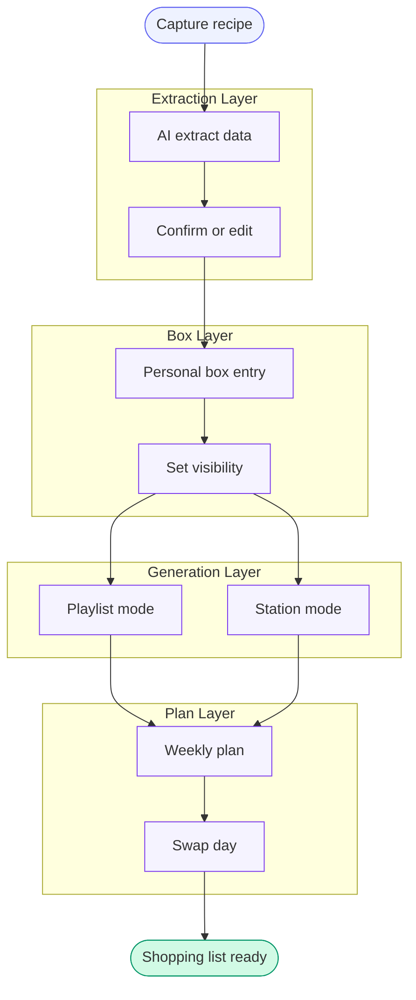
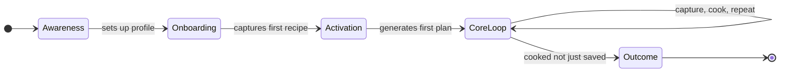
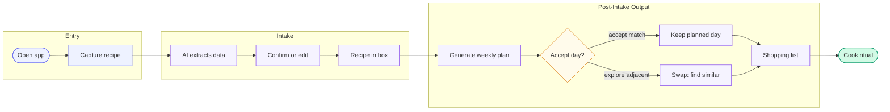

# PRD — Recipe Box

> **Note on depth & evidence base.** Hypothesis (Phase 2) and Discovery (Phase 3) were explicitly skipped by user decision — see [00-Decision-Log](decisions.html), 2026-08-15: the idea was already well-developed, backed by a working single-user V1 prototype (`~/Downloads/recipe_box.html`) and a clear lived problem. In place of formal Discovery, light-touch competitor research (Pepper, ReciMe, Samsung Food, AnyList, Paprika, AI clippers) was pasted in from Grok and is folded into Sections 3–4 below. No structured primary research (interviews/surveys) was run — the closest primary signal is the user's own extended use of the V1 prototype, a single-subject data point, not a representative sample. This PRD is written at **standard depth**: all 14 sections are present and fully populated, but Sections 3–6 are honest about the thinner evidence base, and draft/unvalidated figures are flagged explicitly rather than presented as researched targets.
>
> The product model pivoted significantly on 2026-08-15, mid-session, from an earlier "persistent shared household group" design to the current **"Spotify of recipes" model**: independent per-user Recipe Box ("playlist"), a global catalogue, three-tier visibility (private / specific-users / global), fork-on-receipt with no merge-back, and Playlist-mode vs Station-mode generation. This PRD reflects the current model throughout. Anything in discovery-context or design-context that assumes the old group model has been treated as superseded, per the explicit notes at the top of those files.

---

## 1. Executive Summary

> **Thought Process:** 60-second snapshot of the entire PRD — a stakeholder should be able to read only this section and understand what, why, and how.

- **Product Name:** Recipe Box
- **One-Liner:** A personal recipe box that works like Spotify — your own playlist of recipes, a global catalogue to discover from, and easy sharing with specific people — built to turn "saved" recipes into "cooked" ones.
- **Problem in a Nutshell:** People default to the same small rotation of meals, waste money buying non-overlapping groceries across the week, and accumulate saved recipes they never actually cook. No existing tool combines strong social-video capture, a genuinely personal library, and low-friction sharing without forcing a heavyweight shared-household commitment.
- **Proposed Solution:** Every user gets an independent Recipe Box fed by low-friction capture (paste/screenshot/manual entry, AI-extracted and confirmed) with fork-on-receipt sharing to specific people or the global catalogue. Weekly menu generation draws from the user's own box by default (Playlist mode) or the global catalogue for discovery (Station mode), favours ingredient overlap to cut grocery cost, hard-excludes recent repeats, and closes the loop with a lightweight post-cook check-in.
- **Target User:** Mobile-first home cook planning meals for themselves and/or a small friend/family circle — the "Home Cook Planner" persona (Section 5).
- **Key Outcome:** A rising share of recipes added to a user's box that get marked "cooked" via the cook ritual within a rolling window — the direct measure of closing the saved-vs-cooked gap (Section 12). No numeric baseline exists yet; alpha will establish one.
- **MVP Scope:** Personal box; capture via **native share-sheet (primary), paste/screenshot/manual entry (fallback)** with AI extraction and a confirm/edit/discard step; recipe structure (multi-source URLs, two-level notes, produce/pantry split, cuisine/dietary/effort/time tags); three-tier visibility with fork-on-receipt; Playlist-mode and Station-mode generation; user-defined category slots; per-day swap with configurable "find similar"; shopping list (produce/pantry); pantry inventory; cook ritual; idea pool. **Out of scope for v1:** quantity scaling, desktop browser extension, marketplace/delivery/content-channel expansion.
> **Delta (2026-08-16, product-owner decision):** Mobile OS share-sheet capture is promoted from P1 fast-path to **P0, the primary capture path** — copy/paste-a-link was judged too much friction to be the app's main capture mechanism, including by the product owner themselves ("I myself won't copy paste links into this"). This directly serves the core pitch (capture happens where the scrolling happens — TikTok/Instagram/YouTube — not in a second app). Platform reality is asymmetric and must be designed for honestly, not glossed over: **Android** gets a true native share-target via the PWA Web Share Target API (manifest `share_target` entry + a service-worker-handled intake route) — cheap, no native app shell required. **iOS** cannot register a plain installed web app as a Share Sheet target; the V1 answer is a distributable **iOS Shortcut** (one-time user setup: install a provided Shortcut that appears in the share sheet and POSTs the shared URL to the same capture endpoint) — not as seamless as Android's zero-setup path, but eliminates copy-paste per capture, which was the actual complaint. A true native iOS Share Extension remains possible later if/when a native app wrapper is built, but that is an architecture-phase decision, not assumed here. Paste-link/screenshot/manual entry remain as fallback entry points (desktop, or before a user has set up the iOS Shortcut), not the primary path. See [00-Decision-Log](decisions.html).

---

## 2. Problem Statement

> **Thought Process:** Start with the problem, then layer understanding on top — make it clear why this is worth solving.

### 2.1 Context
Recipe management is a crowded but structurally fragmented category (Section 4.1). Recipe discovery has shifted decisively to social video — Instagram Reels and TikTok — which most incumbent recipe managers (Paprika, AnyList) were designed before and still handle poorly. Mobile is now the dominant surface on which recipes are encountered, saved, and shared; laptop-based clipping, the model most legacy tools were built around, is decreasingly how this actually happens. The user's own usage pattern (mobile Safari/Chrome and TV apps, laptop rare) is representative of this shift, not an outlier.

### 2.2 The Core Problem
People default to cooking the same small rotation of meals, overspend and waste groceries because weekly meal choices aren't optimized for shared ingredients, and accumulate saved recipes across screenshots, DMs, and bookmark folders that are rarely actually cooked. No single tool today closes all three gaps for a personal-first user without demanding a heavyweight shared-household setup.

### 2.3 Why Does This Problem Exist?
The point of recipe *capture* (scrolling Instagram/TikTok, receiving a link from a friend) is disconnected from the point of meal *decision-making* (what to cook this week). Grocery-cost optimization via ingredient overlap is manual mental math that essentially nobody actually does at meal-planning time. Sharing recipes with friends/family today is informal — a screenshot in a group chat — with no persistent, personal record on the receiving end. And "save for later" has no forcing function or feedback loop to convert into "actually cooked" — competitor research (Section 4.1) confirms that apps strong at capture (Pepper, ReciMe) are largely silent on this conversion problem.

### 2.4 Why Now?
AI extraction — schema.org parsing for structured recipe sites plus LLM fallback for social video captions/audio — has only recently become reliable and cheap enough to productize a genuine "confirm/edit/discard" capture step at consumer cost, rather than requiring users to type recipes in by hand. Social video has overtaken blogs as the dominant recipe-discovery surface, a shift most incumbent tools have not caught up to. And a working single-user V1 prototype already validates the core generation logic (produce-overlap selection, category-balanced weekly generation) — the remaining gap is capture, sharing, and discovery layered on top of a model that's already proven at the individual level.

### 2.5 Who Is Most Affected?
Mobile-first individuals who plan meals for themselves or a small circle, who source recipes largely from social video and friend shares, and who currently either keep no structured personal recipe record or maintain a low-conversion bookmark graveyard. Full persona detail in Section 5.

---

## 3. Discovery Framework

> **Thought Process:** Show the thinking process before jumping to solutions — what questions needed answers, and how rigorously they were pursued. Read this section knowing formal Discovery was skipped (see banner note above); it documents what *was* asked and answered informally, and is explicit about what remains unanswered.

### 3.1 Open Questions Bank

**A. Understanding the User**
- Who is the primary user? Answered informally: a mobile-first individual planning meals for self and/or a small friend/family circle — modelled directly on the user's own behaviour, not a researched sample.
- Demographics? **TBD — no demographic survey run.** Working assumption from the user's own profile: working adult, cooks regularly, sources recipes from Instagram/TikTok/WhatsApp.
- What do they currently believe about their situation? Informal signal only: users tend to treat a repetitive meal rotation and an unused bookmark pile as a personal failing rather than a tooling gap — this is the user's own framing, not verified across other subjects.
- Gap between perception and reality? **TBD — not measured.**
- Which platforms/tools do they use today? Instagram/TikTok for discovery, screenshots or the phone's Notes app for saving, WhatsApp/Instagram DMs for sharing with family/friends — no dedicated recipe manager currently in daily use (evidenced indirectly: the user built V1 from scratch rather than adopting an existing tool).
- What motivates them / what changes behaviour? Reducing daily "what to cook" decision fatigue, reducing grocery waste and cost, wanting variety without sacrificing reliability.
- What does success look like to them? Cooking something today that used to just be a saved link.

**B. Understanding the Market**
- Current market state: crowded, fragmented across three distinct jobs — Capture, Library, Group (Section 4.1).
- Opportunity size / growth: **TBD — not sized.** Directionally supported by the shift of recipe discovery to social video, which is a growing behaviour.
- Which segments have most demand? Not formally segmented; informally, small friend/family circles planning meals together (2–6 people) match the product's design point.
- Existing players, strengths/gaps: see competitor table, Section 4.1.

**C. Understanding the Demand/Decision Side**
This is a consumer, single-player product with no organizational buyer — the template's "hiring/demand side" questions are adapted to "what makes an individual user keep using it." The decision to keep using it is made entirely by the user themselves, day to day, based on whether the app saves them planning time and money versus their current informal habits (screenshots + memory). No B2B procurement process, RFP, or hiring-style screening applies here.

### 3.2 Research Methodology

**A. Secondary Research**
- Tools used: ground research compiled by Grok (xAI), pasted directly into the project by the user on 2026-08-15.
- Source credibility filter: treated as directionally reliable for competitive positioning; **not independently verified** against app-store listings, current pricing pages, or hands-on testing — flagged as a limitation, not presented as audited data.
- Key sources: competitor product behaviour for Pepper, ReciMe, Samsung Food (ex-Whisk), AnyList, Paprika, and generic AI recipe clippers (Recipe One, Flavorish, Pestle), plus a named copyright-handling precedent (Copy Me That).

**B. Primary Research**
- Hypothesis going in: a personal, mobile-first recipe box combining capture + a personal library + lightweight peer sharing would close a real gap no single competitor covers.
- Number of respondents: **0 formal respondents.** The only primary signal is the product owner's own build and use of the V1 prototype — a single-subject data point.
- Respondent profile: n/a — not a structured study.
- Research method: informal self-use / dogfooding of V1, plus direct problem articulation from the user in project-context sessions.
- Key questions asked: none via structured interview or survey instrument. **This is the clearest gap in the evidence base** — flagged for the roadmap (Section 13.2) as validation to pursue during alpha/beta rather than pre-build.

---

## 4. Research Findings

> **Thought Process:** Data speaks here. Given the thin primary base (Section 3.2B), this section leans on competitor research plus the V1 prototype as the two available evidence sources, and is explicit about where they do and don't overlap.

### 4.1 Secondary Research Findings

**Market Insights:** The recipe-app category is fragmented across three distinct jobs, and almost nobody is strong at all three simultaneously:
- **Capture** — pulling a cookable recipe out of Instagram, TikTok, YouTube, a blog, or a screenshot
- **Library** — collections, personal notes, search
- **Group** — a living shared cookbook with people you cook with, not a one-time link share

| App | Strength | Weakness relative to Recipe Box |
|---|---|---|
| Pepper | Nearest "social cookbook" — imports from Instagram/TikTok/Pinterest/blogs/Notes, collaborative folders | No fork-on-edit personal note layer; no behaviour-aware generation or grocery-overlap optimization |
| ReciMe | Nearest "save from the feed" — share-sheet capture from IG/TikTok/YouTube/Pinterest/screenshots | Strong personal library, weak as a group workspace |
| Samsung Food (ex-Whisk) | Broadest free option — save from web, collections, meal plans, shopping lists, community notes | Shared collections don't sync edits live; only meal plan/grocery list actually collaborates |
| AnyList | Household pick when the shared object is the shopping list/meal plan | Weak TikTok/Instagram capture; not a cookbook experience |
| Paprika | Serious personal cookbook — blog clipping, own notes, scale, plan, shop, offline | Social video import is clumsy; sharing is device-sync, not a live group |
| AI clippers (Recipe One, Flavorish, Pestle) | Good at turning Reels/TikToks/photos/PDFs into structured recipes | Sharing is usually a link, not a group workspace |

**User Insights:** No structured user research was run (Section 3.2B). Informal signal from the product owner: recipe capture happens on social video and in friend chats, saving is high-volume, and cooking-from-saved is low-conversion.

**Copyright note (risk surfaced, resolved for this PRD):** some clippers (Copy Me That cited) deliberately share only ingredients, not full instructions, redirecting back to the source post for the method — a copyright-driven design constraint, not an oversight. Resolved 2026-08-15 (see discovery-context): Recipe Box stores full extracted instructions, on the reasoning that this is a private, personal/peer-shared product (private by default, sharing is targeted or opt-in global), not a public redistribution app like Copy Me That — a materially lower copyright risk profile, and consistent with the "actually cook from it, without leaving the app" goal.

### 4.2 Primary Research Findings
From the V1 prototype (the only primary evidence available): the produce-overlap algorithm for salad/ingredient selection and category-balanced weekly generation with shuffle were built and used at the single-user level and are carried forward unchanged into this PRD. No group, sharing, or multi-user behaviour was ever tested — the entire catalogue/playlist/fork/station model is a first-principles design response to the "Spotify of recipes" framing, not something validated by observed multi-user behaviour. This is the single biggest evidence gap in the PRD and is called out again in Section 13.2.

### 4.3 Convergence: Evidence-Base × Competitor Research

> Adapted from the template's Primary × Secondary convergence filter: "primary" here means prototype/lived-use evidence, not structured user research, per the honesty note above.

| Pain Point | In Secondary (competitor research)? | In Primary (prototype / lived use)? | Verdict |
|---|---|---|---|
| Repetition / lack of inspiration | Yes — no competitor combines strong capture + group + generation | Yes — direct motivation for building V1 | Include |
| Grocery bill via ingredient overlap | Partial — Samsung Food/AnyList do grocery lists but not overlap-optimized selection | Yes — V1's produce-overlap algorithm already built and used | Include |
| Saved-not-cooked gap | Yes — capture-strong apps (Pepper, ReciMe) have no cook-conversion signal | Yes — the core motivating reason the app exists at all | Include |

---

## 5. Target Persona Segmentation

> **Thought Process:** Segment the target audience; pick the one where the problem burns hardest. Given the thin primary research base, personas here are informed reasoning from the user's own profile and competitor-implied user types, not researched segments — flagged accordingly.

### 5.1 Persona Segments

| Field | Persona 1 — Home Cook Planner | Persona 2 — Recipe Collector | Persona 3 — Group Cook |
|---|---|---|---|
| Name & archetype | Weekly meal planner, cooks regularly for self and/or household | Compulsive saver, low cook-conversion | Informal social sharer, cooks with a friend/family circle |
| Demographics | Adult, mobile-first, urban/suburban, grocery access — **TBD, not researched** | Similar mobile-first profile, higher social-media time | Small friend/family group, 2–6 people |
| Motivation | Reduce decision fatigue, cut grocery waste/cost, add variety without losing reliability | Aspiration/inspiration; enjoys collecting more than cooking | Wants recipe finds from trusted people, not a public feed |
| Current behaviour | Repeats a small rotation; plans loosely from memory | Screenshots/saves heavily on Instagram/TikTok; rarely returns to cook | Shares via WhatsApp/DM screenshots; no persistent record kept |
| Top 3 pain points | Repetition, grocery waste, "what do I cook" fatigue | Bookmark graveyard, no forcing function to cook, extraction friction | No lasting record of shares, no easy way to add a friend's find to their own plan, over-commitment fear of a shared group |
| Willingness to pay | Low–moderate for personal use, potentially higher for group utility — **TBD, no pricing research done** | Low — value is aspirational, not utilitarian | Low individually, but social stickiness may drive retention |

### 5.2 Primary Persona Selection

- **Selected Persona:** The Home Cook Planner.
- **Why This Persona:** This is the user's own persona, and the problem burns weekly, not occasionally — repetition, grocery waste, and decision fatigue recur every single planning cycle. The existing V1 prototype was built specifically to solve this persona's problem, giving it the strongest (if single-subject) evidence base of the three.
- **Fastest Validation Path:** Continued self-use of the evolving V1→V2 build (dogfooding), then extend sharing to a small real friend/family circle (2–4 people) in a soft beta before any broader release — matching the friend-group scale referenced throughout the decision log, rather than jumping straight to a public launch.

---

## 6. Pain Point Analysis

> **Thought Process:** Converge on exactly 3 pain points from Section 4.3. Prioritise by Impact vs Effort — high-impact problems realistically solvable in MVP.

### 6.1 Impact vs Effort Matrix

| Pain Point | Impact (H/M/L) | Effort (H/M/L) | Quadrant | Include in MVP? |
|---|---|---|---|---|
| Repetition / lack of inspiration | H | M | Major project, high value | Yes |
| Grocery bill via ingredient overlap | M | L (algorithm already exists from V1) | Quick win | Yes |
| Saved-not-cooked gap | H | M | Major project, high value | Yes |

### 6.2 Final 3 Pain Points

**1. Repetition / lack of inspiration**
- **Pain point statement:** Left to memory and habit, people default to the same small rotation of dishes and rarely branch out.
- **Who it affects most and why:** The Home Cook Planner, who plans weekly and feels the fatigue of "not this again" most acutely.
- **Evidence from research:** Section 4.3 — competitor research shows nobody combines a personal library with a genuine taste-filtered discovery surface; V1's category-balanced generation was a direct response to this.
- **Why solvable in MVP scope:** Station mode (global catalogue, taste-filtered) plus behaviour-aware exclusion of recently-used recipes are both scoped for v1 and build directly on V1's existing generation logic.

**2. Grocery bill optimization via ingredient overlap**
- **Pain point statement:** Choosing meals independently across a week produces a shopping list with little overlap, driving unnecessary spend and waste.
- **Who it affects most and why:** Anyone shopping for more than one meal at a time — sharpest for the Home Cook Planner shopping for a household.
- **Evidence from research:** Section 4.3 — Samsung Food/AnyList generate shopping lists but don't optimize selection for overlap; V1's produce-overlap salad algorithm already proves the mechanism works.
- **Why solvable in MVP scope:** The algorithm exists and is carried forward unchanged; "find similar" by ingredient overlap at swap time extends it with minimal new build.

**3. Recipes that get used, not just bookmarked**
- **Pain point statement:** Recipes get saved constantly but rarely actually cooked, with no signal or forcing function to close that gap.
- **Who it affects most and why:** The Recipe Collector most acutely, but present in all three personas to some degree.
- **Evidence from research:** Section 4.3 — capture-strong competitors (Pepper, ReciMe) have no cook-conversion mechanism at all.
- **Why solvable in MVP scope:** The cook ritual (thumbs/skip/make-again) is a lightweight, low-build-cost prompt that directly measures and reinforces this outcome — no complex inference required.

---

## 7. Solution Space

> **Thought Process:** Three validated pain points, for the Home Cook Planner persona, translate into a solution: high-level concept → features → journey → hero flow → edge cases.

### 7.1 High-Level Solution
Recipe Box gives every user an independent, personal recipe library ("your playlist") fed by low-friction capture — paste a link, screenshot, or type a name now and add the link later — with AI extraction (schema.org parsing plus LLM fallback for social video captions/audio) prefilling structured recipe data that the user confirms, edits, or discards. Recipes carry one of three visibility levels (private, shared with specific people, or global) and, once added by anyone else, become an independent fork with no merge-back — simple ownership, no review queue. Weekly menu generation draws from the user's own box by default (Playlist mode, reliable and known) or from the global catalogue filtered by taste (Station mode, for discovery) — directly answering pillar 1. Category-balanced generation and a produce-overlap "find similar" swap directly answer pillar 2. A lightweight post-cook check-in (cook ritual) answers pillar 3 by measuring the thing that actually matters: was it cooked, not just saved.

### 7.2 Feature Breakdown

| Feature | Pain Point Solved | Priority | Notes |
|---|---|---|---|
| Personal box (playlist) | All three | P0 | Core data model; every recipe lives here once added |
| Capture — native share-sheet (primary), paste link / screenshot / manual entry (fallback) | Saved-not-cooked, repetition | P0 | Share-sheet is now the primary path (2026-08-16 delta) — Android via PWA Web Share Target, iOS via a distributable Shortcut (one-time setup); paste/screenshot/manual remain as fallback entry points |
| AI extraction (schema.org + LLM fallback for Reels/TikTok captions/audio) | Saved-not-cooked | P0 | Confirm/edit/discard is a first-class step, not a fallback |
| Second-clipper-free extraction reuse | Saved-not-cooked | P0 | Second person to add the same URL gets the validated extraction |
| Recipe structure (multi-source URLs, per-URL + overall notes, produce/pantry split, cuisine/dietary/effort/time tags) | All three | P0 | Carried forward + extended from V1 |
| Three-tier visibility (private/specific-users/global) | Repetition, group sharing | P0 | No persistent group; sharing is always a deliberate, targeted action |
| Fork-on-receipt | Repetition, group sharing | P0 | Adding a shared/global recipe makes it an independent local copy |
| Playlist-mode generation | Grocery overlap, repetition | P0 | Default generation mode, draws only from user's own box |
| Station-mode generation/browse | Repetition | P0 | Discovery mechanism, draws from global catalogue filtered by taste |
| User-defined category slots | Repetition | P0 | Fixed-pick or randomised, always dietary-filtered |
| Behaviour-aware generation (recency exclude + cook-history favouring) | Repetition | P0 | Intentionally simple for v1 — no heavy learning model |
| Per-day swap + configurable "find similar" (cuisine/category/ingredients) | Grocery overlap, repetition | P0 | Ingredient overlap shown visibly at swap time |
| Shopping list (produce grouped/sorted, pantry checklist) | Grocery overlap | P0 | Scoped per generation instance |
| Pantry inventory (always-on-hand, auto-crossed-off) | Grocery overlap | P0 | Carried forward from V1 |
| Cook ritual (thumbs/skip/make-again) | Saved-not-cooked | P0 | The real "used, not bookmarked" signal |
| Idea pool (uncooked-in-N-weeks + optional hand-pick) | Repetition, saved-not-cooked | P1 | Small taste of Station mode, not a separate curation system |
| Follow specific cooks | Repetition | P1 | Followed cooks' global recipes surface preferentially |
| Saved contact lists for sharing (Reels-close-friends style) | Group sharing | P1 | Alternative to ad hoc per-share selection |
| Quantity scaling | — | P2 / Post-MVP | Explicitly deferred to V2 per decision log; number-of-people field captured on profile now for future use |
| Desktop browser extension | — | Out of scope v1 | Real usage is mobile/TV, not laptop |
| Marketplace / delivery / content channel | — | Out of scope v1 | Deliberate future scope, not V1 |

### 7.3 User Journey

| Stage | Description |
|---|---|
| Awareness | User hears about Recipe Box from a friend's share, or starts from their own need (the product owner's own motivation) — no formal acquisition channel defined for v1. |
| Onboarding | Sets dietary preference, cuisine filters, meal-planning style, and household size on their personal profile; box starts empty. |
| Activation | Captures their first recipe (paste/screenshot/manual), confirms the AI-extracted data, and it lands in their box — first meaningful "this app has value" moment. |
| Core Loop | Capture recipes → generate a weekly plan (Playlist or Station mode) → swap a day if needed → get a shopping list → cook → complete the cook ritual → repeat. |
| Outcome | A rising share of the user's box gets marked "cooked," not just saved — the direct signal that the saved-vs-cooked gap has closed for that user. |

### 7.4 Hero Flow

> **Thought Process:** The single most important path — capture through to a completed cook. If this doesn't work end to end, the product fails regardless of how good any individual feature is.

| Step | Screen/State | User Action | System Response |
|---|---|---|---|
| 1 | Capture entry | Pastes a link, takes a screenshot, or types a recipe name | Item lands in personal inbox, marked "pending extraction" |
| 2 | Extraction | (passive) | AI extracts structured data (schema.org or LLM fallback for social captions/audio) |
| 3 | Confirm/edit | Reviews extracted ingredients, instructions, tags; edits or discards | Recipe saved to box with produce/pantry split and tags applied |
| 4 | Generate plan | Picks who it's for (self or specific people) and how much (1 meal–1 week), chooses Playlist or Station mode | System fills category slots, excluding recently-used recipes |
| 5 | Review plan | Views the generated weekly plan | Each day shows a recipe, category, and effort/time |
| 6 | Swap (optional) | Taps "find similar" on a day, picks cuisine/category/ingredient match | System shows alternatives with visible ingredient overlap vs the replaced day |
| 7 | Shopping list | Opens the generated list for this plan instance | Produce grouped/sorted; pantry shown as checklist, auto-crossed-off items pre-checked |
| 8 | Cook ritual | After the planned day passes, responds thumbs/skip/make-again | Signal recorded against the recipe; feeds recency-exclude and idea-pool logic |

### 7.5 Edge Cases

- **Empty box, first generation:** user has too few recipes to fill all category slots — system falls back to Station mode suggestions or prompts capture before generating.
- **Failed AI extraction:** extraction returns nothing usable (e.g. unsupported source, garbled audio transcription) — user falls through to manual entry, pre-populated with whatever was extracted.
- **Duplicate URL, second clipper:** a second user pastes a URL already extracted by someone else — they get the already-validated extraction for free instead of re-running AI extraction.
- **Original recipe edited/deleted after being forked:** no effect on any fork — forks are fully independent copies (fork-on-receipt, no merge-back).
- **Sharing with a user who hasn't onboarded:** share is queued/visible once they create an account; never auto-added to their box.
- **Insufficient recipes to fill all category slots:** system either leaves a slot unfilled with a prompt to add more, or offers Station-mode suggestions for that slot.
- **Dietary conflict at swap time:** "find similar" suggestions are always filtered by the profile's dietary preference first — a conflicting recipe is never surfaced as a swap option.
- **Capture during network failure:** item is saved to the inbox as a draft (link/screenshot only) and extraction retried once connectivity returns.
- **Recipe re-added to own box after removal:** treated as a fresh add — any prior notes on the removed copy are gone; no restore/undo in v1.

---

## 8. Design Guide

> **Thought Process:** Enough direction for anyone (including Claude Code) to build the MVP. Detailed execution belongs to the design-agent's formal Phase 7a pass — this section is high-level intent, flagged where the existing Fable draft is superseded.

### 8.1 Design Philosophy
Should feel like your own cookbook, not a spreadsheet or a corporate meal-planning tool — warm, personal, low-friction, and built for thumbs, not a keyboard. Minimise typing wherever a photo, screenshot, or paste can do the job instead.

### 8.2 Layout Descriptions

> A Fable design-refinement pass exists in design-context but is explicitly flagged as **partially superseded** by the 2026-08-15 model pivot — the group-formation and "shared pool" browse screens, and share-sheet-as-hero-capture, assumed the old persistent-household model and need rework in a formal Phase 7a pass. The brand-personality directions (Grandmother's Recipe Tin, Kitchen Whiteboard, Quiet Pantry) and the per-day "find similar" swap / shopping-list screen concepts likely still hold and should be reviewed, not discarded, during 7a.

For the hero-flow screens (current model, direction only — not final):
- **Capture/Inbox:** full-width, single primary action (paste/screenshot/name), pending items shown as a simple queue.
- **Confirm/Edit extraction:** card-based, editable fields inline, clear discard vs confirm actions, produce/pantry split shown as two visually distinct lists.
- **Box (playlist view):** scrollable card grid or list, filterable by cuisine/dietary/tag, visibility indicator per recipe (private/shared/global).
- **Generate weekly plan:** one card per day/slot, category label visible, primary CTA to generate; toggle for Playlist vs Station mode near the top.
- **Swap/find similar:** bottom-sheet or full-screen overlay from a day card, alternatives shown with visible ingredient-overlap tags.
- **Shopping list:** two clearly separated sections (produce grouped/sorted; pantry as checklist), checked items visually de-emphasised.

### 8.3 Colour System

> Draft placeholder only — pending formal ratification of the Fable brand-personality directions during Phase 7a. Directionally consistent with a warm, personal, low-friction feel ("Quiet Pantry"-leaning neutral base).

| Role | Colour Name | Hex |
|---|---|---|
| Primary | Warm Terracotta | #C1694F |
| Secondary | Sage | #7A8B6F |
| Accent | Golden Ochre | #D9A441 |
| Background | Warm Off-White | #FAF6F0 |
| Surface | Card White | #FFFFFF |
| Text primary | Charcoal | #2B2521 |
| Text secondary | Warm Grey | #6E645C |
| Error | Muted Red | #C0392B |
| Success | Sage Green | #4F7A5A |

### 8.4 Typography

> Draft placeholder — pending Phase 7a. A friendly, legible sans for a mobile-first product; a warmer serif/rounded display face if the "Grandmother's Recipe Tin" direction is ratified for hero screens.

| Style | Font | Size | Weight | Line Height |
|---|---|---|---|---|
| Heading 1 | System sans (e.g. Inter/SF Pro) | 24px | 700 | 1.3 |
| Heading 2 | System sans | 18px | 600 | 1.35 |
| Body | System sans | 15px | 400 | 1.5 |
| Caption | System sans | 12px | 400 | 1.4 |

### 8.5 Component Guidance
- **Recipe card:** image/thumbnail, title, cuisine/dietary/effort tags as chips, visibility indicator.
- **Day card (weekly plan):** category label, recipe title, swap icon, cook-ritual state once past.
- **Tag chip:** rounded, colour-coded loosely by tag type (cuisine vs dietary vs effort) — final palette pending 8.3.
- **Checklist item (shopping/pantry):** tappable row, strikethrough on check, pantry items visually distinct from produce.
- **Confirm/edit/discard bar:** persistent bottom bar on the extraction-review screen — three clear actions, confirm as primary.
- **Bottom navigation:** Box / Generate / Station / Shopping List / Profile — five-item mobile tab bar, thumb-reachable.

---

## 9. Technical Architecture

> **Thought Process:** High-level direction only — shows the product has been thought through at the build level. Detailed execution belongs to the architecture-agent's formal pass.

### 9.1 Tech Stack (MVP)

| Layer | Choice | Rationale |
|---|---|---|
| Frontend | Mobile-first PWA (React or similar), share-target-capable | Matches "mobile/TV, laptop rare" usage; PWA keeps install friction low; TBD — formal choice deferred to architecture-agent |
| Backend / API | Lightweight serverless/Node API | Cost-minimal per decision log; TBD |
| Database | Relational (e.g. Postgres) with recipe/box/visibility/fork schema | Needs to model multi-source recipes, forks, and 3-tier visibility cleanly; TBD |
| Auth | Simple email/social login | Low-friction for a small friend-group beta; TBD |
| File storage | Object storage for screenshots/recipe images | Needed for screenshot-based capture; TBD |
| Hosting | Cost-minimal PaaS (e.g. Vercel/Supabase-style) | Matches "cost-minimal, mobile-friendly" constraint from decision log; TBD |

### 9.2 Third-Party APIs

| API / Service | Purpose | Pricing model |
|---|---|---|
| LLM API (extraction fallback) | Structured extraction from social video captions/audio (Reels/TikTok), blogs without schema.org markup, manual entries | Usage-based — TBD, primary variable cost driver |
| schema.org recipe parser | Structured extraction from blogs/sites with recipe markup | Free/self-built parsing logic |
| OCR service | Screenshot-based capture | Usage-based — TBD |
| Push notification service | Optional — cook-ritual reminders | TBD, likely deferred past MVP |

### 9.3 Cost Projection

**TBD — deferred to architecture-agent's formal pass.** The clearest cost driver flagged here for that phase: LLM extraction cost scales with capture volume, not user count directly, and social-video (audio/caption) extraction is likely materially more expensive per call than schema.org parsing — the architecture-agent should model these as separate cost lines, not a single blended per-recipe cost.

| Scale | Monthly cost | Cost per user |
|---|---|---|
| 100 users | TBD | TBD |
| 1,000 users | TBD | TBD |
| 5,000 users | TBD | TBD |

---

## 10. Rollout Plan

> **Thought Process:** Phased rollout — start small, validate, then scale.

### 10.1 Phased Rollout

| Phase | Objective | User Count | Duration | Success Criteria |
|---|---|---|---|---|
| Alpha | Validate capture → box → Playlist-mode generation → cook ritual loop end to end, solo dogfood | 1 (product owner) | ~2–4 weeks | Full hero flow (Section 7.4) works without manual workarounds; a real baseline cook-ritual completion rate is established (Section 12) |
| Beta | Validate sharing, fork-on-receipt, and Station mode with real peer usage | 2–6 (small friend/family circle) | ~4–8 weeks | At least one cross-user share-and-fork completes end to end; Station mode used by more than one participant; no data-loss or visibility-leak incidents |
| Launch | Open global-catalogue signup, broader release | Unbounded (soft) | Ongoing | North Star metric trending upward from alpha baseline (Section 12.1); no unresolved P0 bugs from beta |

### 10.2 Go / No-Go Criteria

- **Alpha → Beta:** hero flow works reliably solo, no P0 bugs in capture/extraction/generation/shopping-list/cook-ritual; a baseline cook-ritual response rate exists to compare beta against.
- **Beta → Launch:** at least one full share → fork → independently-edited recipe cycle completed by real peers; visibility rules (private/specific-users/global) verified to never leak private recipes; shopping-list and generation logic hold up with multiple concurrent users' boxes.

---

## 11. Test Cases

> **Thought Process:** Seed cases for the hero flow and edge cases — expanded by the qa-agent in a later phase.

| # | Test Case | Type | Expected Result | Pass/Fail |
|---|---|---|---|---|
| 1 | Paste a schema.org-marked blog URL, let AI extraction run, confirm without edits | Happy path | Recipe lands in box with correct ingredients (produce/pantry split), instructions, and tags | |
| 2 | Screenshot capture of an Instagram Reel caption, AI extraction, confirm | Happy path | Recipe extracted via LLM fallback, correctly split and tagged; user can edit before confirming | |
| 3 | Generate a weekly plan in Playlist mode with a full box | Happy path | All category slots filled from own box, no recently-used (last N weeks) recipes included | |
| 4 | Generate a weekly plan in Station mode | Happy path | Slots filled from global catalogue, filtered by dietary/cuisine profile | |
| 5 | Swap a day using "find similar" by ingredient overlap | Happy path | Alternatives shown with visible overlap tags vs the replaced day; selection updates the plan and shopping list | |
| 6 | View shopping list for a generated plan | Happy path | Produce grouped/sorted; pantry shown as checklist with always-on-hand items pre-checked | |
| 7 | Complete cook ritual (thumbs/make-again) after a planned day passes | Happy path | Signal recorded; recipe excluded from generation for configured recency window | |
| 8 | Second user pastes a URL already extracted by another user | Edge case | Already-validated extraction reused, no duplicate AI extraction call | |
| 9 | Generate a plan with fewer recipes in box than category slots | Edge case | System either leaves slot unfilled with a prompt, or offers Station-mode fallback — never errors silently | |
| 10 | Share a recipe with a user who hasn't signed up yet | Edge case | Share queued/visible on their signup; recipe never auto-added to any box | |
| 11 | AI extraction fails (unsupported source, garbled transcript) | Failure scenario | User routed to manual entry, pre-populated with any partial data; no silent data loss | |
| 12 | Attempt to view a private recipe as a non-owner, non-shared user | Failure scenario / security | Recipe not visible or discoverable in any surface (search, Station mode) | |
| 13 | Edit a forked recipe after the original owner deletes/edits their copy | Edge case | Fork remains fully independent; no change propagates either direction | |

---

## 12. Success Metrics

> **Thought Process:** North Star first, then supporting metrics that feed it. Given the thin evidence base (Sections 3–4), targets here are drafts to be replaced with real baselines during alpha, not researched figures — flagged explicitly rather than presented as settled.

### 12.1 North Star Metric

- **Metric:** Share of recipes added to a user's box that receive a "cooked" (make-again/thumbs) response via the cook ritual within a rolling 8-week window.
- **Why This Metric:** It directly measures the core differentiator and pillar 3 (saved-not-cooked gap) — no competitor identified in Section 4.1 tracks anything equivalent. It's also a leading indicator for pillars 1 and 2, since a plan that's actually cooked implies the generation and swap logic produced something usable.
- **Target (MVP phase):** **TBD — no baseline exists.** Alpha (Section 10.1) is explicitly scoped to establish this baseline before a hard numeric target is set for beta/launch.

### 12.2 Supporting Metrics

| Metric | Type | Target | How Measured |
|---|---|---|---|
| Recipes added per active user per week | Input | TBD post-alpha baseline | Count of confirmed (non-discarded) recipe additions |
| Weekly generation completions (plan actually generated and viewed) | Input | TBD post-alpha baseline | Generation events per active user |
| Repeat-recipe rate (same recipe reused within recency window) | Output | Downward trend from alpha baseline | Recipe-ID repetition within configured recency window |
| Swap rate via "find similar," and ingredient overlap % shown at swap | Output | TBD post-alpha baseline | Swap events + overlap tag data captured at swap time |
| Station-mode adoption (users who use Station at least once/week) | Output | TBD post-beta | Station-mode session count per user |
| Shares sent vs accepted (added to recipient's box) | Output | TBD post-beta | Share event → fork event conversion |

---

## 13. Future Roadmap

> **Thought Process:** Thinking beyond MVP signals product maturity — keep it high-level.

### 13.1 Post-MVP Roadmap

| Version | Focus | Key Features | Trigger to Start |
|---|---|---|---|
| V2 | Depth on existing model | Quantity scaling (using the household-size profile field captured but unused in v1), richer pantry inventory, notifications/reminders for cook ritual, deeper behaviour-aware generation | Beta metrics show the core loop (Section 7.3) is retained; North Star trending upward |
| V3 | Expansion beyond personal-first | Marketplace/delivery integration exploration, content-channel/creator-following at scale, possible monetization model | Launch-phase usage shows sustained multi-user (peer-sharing) engagement, not just solo use |

### 13.2 Open Questions for Future

- **No structured primary research has been run** (Section 3.2B) — user interviews/surveys with people outside the product owner are needed to validate personas (Section 5) and pain points (Section 6) beyond a single-subject data point.
- **No numeric success targets exist yet** (Section 12) — alpha is scoped to produce a real baseline.
- **Pricing/monetization model** is entirely undetermined — willingness-to-pay in Section 5.1 is flagged TBD throughout.
- **Demographic profile** of the target user beyond the product owner's own is unresearched.
- **iOS Shortcut adoption rate** — share-sheet capture is now P0 (Section 7.2, 2026-08-16 delta), but the iOS path relies on a one-time user setup step (installing a provided Shortcut) since a plain PWA can't register as a native Share Sheet target. Whether real users actually complete that setup step, versus abandoning at that friction point, is unvalidated — worth an explicit alpha metric (Shortcut install rate) rather than assuming it's solved once built. A true native iOS Share Extension (no setup step) remains the long-term answer if a native app wrapper gets built later.
- **Global catalogue moderation** — at meaningful scale, does the global tier need any moderation/reporting mechanism? Out of scope for a small-beta v1, but a real question before broad launch.
- **Cost model** (Section 9.3) — LLM extraction cost per capture at scale is unmodelled; needs architecture-agent follow-up before broad launch.

---

## 14. Appendix

### 14.1 Research Raw Data
- 00-Project-Context — full "How it works" model, all key decisions, constraints.
- [00-Decision-Log](decisions.html) — full reasoning trail including the 2026-08-15 model pivot.
- discovery-context — light-touch competitor research (Grok) and resolved copyright/extraction-scope decisions.
- design-context — Fable design-refinement pass, flagged partially superseded (see note at top of that file and Section 8.2 above).
- V1 prototype: `~/Downloads/recipe_box.html` — working single-user reference implementation for produce-overlap and category-balanced generation logic.

### 14.2 Additional References
- Competitor research (Grok, 2026-08-15): Pepper, ReciMe, Samsung Food (ex-Whisk), AnyList, Paprika, AI clippers (Recipe One, Flavorish, Pestle), Copy Me That (copyright-handling precedent). Credibility note: ground research pasted directly by the user, not independently re-verified by prd-agent against current app-store listings or pricing — treat as directionally reliable, not audited.

### 14.3 Glossary
- **Box / Playlist:** A user's own independent recipe collection — nothing is in it unless explicitly added, same mental model as a Spotify playlist.
- **Catalogue:** The full global pool of recipes anyone has marked global — not owned by any one user, browsable/searchable by all.
- **Station mode:** Generation/browsing mode that draws from the global catalogue, filtered by the user's taste profile — the primary discovery mechanism (equivalent to a Spotify radio station).
- **Playlist mode:** Default generation mode; draws only from the user's own box.
- **Fork-on-receipt:** When a recipe is added to a user's box (via share or catalogue), it becomes their own independent copy — edits are local, no merge-back to the original.
- **Visibility tiers:** Private (default, owner-only), specific-users/group (shared with a chosen set of people), global (part of the catalogue, discoverable and addable by anyone).
- **Cook ritual:** The lightweight thumbs/skip/make-again prompt after a planned day passes — the real "used, not bookmarked" signal.
- **Idea pool:** A dashboard row surfacing recipes in the user's own box uncooked in N weeks, plus an optional hand-picked addition.
- **Category slots:** User-defined structure for a weekly plan (e.g. International, South Indian, Legumes, Salad) — fixed-pick or randomised, always dietary-filtered.
- **Produce vs pantry:** Ingredient split carried from V1 — produce items go on the shopping list; pantry items are a check-what-you-have list, with an inventory of always-on-hand items auto-crossed-off.

---
*PRD version 1.0 · Last updated 2026-08-15 · Status: Draft*
*This is a living document. Update as decisions are made and scope evolves.*
