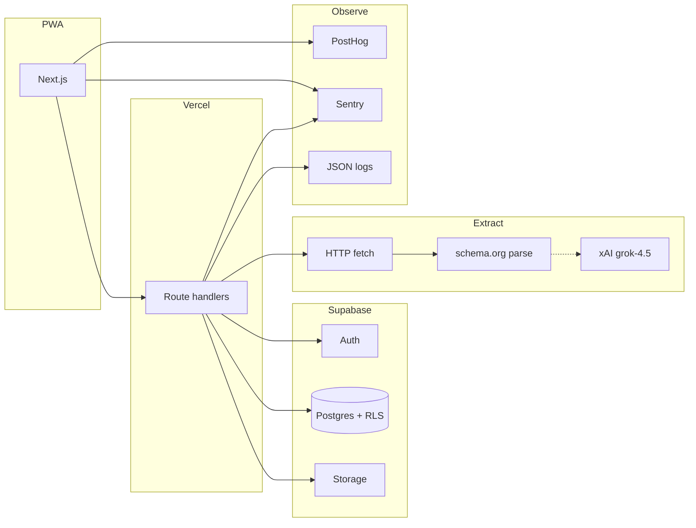
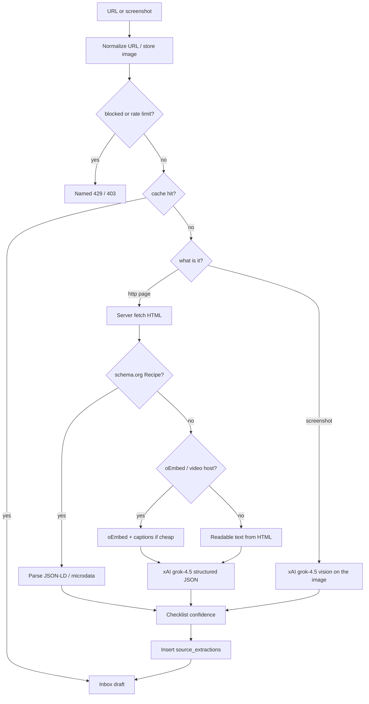

# Architecture — Recipe Box

> **Draft v1.1 — 2026-08-16.** Built against [Design](design.html) v1.6 and [Solution-Sketch](sketch.html) through delta #15, plus proto-directed drift (link-only share, capture defaults Global, committed week). Hosting is still a **proposal**. architecture-reviewer not invoked. Git not touched.
>
> **Prototype of record:** `Prototype-v2.html`.

This document is how we build the real app. Three questions the product owner asked are answered in full below: **how Browse home loads**, **how the week is generated**, **what tools extract a recipe from a link or a video**.

---

## 1. Hosting (needs your lock)

Same recommendation as the last draft.

**Option A (assumed until you say otherwise): Vercel + Supabase + PostHog.**

| Layer | Start ($0) | Scale later |
|---|---|---|
| App + API | Vercel Hobby (Next.js) | Vercel Pro |
| DB + Auth + files | Supabase Free | Supabase Pro |
| Product analytics + replay | PostHog Cloud free | PostHog paid |
| Errors | Sentry free | Sentry team |
| CI | GitHub Actions, public repo, hosted runners only | Larger runners if needed |
| Email (magic link) | Supabase Auth | Same |
| LLM extract | xAI API (`XAI_API_KEY`, `grok-4.5`) — pay-per-use | Same; cache kills repeat cost |

**Not LogRocket** on day one (overlaps PostHog). **Not AWS** on day one (Auth + Postgres + Storage in one free project is the match). **Not GitHub Pages** (we need POST + auth callbacks). **Not a CI server** — public repo uses GitHub-hosted runners.

Estimated month-1 bill: **$0** plus whatever extract calls you actually make (cached URL = $0 the second time).



---

## 2. Stack

| Concern | Choice | Why |
|---|---|---|
| Language | TypeScript, strict | Compiler is the first reviewer |
| App | Next.js App Router + PWA | Share target, public plan pages |
| API | Route handlers | Same deploy |
| DB | Postgres (Supabase) + RLS | Owner Box + global reads |
| Auth | Supabase magic link | Free |
| Files | Supabase Storage | Images, screenshots |
| Client cache | TanStack Query | Home payload + Box |
| UI | Tailwind | Fast |
| Tests | Vitest on PR | Generate + extract parsers must have UTs |
| Lint | ESLint + Prettier + `tsc --noEmit` | Merge gate |
| Logs | `src/lib/logger.ts` | Observability standard |
| Telemetry | `src/lib/analytics.ts` → PostHog | Named events |
| Errors | Sentry | Client + server |
| Replay | PostHog session replay | LogRocket equivalent |
| LLM | **xAI** `https://api.x.ai/v1`, model `grok-4.5`, key `XAI_API_KEY` server-only | Project default; OpenAI-compatible |

**Not in V1:** Redis, queues, K8s, Nest, GraphQL, Whisper-on-every-video, a second backend.

---

## 3. How Browse / Discover loads

### What the user sees

S12 first paint: search box, cuisine chips, ingredient field, For you / Discover, then two short grids — Trending and Popular. Search is a separate mode.

### Network (first paint)

One request, not N:

`GET /api/catalogue/home`

Response:

```ts
{
  trending: CatalogueCard[]  // ≤ 8, last 7 days of likes
  popular: CatalogueCard[]   // ≤ 8, engagementScore desc
  cuisines: { id: string, name: string, parentId: string | null }[]
}
```

`CatalogueCard` is a **projection**, not the full recipe: `id, title, dishName, cuisine, creatorName, mins, imageUrl, likeCount, ownerDisplay`. Ingredients and method stay off this payload.

**Server work:**

1. Read `recipes` where `visibility = global` (index on `visibility`).
2. **Trending:** count `recipe_ratings` with `created_at > now() - 7 days`, order by that count, take 8.
3. **Popular:** `engagementScore` (placeholder, same as proto):  
   `2 * box_add_count + like_count + min(log(1 + external_engagement_count), cap) + newItemFloor`  
   Deprioritize `user_confirmed_low_confidence`. Take 8.
4. **Cuisines:** distinct `cuisine_tag_id` among globals, with parent so the client can do parent-includes-children.

Cache the home payload **30–60s** at the CDN/edge (it is public). Invalidate lazily; a few seconds stale is fine.

### Lens (For you / Discover)

Done **after** the home payload, using the signed-in profile’s `cuisines_liked_tag_ids` (parent includes children):

- For you: keep cards whose cuisine is in liked.
- Discover: keep cards whose cuisine is **not** in liked.
- Empty liked set: show the rails as returned.

This can run on the client (payload is tiny) or as `?lens=liked|discover` if we later personalize ranking. V1: client lens. Profile has **no** explore-cuisine list.

### Search

`GET /api/catalogue?q=&cuisine=&ingredient=`

- Match `title`, `dish_name`, `creator_name`, ingredient names.
- Return **every** version of a matched dish, grouped by `dish` slug. Never truncate a group.
- Do not run the home rails query.

### Indexes

- `recipes (visibility, cuisine_tag_id)`
- `recipe_ratings (recipe_id, created_at)`
- `recipes` trigram or `tsvector` on title + dish_name + creator_name when search feels slow (not day one).

### What we will not do

- Download the full catalogue into the browser.
- Per-card `GET /api/recipes/:id` on home.
- An LLM to “curate” Discover.

---

## 4. How the week is generated

There is **no menu-writing model**. Fill is a pure function. That is what unit tests lock.

`src/lib/generate/fillWeek.ts`

### Inputs

- `seats[]`: `{ facetType, facetValue, count, collectionId? }` — this week’s shape, already copied from usual week and edited.
- `headcount`
- `saveOnGroceries` boolean
- `mixInBrowse` boolean
- Caller profile (restrictions, stance, frameworks, liked cuisines)
- Caller Box recipes
- If mix-in: global recipes (same projection as catalogue, plus ingredients for matching)
- `recentlyCookedIds` (short window)
- `cookLog` + swap-away counts (for rank)

### Algorithm (same order as the proto)

```
pool ← Box
if mixInBrowse: pool ← pool ∪ globals the user does not already own

for each seat in seats:
  for i in 1..seat.count:          // expands to Meal N
    cands ← pool where
        not already used this week
        and not in recentlyCookedIds
        and matchesFacet(recipe, seat)
        and dietOk(recipe)         // hard restrictions + stance
    cands ← rank(cands, seat, ingredientsAlreadyPicked)
    pick ← cands[0] or Unfilled
    if pick: mark used; add its ingredient names to ingredientsAlreadyPicked
```

**`matchesFacet`**

| facet | match |
|---|---|
| cuisine | recipe cuisine = value, or value is a parent of recipe cuisine |
| tag | exact tag, except `quick` ⇒ `mins ≤ 25` |
| ingredient | any ingredient name contains the one token (lists like “basil, thyme” are rejected at the shape UI) |
| collection | recipe is in that collection |
| surprise | cuisine in liked (if liked is non-empty) **and** recipe does **not** match any other named seat in this shape |

**`dietOk`**

- Hard restrictions: keyword / tag exclude (gluten, nut, …).
- Stance: vegetarian / vegan exclude land meat (and vegan excludes dairy/egg); non-vegetarian excludes nothing; mixed stance is permissive (OR).
- Frameworks (keto, etc.): **not** a hide. Optional later rank boost. V1 proto does not even boost them.

**`rank`**

1. Recipes the user marked skip on sort last.
2. If `saveOnGroceries` and we already picked meals: more shared ingredient names first.
3. Else: `cookScore` (loved +3, cooked +2, skip −3) minus times this recipe was swapped away.

Deterministic. Same inputs ⇒ same week. Tests: one fixture Box + one fixture shape ⇒ snapshot of Meal ids.

### Draft vs commit

- `POST /api/plans` writes `generation_instances.status = draft` (or `committed = false`). **Does not** write a shopping list. **Does not** archive unless the previous plan is `committed`.
- `POST /api/plans/:id/shopping-list` (or first `GET` from the plan’s Shopping list CTA) sets `committed = true` and materializes list rows.
- Next `POST /api/plans` while current is committed: archive current (`status = archived`), then insert the new draft.

Swaps on a committed plan rebuild the list. Swaps on a draft do not create a list.

### What we will not do

- Call grok to “invent a menu.”
- Pack meals onto weekdays.
- Fail the whole week because one seat is empty.

---

## 5. How extraction works (links and videos)

### Goal

Turn a URL, a share-sheet URL, or a screenshot into a **draft** the user can correct. Never write a Recipe until Confirm.

### Cache

`source_extractions.normalized_source_url` is unique. Second user to drop the same link **does not** pay again. Cache stores structured fields + confidence, **not** who extracted it.

### Pipeline (`src/lib/extract`)



### Tools (V1, concrete)

| Step | Tool | Cost |
|---|---|---|
| Fetch page | Server `fetch` + timeout (8s). No headless Chrome in V1. | Free |
| Parse Recipe markup | JSON-LD / microdata `schema.org/Recipe` (linkedom or similar). Fields: name, recipeIngredient, recipeInstructions, image, author, recipeCuisine, cookTime, aggregateRating | Free |
| Open Graph / author | `<meta property="og:image">`, `<meta name="author">` | Free |
| Social metadata | **oEmbed** for YouTube, TikTok, Instagram when the host publishes it (`author_name`, thumbnail, title, description) | Free |
| YouTube captions | If a public caption track exists, pull timedtext. If not, use description only | Free |
| Unstructured page or captions | **xAI** `grok-4.5` via `https://api.x.ai/v1`, server-side `XAI_API_KEY`. Structured output: `{ title, dishName, creatorName, ingredients[{item,amount}], steps[], cuisine, mins, effort, dietTags[] }` | Paid, cache once |
| Screenshot / no URL | Same model **vision** on the stored image. No separate OCR vendor in V1 | Paid |
| Manual “type name” | No extract | Free |

**We do not, in V1:** download TikTok/Reels video files; run Whisper on every share; use Puppeteer; ask the model “how confident are you.”

Confidence is a **checklist** after extract (title real, ≥4 ingredient lines, method longer than one line, source material existed). schema.org starts higher. Low score ⇒ `needs_care` + banner. User can still save.

### Rate limit

Per user, rolling hour, billable methods only (link, screenshot, share-sheet, re-extract). Manual entry exempt. Check **before** fetch/LLM.

### Confirm write

- Capture path: `visibility = global` unless they flipped Personal.
- Browse fork: always `private`, `forked_from` set, `box_add_count++` on the source.

---

## 6. Data (sketch + proto drift)

Implement [Solution-Sketch](sketch.html) through delta #15, with these proto-directed deltas (log them; do not invent extra tables):

- **RecipeShare** becomes **link-token**, same shape as PlanShare (`share_token`, `revoked_at`). No recipient inbox.
- **CollectionShare** same token shape.
- `generation_instances.committed` (bool) or `status` includes `draft | committed | archived`.
- Capture confirm default `visibility = global`.
- No `cuisines_explore` UI. Liked cuisines come from the taste graph. Discover = not-liked.

RLS: owner on Box/plans/lists/collections. `visibility=global` readable. Token routes are public and **not** RLS — they check token + `revoked_at`.

Shopping aisle is **not a column**. Infer at list build time from a static ingredient→aisle map in `src/lib/aisle.ts`.

---

## 7. API (deltas on top of the sketch)

| Method | Path | Notes |
|---|---|---|
| `GET` | `/api/catalogue/home` | Trending + Popular + cuisine list |
| `GET` | `/api/catalogue` | Search / filter |
| `POST` | `/api/inbox/capture` | `{ type, url? }` — rate limit first |
| `POST` | `/api/recipes/:inboxId/confirm` | `{ visibility: 'global' \| 'private', ...edits }` default global |
| `POST` | `/api/recipes/:id/add-to-box` | Always private fork |
| `POST` | `/api/recipes/:id/publish` | Globe. Reject if already global or forked from catalogue |
| `POST` | `/api/recipes/:id/share` | Creates/returns link token |
| `POST` | `/api/plans` | Fill week. Archive only if current is committed |
| `POST` | `/api/plans/:id/shopping-list` | Commit + materialize |
| `GET` | `/api/shared/:token` | Public recipe / plan / collection |
| `POST` | `/api/feedback` | `{ body }` — store + optional email later |
| `GET` | `/api/health` | DB ping + version |

---

## 8. Observability

Per `~/.claude/agents/00-Observability-Standard.md`.

**Logging** — `src/lib/logger.ts`, JSON, `requestId`. Log extract (method + cache hit/miss + latency + outcome, **not** page HTML or full recipe). Log generate (seat count, mix-in, unfilled count). Never log tokens, emails, full recipe text.

**Telemetry** — `src/lib/analytics.ts`:

| Event | When |
|---|---|
| `onboarding_completed` | Taste continue |
| `recipe_captured` | Confirm (`visibility`) |
| `recipe_added_from_browse` | Fork |
| `recipe_published` | Globe |
| `plan_generated` | Fill (`meal_count`, `mix_in_browse`, `save_on_groceries`, `committed:false`) |
| `plan_committed` | Shopping list from plan |
| `meal_swapped` | Swap |
| `meal_marked` | cooked / skip / loved |
| `share_copied` | Any link copy |
| `feedback_sent` | Support |
| `browse_home_viewed` | S12 first paint |
| `browse_lens` | for_you / discover |

**Observability** — `x-request-id`, Sentry, `/api/health`, Vercel duration. PostHog replay with inputs masked.

---

## 9. DevOps

Public repo, GitHub-hosted runners, no CI server.

**Required on every PR:** lint + `tsc` + Vitest (floor on `src/lib/generate` and `src/lib/extract` parsers).

**On merge to main:** Vercel prod + curl `/api/health`.

Branch: `feat/<story-id>-<slug>`. Foundation first. One story = one PR.

Secrets: `NEXT_PUBLIC_SUPABASE_URL`, `NEXT_PUBLIC_SUPABASE_ANON_KEY`, `SUPABASE_SERVICE_ROLE`, `XAI_API_KEY` (server only), `NEXT_PUBLIC_POSTHOG_KEY`, `SENTRY_DSN`.

---

## 10. Story map

Foundation F1–F6 unchanged (repo, Actions, logger, analytics, Supabase, shell).

Then, independent PRs:

| ID | Story | Depends |
|---|---|---|
| A1 | Auth | F5 |
| A2 | Profile diet + taste persist | A1 |
| B1 | Recipe CRUD + My recipes | A1 |
| B2 | Collections | B1 |
| B3 | Globe publish + link share | B1 |
| C1 | Inbox + manual confirm | B1 |
| C2 | schema.org extract | C1 |
| C3 | xAI fallback + vision screenshot + rate limit | C2 |
| D1 | `GET /catalogue/home` + Browse UI | B1 |
| D2 | Search + dish groups + preview + fork | D1 |
| E1 | Shape APIs | A2 |
| E2 | `fillWeek` + plan view | E1, B1 |
| E3 | Draft vs commit + shopping list | E2 |
| E4 | Swap | E2, D2 |
| G1 | PlanShare / public token page | E3 |
| P1 | PWA share target | C2 |
| S1 | Support (feedback + coffee link) | A1 |

---

## 11. Open

| Item | Status |
|---|---|
| Lock hosting Option A | Waiting on you |
| `Profile.tasteSignals` column | Sketch open question |
| Confidence cutoff number | Alpha |
| Ranking weights | Alpha |
| Whisper / download social video | **Not V1** |
| Themes / skins | Not this freeze |

---

## 12. Will not build in foundation

A second backend. A design-system repo. LogRocket. Kubernetes. Named-recipient share. Per-person menus. Weekday calendars. Follow. An LLM menu writer.

---

*Architecture draft v1.1 · 2026-08-16 · Grok · grok-4.6. Awaiting hosting lock + architecture-reviewer after you promote.*
