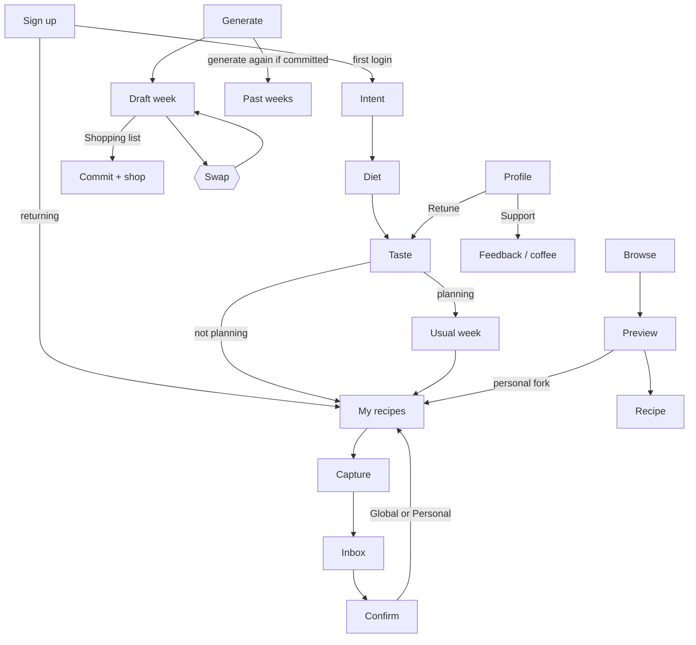

# Design — Recipe Box

> **v1.6 — Proto freeze (2026-08-16).** Rewritten from `Prototype-v2.html` after the product owner said the click-through is more or less the product. [Architecture](architecture.html) answers how Browse loads, how Generate fills, and which extraction tools run. [Solution-Sketch](sketch.html) through delta #15 still owns entities; this pass records proto-directed drift (link-only share, capture defaults Global, no named-recipient share, no Incoming Shares inbox).
>
> **Prototype of record:** `Prototype-v2.html`. `Prototype-Full.html` is the untouched earlier freeze. Wireframe is historical.
>
> **Not decided here:** `Profile.tasteSignals` as a locked column (still an open sketch question). Hosting lock (Architecture Option A).
>
> **Not invoked:** design-reviewer.

---

## 0. Screen Inventory

| # | Screen | Flow(s) |
|---|---|---|
| S1 | Sign up / Log in | Entry |
| S2 | Onboarding — Intent | Onboarding |
| S2b | Onboarding — Profile (diet) | Onboarding |
| S2c | Onboarding — Taste graph (always last before week, if planning after) | Onboarding |
| S3 | Onboarding — Usual week (only if “Plan weekly meals”) | Onboarding |
| S5 | Capture Entry | Flow 1 |
| S6 | Inbox | Flow 1 |
| S7 | Confirm / Edit Extraction | Flow 1 |
| S8 | My recipes | Hub |
| S9 | Recipe Detail | Flow 2, 4, hub |
| S12 | Browse | Flow 4, 8 |
| S13 | Catalogue Preview | Flow 4, 8 |
| S14 | Generate (This Week setup) | Flow 5 |
| S15 | Plan View | Flow 5, 5b, 7 |
| S16 | Swap / Fill (overlay) | Flow 5 |
| S17 | Shopping List | Flow 6, 6b |
| S19 | Profile & Settings | Support, diet, taste, usual week |

**Removed (not deferred):**
- **S4 Dashboard** — strip on My recipes only (plan / existing list).
- **S10 Visibility & Share Picker** — named “Share with people” is gone. Share is a generated link. Public is the globe.
- **S11 Incoming Shares** — no named-recipient inbox. Opening a recipe link is the receive path.
- **S18 Pantry** — deleted at sketch delta #4.

**Bottom nav:** Browse · My recipes · This Week · Profile. Capture is the FAB on My recipes. Shopping list is reached from This Week (or “Shopping list from recipes” on S8).

**Chrome rule:** no extra icons in the hub header (no cart, no filter). Those belong in the page. Recipe / week / list share is a header share icon that opens a sheet.

---

## 1. User Flows

### Flow 0 — Onboarding
1. Intents (multi-select). Transient — not a Profile “I am a planner” field.
2. Diet: stance (required), frameworks (optional), hard restrictions (optional).
3. Taste graph auto-opens. Continue after enough taps (no “1 of 3” count). Writes liked cuisines from taps. Seeds usual-week seats once from those cuisines.
4. If planning: review usual week (seats + people). If not: skip; seed still exists for later.
5. Land on **empty** My recipes.

Back preserves answers. Taste **resumes**. Retune from Profile always starts fresh.

### Flow 1 — Capture, Extract, Confirm
**Primary entry:** OS share sheet (Android PWA share target / iOS Shortcut). **Fallback:** S5 paste link / screenshot / type name.

1. Billable extracts check `blocked` and the per-user rate window first.
2. Inbox item extracting → ready.
3. Server resolves via `SourceExtraction` cache or a fresh extract (see [Architecture](architecture.html) § Extract).
4. Confirm (S7): dish name, version title, creator, cuisine, tags, yield, ingredients, method, photo. Low-confidence banner is non-blocking.
5. **Save as Global (default) or Personal.** Global is how Browse grows. Personal is the opt-out. Globe on the recipe still publishes later.
6. Browse-add / swap-from-Browse never uses this toggle — those copies are always personal.

### Flow 2 — Publish vs link
- **Globe** (owned original, not already global, not a catalogue fork): publish to Browse. One way. Copies people already took stay.
- **Header share:** unguessable link. Anyone with it can view and add their own copy. That is not Browse.
- Same sheet for a collection, this week, and the shopping list (week-linked list shares the plan link).

### Flow 4 — Add from Browse
1. Browse home or search → preview.
2. Cook without saving, or **+** / Add to my recipes → **personal fork**. Never “open it to make it global.”
3. Increments source `box_add_count`. Like is only on global / Browse.

### Flow 5 — Generate week
1. S14: this week’s shape (seats + people). Switches: Save on groceries · Use recipes that aren’t mine. Surprise is a seat. Collection is a seat. One value per tag/ingredient seat.
2. Generate fills Meal 1…N from My recipes (catalogue only if mix-in is on). Unfilled seats: pick from Browse or from my recipes — not capture.
3. Result is a **draft**. Swap freely. No shopping list yet. Generate again **replaces** the draft (no archive).
4. **Shopping list** commits the week. Swaps after that rebuild the list.
5. Generate again after a commit: prior week archives to Past weeks with **no lecture**.

### Flow 6 — Shopping list
Plan-derived (commit) or ad hoc from “Shopping list from recipes” on S8. Quantities merged and scaled. Aisle groups inferred at display. Back + share.

### Flow 7 — Cook marks
Optional cooked / skip / loved on the meal card only. No strip nudge. No generate quiz.

### Flow 8 — Like
Heart only on recipes that are in Browse. A private Box copy has no audience.

### Flow 9 — Collections
Personal playlists. Book shortcut on cards. On the recipe: labelled row + Add. Tap a collection, sheet closes. From Browse, book forks personal first.

### Flow 10 — Support
Profile top: Feedback (one box, Send closes) · Buy me a coffee (quiet).

---

## 2. How Browse / Discover loads (product)

Browse home is not “the whole catalogue dumped into the page.”

**First paint (no search):**
1. App asks the server for a **home payload**: Trending (recent likes, last 7 days), Popular (bias-aware engagement), and the cuisine tab list derived from what is actually in the catalogue.
2. Those two lists are **already short** (about 8 each in the proto). Cards are a 3-up grid, not a sideways rail.
3. **For you / Discover** is a lens on that home payload, using `cuisines_liked` from the taste graph:
   - For you = recipes whose cuisine is in liked (parent includes children).
   - Discover = recipes whose cuisine is **not** in liked.
   - No liked cuisines yet → both lenses show the unfiltered rails.
4. Cuisine tabs filter the same home set. Ingredient field filters by name contains.
5. Search is a **different request**. Results group by dish name; every version of that food is shown.

Nothing on Profile is a second “explore cuisine” list. Discover *is* explore.

**Empty / sparse:** if a lens + cuisine + ingredient combo has nothing, say so and let them clear a filter. Do not invent recipes.

---

## 3. How the week is generated (product)

Generate is a **slot fill**, not an LLM writing a menu.

1. Expand this week’s shape into Meal 1…N (each seat’s `count` becomes that many meals).
2. Pool = My recipes. If “Use recipes that aren’t mine” is on, also the global catalogue (not the user’s own globals twice).
3. Drop anything that fails hard diet (restrictions + animal stance). Frameworks only tilt rank, they never hide.
4. For each meal, in order:
   - Keep recipes that match the seat (cuisine / tag / ingredient / collection / surprise).
   - Drop recipes already used this week.
   - Drop recipes in the short recency window (recently marked cooked).
   - Surprise: must match liked cuisines (if any) and must **not** already match another named seat in this shape.
   - Rank survivors (below). Take the top one. If none, that meal is **Unfilled**.
5. If Save on groceries is on, later meals prefer recipes that share ingredient names with ones already picked.

**Rank (in order):** skip-marked recipes last; if grocery-saving, more ingredient overlap first; then cook-score (loved > cooked) minus how often this recipe was swapped away.

Unfilled is honest. The user fills from Browse or My recipes. Capture is not the unfilled CTA.

Shopping list is not part of this algorithm. It runs when they tap Shopping list, from the committed (or then-committed) meals, scaled to people.

---

## 4. Screen definitions (delta from v1.5)

### S1
Email continue. Review-only “load demo” is labelled as not onboarding.

### S2 / S2b / S2c / S3
Intent → diet → taste → usual week if planning. Taste Continue has no tap-count. Usual week after taste.

### S5 / S6 / S7
Share-sheet primary. Confirm has Global/Personal, **Global selected**. Adopt-from-Browse helper: personal copy, original stays in Browse.

### S8 — My recipes
Wordmark Recipe Box. Search + wrap chips. **Shopping list from recipes** is a page CTA, not a header cart. Cards 3-up. Globe only on publishable originals. Book = collection. Empty: dark hero, cream Capture, Browse as text.

### S9 — Recipe Detail
Owned: like only if already global; globe if publishable; collection block (label + orange Add); header share = link. Scale is display-only.

### S12 — Browse
Search, wrap suggestion chips, wrap cuisine chips, ingredient field on the page (not a header filter). For you / Discover. Trending + Popular as **3-up grids**. Card: like, +, book.

### S13 — Catalogue Preview
Cook without saving. Add = personal. Collection block may fork first. No “open to make global.”

### S14 — Generate
No regenerate lecture. Always “Generate this week.” View this week if a plan exists. Past weeks quiet.

### S15 — Plan
Meal N · facet. Marks + swap. Primary Shopping list. Quiet New week. Header share opens the **same link sheet** as a recipe (copy actually copies; Share… is the OS sheet). No Close.

### S16 — Swap
My recipes / Browse. Browse fork is always personal.

### S17 — Shopping list
Aisles, amounts, back, share sheet (week-linked = plan URL; ad hoc = list text).

### S19 — Profile
**Support first** (feedback + coffee). Then how you eat, taste + retune, most cooked, usual week, sign out. No “I am here to browse/plan.” No cuisine-like / cuisine-explore chip rows.

---

## 5. Flow diagram

---

## 6. Design decisions (v1.6)

- Capture **defaults Global** so the pool grows; Personal is the opt-out. Catalogue forks stay personal and cannot be re-published.
- Share is **only a link** (or globe). No named people, no Incoming Shares.
- Generate is a **draft** until Shopping list. Then the next generate archives silently.
- Discover is a Browse lens, not a Profile chipset.
- Chips wrap. Recipe cards are a 3-up grid.
- Support lives at the **top** of Profile, quiet, not on hubs.
- Themes/skins are not in this freeze.

---

## 7. Architecture handoff notes

- RLS: owner Box; `visibility=global` readable; share tokens public-by-unguessable-link.
- Browse home is one cheap payload, not a full table scan in the client.
- Generate is deterministic TypeScript in `src/lib/generate` — no LLM in the fill path.
- Extraction is server-only. Tools and failover are in [Architecture](architecture.html).
- Shopping aisle is computed, not stored on ingredients.

---

## 8. Out of scope (V1)

Follow. Pantry inventory. Named-recipient share. Incoming share inbox. Weekday calendar. Per-person menus. Theme shop. LogRocket (PostHog instead). Incoming Plan-Shares screen.

---

*Design v1.6 · 2026-08-16 · Grok · grok-4.6. Awaiting product-owner freeze review; design-reviewer not invoked.*
