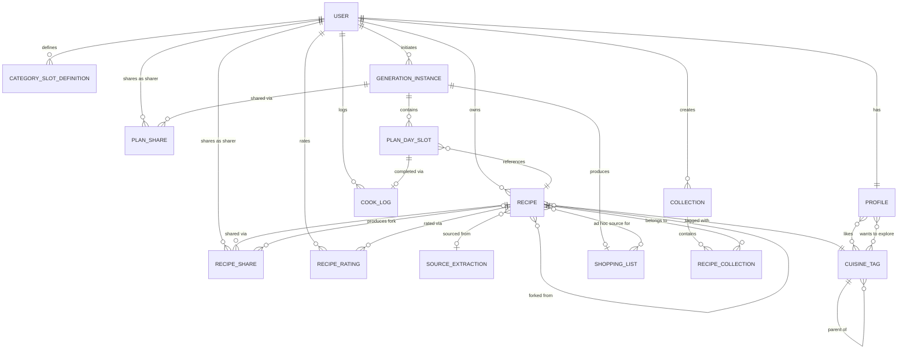

# Solution Sketch — Recipe Box

> Precedes design/architecture. See Challenge-Report for the challenge pass run before this sketch was locked — no blockers found; seven findings resolved as design decisions or documented risks below. This sketch does not re-litigate the PRD's two tracked-forward warnings (global-tier copyright exposure; unvalidated social-video AI-extraction feasibility) — both are owned by roadmap/alpha per [00-Decision-Log](decisions.html).
>
> **Delta pass (2026-08-15, post-7b click-through):** six targeted changes folded in below — explicit meal-count parameter; named-contact participants dropped from `GenerationInstance` in favour of headcount + dietary mix (plan-sharing with specific people stays a separate concept, now modeled as `PlanShare`); Station-mode filters (cuisine, followed cooks, ingredients) added to the catalogue endpoint, promoting `Follow` from P1 to a full V1 entity; shopping-list generation confirmed strictly derived from plan contents plus a new ad hoc (no-plan) path; a required `generation_intent` parameter added to plan generation; and the produce/pantry ingredient split removed entirely — `Recipe.ingredients` is now a flat list, `PantryInventoryItem` is a shopping-list-time matching reference only. Status remains `confirmed` — this is a delta, not a re-open. See [00-Decision-Log](decisions.html) for the source feedback and reasoning.
>
> **Delta pass #2 (2026-08-15, ratings/likes):** one further targeted change — a new `RecipeRating` entity giving each `visibility=global` `Recipe` its own independent like/popularity signal, surfaced in Station mode and search so a user can gauge a recipe before adding a stranger's version to their box. Deliberately a boolean-like, not a star rating, for V1 (see entity definition for the extensibility reasoning). Ratings are per-recipe, not aggregated across a `forked_from_recipe_id` lineage — a published fork starts at zero, same as any new global recipe, consistent with forks being fully independent objects. Status remains `confirmed`. See [00-Decision-Log](decisions.html).
>
> **Delta pass #3 (2026-08-15, Profile taxonomy overhaul):** focused solely on `Profile`. `dietary_preference` (singular) and `cuisine_filters[]` are replaced with: `diet_type` (single-select, mutually exclusive: veg | non_veg | vegan | eggetarian), `dietary_restrictions[]` (multi-select hard-constraint tags — gluten-free, nut-free, dairy-free, etc. — no explore variant, always enforced regardless of generation_intent), `diet_type_explore[]` (optional multi-select of other diet types the user is willing to explore — new field, judgment call, see `Profile` entity), `cuisines_liked_tag_ids[]` and `cuisines_explore_tag_ids[]` (both open/extensible, backed by a new lightweight reference entity `CuisineTag` rather than a hardcoded enum). `Recipe.cuisine` (free-text) is also converted to `cuisine_tag_id` (FK → `CuisineTag`) as a required side-effect — without a shared reference vocabulary, `cuisines_explore_tag_ids` cannot actually match candidate recipes. `cuisines_explore_tag_ids` (and, secondarily, `diet_type_explore[]`) are wired directly into the `try_something_new` generation-intent branch (Flow 5) and into `GET /api/catalogue`'s new `taste=explore` mode — replacing the prior unweighted "whole global catalogue" fallback with an actual signal. Status remains `confirmed`. See [00-Decision-Log](decisions.html).
>
> **Delta pass #4 (2026-08-15, Pantry Inventory removed entirely):** the `PantryInventoryItem` entity is deleted — no separate reference list, no auto-matching against the shopping list. User feedback from click-through found the concept confusing. `ShoppingList` items no longer carry a `pantry_match` flag; each item now has a single manual `checked` boolean, set directly by the user per list instance, with no persistence or matching logic beyond that instance. This mooted the delta-1/6b `pantry_match`-is-fuzzy-and-imprecise risk entirely (there is no more matching logic to be imprecise) — noted as resolved, not carried forward. No other entity, flow, or endpoint changes. Status remains `confirmed`. See [00-Decision-Log](decisions.html).
>
> **Delta pass #5 (2026-08-15, image support — reopened post-confirmation for a scoped gap fix):** direct inspection found neither `Recipe` nor `SourceExtraction` had any image field, despite PRD.md's own design principles (line 396) already assuming every recipe card shows an image/thumbnail — a data-model/PRD mismatch confirmed by the product owner, who also confirmed images are fundamentally important to this product. Fix: added `Recipe.image_url` (nullable, owner-editable, forked as an independent copy not a live reference) and `SourceExtraction.extracted_image_url` (nullable, cached/reused same as other extracted fields); extended the Flow 1 extraction chain to resolve an image per path (schema.org `image` property, `og:image` meta tag for the LLM-text-fallback path, video thumbnail/oEmbed for the social-video path, the already-stored screenshot for the screenshot-capture path); updated the `POST /api/inbox/capture`, `GET /api/inbox/:id`, and `POST /api/recipes/:inboxId/confirm` contracts accordingly; broadened the existing "Object storage" integration row rather than adding a new integration. LLM/vision-based "pick the best image" is explicitly out of scope for V1 (metadata-only resolution) — see Structural Risks. Manual "type name now" entries have no auto-extracted image; the resulting manual-upload affordance at Confirm is flagged for design-agent, not designed here. Surgical, additive change only — no other entity, flow, or endpoint touched. Status remains `confirmed`. See [00-Decision-Log](decisions.html).
>
> **Delta pass #6 (2026-08-16, Collections — reopened post-confirmation for a scoped gap fix):** product owner's 7c click-through flagged that Box's only organization is automatic `cuisine_tag_id` grouping — no user-created organization exists, directly hitting PRD.md Persona 2's ("Recipe Collector") top pain point, "bookmark graveyard" (PRD Section 5.1). Fix: two new entities, `Collection` (id, owner_user_id, name, created_at, updated_at — owner-scoped only, never shared/visible to other users regardless of member recipes' own `visibility`) and `RecipeCollection` (recipe_id, collection_id, added_at — many-to-many join, unique on `(recipe_id, collection_id)`); a recipe can belong to zero or more collections, independent of and additive to its single `cuisine_tag_id`. Four new endpoints (`POST`/`GET /api/collections`, `POST /api/recipes/:id/collections`, `DELETE /api/recipes/:id/collections/:collectionId`) plus one added beyond the original ask (`DELETE /api/collections/:id`, needed to give the `Collection` entity a concrete deletion path per its own "Deleted/archived" field — see judgment call in the entity definition) and a new `collection_id` filter param on the Box-listing read (`GET /api/recipes`, formalized as an explicit contract row for the first time — it previously existed only as an implicit "Box view reads Recipe" reference). Deliberately minimal: no nesting, no collection-level sharing/visibility, no rename endpoint in V1, no new integration/service. **Terminology note, not a reversal:** this is unrelated to Open Question #1's earlier resolution ("collection" = the whole Box, no sub-collections) — that question was specifically about *sharing* the entire Box as one unit and remains resolved as-is; this delta's `Collection` entity is a distinct, newly introduced, purely personal-organization construct that happens to reuse the English word "collection." Flagged explicitly in Open Questions below so the two aren't conflated by a future reader. Fork-on-receipt model, visibility rules, generation logic, and `CategorySlotDefinition` untouched. Status remains `confirmed`. See [00-Decision-Log](decisions.html).
>
> **Delta pass #7 (2026-08-16, mobile OS share-sheet capture promoted to primary — entry points only, no new entities):** PRD.md was already revised directly by the orchestrator (2026-08-16 delta, Section 1/7.2) to make mobile OS share-sheet capture **P0, the primary capture path** — the product owner rejected copy-paste-link as workable primary-capture UX, directly, twice ("I myself won't copy paste links into this, too much of friction"). This sketch implements that already-made decision; it does not re-derive it (see [00-Decision-Log](decisions.html), 2026-08-16 row). Platform split, documented honestly rather than glossed as parity: **Android** gets a true native share-target via the PWA Web Share Target API — a `share_target` entry in the web app manifest plus a service-worker/route that receives the shared URL/text and feeds it into the existing `POST /api/inbox/capture` flow with `{type:"url", url}` — no new capture logic, only a new entry point ahead of the existing ones. **iOS** cannot register a plain installed PWA as a Share Sheet target; the V1 answer is a distributable **iOS Shortcut** — a one-time user setup (install a provided Shortcut, shown in Capture/Onboarding) that appears in iOS's native share sheet and performs a "Get Contents of URL" `POST` directly to the same capture endpoint. Paste-link/screenshot/manual entry remain exactly as already documented in Flow 1 — now explicitly labeled **fallback** entry points (desktop, or before a user has set up the iOS Shortcut), not primary. **No entity, field, schema, or endpoint-shape change** — confirmed explicitly below (API Contracts), not silently assumed: `POST /api/inbox/capture`'s existing `{type, url?, image?, name?}` contract already covers all three entry points identically. This delta is about *where* a capture originates, not what capture *data* looks like — extraction logic, visibility, the fork model, and everything else already locked by delta passes #1–#6 are untouched. Status remains `confirmed`. See [00-Decision-Log](decisions.html).
>
> **Delta pass #8 (2026-08-16, extraction confidence + rate limiting/manual block — two complementary, orthogonal trust/safety mechanisms, fully spec'd via product-owner/Grok-refinement discussion, implemented here, not re-derived):** two independent additions, both deliberately lightweight and consistent with PRD 13.2's existing "no moderation queue for V1" decision — this pass complements that decision, it does not reopen it. **Part 1 — extraction confidence.** Wires up the previously-unused `SourceExtraction.raw_confidence` field as a deterministic **field-checklist score** — real/non-placeholder title, 4+ non-filler ingredient lines, instructions longer than a trivial one-liner, enough source text/audio actually came back — rather than a raw self-reported LLM confidence value; schema.org-parsed extractions start scored higher by construction (structured markup is inherently reliable in shape), LLM/OCR-based extractions start lower. This is a deliberate rejection of the naive "ask the LLM how sure it is" approach — self-reported LLM confidence is poorly calibrated — and any such signal is used only as a tie-break, never the primary signal. New `SourceExtraction.confidence_reason` names *why* a score is low, not just that it is. New `Recipe.needs_care` (boolean, defaulted from the source extraction's low-confidence flag at Confirm time) is cleared **only** when the user edits and saves `ingredients` and/or `instructions` specifically — not by any other field edit (a title fix does not clear it). At Confirm (S7), a non-blocking banner surfaces `confidence_reason` when `raw_confidence` is below a cutoff — **the exact cutoff is explicitly not hardcoded here**; it must be calibrated empirically against real alpha extraction data so the banner stays unusual, not routine (a naive fixed threshold risks flagging most video-sourced extractions, training users to ignore it entirely — see Open Questions). At the Global-visibility checkpoint (S10 / Flow 2), a still-`needs_care=true` recipe shows the same flag again with stakes-appropriate copy and a one-tap "Publish anyway" path (never a hard block); publishing anyway writes new field `Recipe.user_confirmed_low_confidence=true` — a self-reported signal, explicitly **not** a moderation action. That signal is wired into `GET /api/catalogue`'s `sort=popularity`/Trending/Popular ranking to deprioritize (never remove, never queue for review) such recipes by default — closing the exact "stored but never wired up" gap this pass exists to fix for `raw_confidence` in the first place. **Part 2 — rate limiting + manual block (orthogonal mechanism, unrelated data model).** Billable-action-only rate limiting — paste-link extraction, screenshot OCR, share-sheet-triggered extraction, explicit re-extraction; explicitly **not** manual "type name now" entry, editing/saving, generating a plan, or browsing — via a per-user (never per-IP) rolling window, checked *before* extraction runs so a rejection never incurs LLM/OCR cost. The rejection response on `POST /api/inbox/capture` always includes the current count and reset time (e.g. "8 of 8 extracts this hour, resets 6:40"), with no attempt to distinguish accidental from deliberate overuse — volume-based protection doesn't need to know intent. New `User.blocked` (boolean, default false) is a **manual kill switch, not automated detection** — checked at new-extraction, setting visibility to Global, and outbound sharing (recipe or plan share); a blocked user keeps full access to everything else (Box, cooking/Recipe Detail, This Week/Generate, Shopping List, Profile) — a narrow, deliberate scope, not account suspension. No admin UI, no auto-detection, no moderation queue in either part, consistent with PRD 13.2. Since there's no built admin surface, flipping `User.blocked` in V1 is documented here as a concrete, direct-database-write runbook step (see Structural Risks) — an undocumented manual mechanism is not usable in the moment it's actually needed. No fork model, visibility-tier, generation-logic, or other locked-piece changes. Status remains `confirmed`. See [00-Decision-Log](decisions.html).
>
> **Delta pass #9 (2026-08-16, `PlanShare` redefined as a link-based share — reopened post-confirmation for a scoped, product-owner-directed correction, `PlanShare`-only):** product owner tried the prototype's "Share this plan" action and rejected the internal, named-recipient model `PlanShare` had been given at 7b delta change 2 (recipient must be a Recipe Box user, in-app share/accept flow) — direct feedback: this should be a plain shareable link, copied and sent via WhatsApp/iMessage/email/whatever, viewable without a Recipe Box account. `PlanShare` is redefined accordingly: a generated, unguessable `share_token` per plan (`id, plan_id, share_token, created_at, revoked_at`) — no `recipient_user_id`, no `recipient_contact_identifier`, no `status`/accept-ignore lifecycle, since there's no "recipient" to model once anyone holding the link can view. New/changed endpoints: `POST /api/plans/:id/share` (owner-only, creates-or-returns the plan's active share + its shareable URL, idempotent), `GET /api/shared-plan/:token` (**public, unauthenticated**, read-only plan + shopping-list view — a deliberate, narrow exception to this sketch's otherwise-universal owner/participant-scoped RLS rule, see Structural Risks), `DELETE /api/plans/:id/share` (owner-only, revokes — sets `revoked_at`, invalidating the link immediately). `GET /api/plan-shares/incoming`, `POST /api/plan-shares/:id/accept`, and `POST /api/plan-shares/:id/ignore` are removed entirely — there is no incoming-plan-shares inbox or accept/ignore step anymore. **Deliberately asymmetric with `RecipeShare`, which is untouched by this pass:** a shared Recipe becomes a permanent, owned, forkable part of someone's Box — a real asset worth an account + targeted accept flow + fork-on-receipt; a shared Plan is ephemeral and informational ("here's what I'm cooking this week") — nobody owns or forks a plan, so a lightweight, unauthenticated, link-based view fits its actual nature far better than borrowing `RecipeShare`'s heavier model. Downstream consequence for Design.md, flagged here but not applied in this pass: the previously deferred "Incoming Plan-Shares screen" item (Design.md's Out of Scope, mirroring `RecipeShare`'s S11) no longer exists under this model and should be **removed** from that list in a follow-up Design.md pass, not eventually built — there is no accept/ignore step or persistent inbox entry left to build a screen for. Status remains `confirmed`. See [00-Decision-Log](decisions.html).
>
> **Delta pass #10 (2026-08-16, creator attribution + bias-aware engagement signal — two related, explicitly scoped additions to `SourceExtraction`/`Recipe`, fully additive, no new entities):** **Part 1 — creator attribution.** Product owner's own example, direct: Sanjyot Kher's Pav Bhaji and Ranveer Brar's Paneer Lababdar need to read as two distinguishable dish-grouped-search entries, not indistinguishable "Pav Bhaji" clones — the model had no field for the real-world content creator at all, only `owner_user_id` (the Recipe Box account that happened to capture it) and raw `source_urls[]`. New nullable `SourceExtraction.creator_name` / `Recipe.creator_name`, resolved per extraction path exactly like `extracted_image_url` (delta pass #5's precedent — schema.org `author`, a cheap `<meta name="author">` pull for the non-schema.org path, oEmbed `author_name` for social video, null for screenshot/manual), copied to `Recipe` at Confirm, independently owner-editable after, forked as an independent snapshot like every other forked field. `GET /api/catalogue`'s search now matches `creator_name` too, and dish-grouped search cards display it — wired explicitly into the response/display contract below, not left stored-but-unused (the exact `raw_confidence` mistake delta pass #8 existed to fix). **One pre-existing documentation gap surfaced and minimally closed here, not invented by this pass:** "dish-grouped search" (e.g. "Sambar — 3 versions") shipped in `Prototype-Full.html`'s 7c build (see 00-Handoff, 2026-08-15 first 7c build entry) but was never formalized in this sketch — a new paragraph in Flow 4 below formalizes only as much of it as is needed to hang `creator_name` and the Part 2 ranking requirement on; the fuller Station/Browse screen-level spec remains queued documentation debt in `00-Status.md`, not resolved here. **Part 2 — engagement signal, bias-aware by explicit design.** Product owner wants dish-grouped/catalogue results to factor in engagement ("likes and shares or other engagement metrics"), but raised a sharp, correct concern directly: a pure in-app-engagement sort is rich-get-richer — a genuinely excellent recipe (e.g. sourced from a hugely popular YouTube video) captured only yesterday will always lose to an older, merely-more-exposed one, even if it's objectively better. New `Recipe.box_add_count` (denormalized, one-way, default 0, never decremented — a historical adoption count, not a live "currently in N boxes" count) as the in-app "shares" proxy, deliberately chosen over tracking raw share-actions directly: raw share-tracking would (a) expose private sharing behaviour between specific people, a privacy problem, and (b) be a worse quality signal anyway — one recipe forwarded once to fifty people and fifty independent adoptions look identical as share-events but are very different signals, and adoption count is the one that actually reflects that difference. Increments only on organic-discovery adoption (add-to-box from Browse/catalogue preview, or swap-in-from-Browse), never on accepting a targeted `RecipeShare` — a private 1:1 share to one named person isn't a discovery signal and folding it in would both muddy the metric and leak who-shared-with-whom into a ranking surface, the same privacy posture already applied to rejecting raw share-tracking. New nullable `SourceExtraction`/`Recipe` fields `external_rating_value` / `external_rating_count` / `external_engagement_count`, captured cheaply at extraction time (schema.org `aggregateRating`, video/oEmbed view-or-like count) specifically to fight cold-start for a just-captured recipe with real external quality signal — stored raw and separate per source type, deliberately **not** blended into one fabricated normalized cross-platform score: a 5-star blog rating, a millions-view YouTube count, and an Instagram like count are not comparable on one scale, and manufacturing fake precision to blend them would be worse than storing them raw (blending, if it ever happens, is a ranking-layer concern, not a data-model one). `GET /api/catalogue`'s dish-grouped and Popular/Trending ranking gains an explicit **requirement**, deliberately not a formula: cumulative in-app counters alone must never be the sole sort key; external signal must be able to make a low-in-app-engagement recipe rank competitively rather than being buried at zero; and some new-item exposure-fairness mechanism must exist so a recently-added recipe still gets baseline visibility rather than being permanently buried by early movers (same spirit as the prototype's existing Trending rail's recency-weighting — see 00-Handoff — extended here as an explicit sketch-level requirement rather than left assumed). Exact weighting/algorithm is explicitly deferred to architecture/tuning against real alpha usage data — stated plainly as needing empirical calibration, same posture as delta pass #8's confidence-cutoff, not a guessed-at formula dressed up as validated. **Explicitly scoped out, matching the product owner's own stated boundaries:** no `Creator` entity, no profile/verification/follow mechanism — plain attribution string only, not a `Follow` revival (parked, unrelated, in the nutritionist-marketplace V3 idea); no literal per-share-action tracking (rejected above, with reasoning); no fabricated cross-platform normalized external score. No other entity, flow, fork model, visibility tier, or generation-logic piece touched. Status remains `confirmed`. See [00-Decision-Log](decisions.html).

> **Delta pass #11 (2026-08-16, tag-suggestion extraction — closes a scoped gap in Flow 1, additive, no new entity):** direct inspection confirmed `Recipe.cuisine_tag_id`, `dietary_tags[]`, `effort`, and `cook_time_minutes` are the one category of extractable field that was never wired into the extraction pipeline at all — unlike title, ingredients, instructions, image (delta #5), creator name, and external ratings (delta #10), all of which are pulled automatically, pre-filled at Confirm, and user-correctable, these four have started blank on every single capture since the sketch was first written, requiring full manual tagging every time. Product owner, direct: this was never an intentional exclusion, it was simply missed, and should follow the exact same "extract what's cheap, suggest it, let the user correct it" pattern already established for everything else in this flow. **Fix, fully additive, `Recipe` schema unchanged:** four new nullable `SourceExtraction` fields — `suggested_cuisine_tag_id` (FK → CuisineTag), `suggested_dietary_tags[]` (same restriction vocabulary as `Profile.dietary_restrictions[]`), `suggested_effort` (same vocabulary as `Recipe.effort`), `suggested_cook_time_minutes` (int) — resolved per capture path in Flow 1 and pre-filled as editable defaults on `Recipe.cuisine_tag_id`/`dietary_tags[]`/`effort`/`cook_time_minutes` at Confirm (S7), same UX pattern as every other pre-filled-but-editable Confirm field. **Resolution, per path, same "cheap metadata pull, no new AI cost" framing established by delta pass #5/#10:** schema.org path — `recipeCuisine`/`recipeCategory` maps/normalizes against `CuisineTag`'s existing auto-create-on-use vocabulary (no new matching mechanism) for `suggested_cuisine_tag_id`; `cookTime`/`totalTime`/`prepTime` (ISO 8601 duration) for `suggested_cook_time_minutes`; no schema.org field maps cleanly to `effort`, so it stays null on this path — not forced, no cost either way. **Non-schema.org LLM-text-fallback and social-video paths — the one genuinely new (small) cost in this pass:** the same LLM call already extracting ingredients/instructions is extended to also return suggested cuisine, effort, and a cook-time estimate as additional fields in its structured-output schema — a marginal cost increase on an already-happening call, explicitly not a new call, consistent with how this pipeline has framed cost throughout. **Dietary tags, all paths where ingredients were extracted (including screenshot, if OCR succeeded):** inferred from the already-extracted ingredient list itself (no meat/fish/poultry → vegetarian-compatible; no animal products at all → vegan-compatible; no gluten-containing staples → gluten-free-compatible) as a deterministic post-processing step on already-extracted data, not a new LLM call. **Screenshot path (no OCR success) and manual "type name now" path:** get nothing, same as every other extracted field on those paths. **Critical distinction, stated explicitly per product-owner direction and this sketch's own established precedent for `dietary_restrictions[]` (delta #3):** `suggested_dietary_tags[]` — and the `Recipe.dietary_tags[]` it pre-fills — are recipe-tagging *suggestions*, corrigible at Confirm and after, exactly like every other pre-filled field. They are structurally unrelated to, and must never be confused with, `Profile.dietary_restrictions[]`'s role as a hard, user-declared, always-enforced safety/allergen filter (Flow 5, `GET /api/catalogue` — untouched by this pass). Nothing safety-critical rests on a `suggested_dietary_tags[]` inference being correct; a wrong inference at worst mistags one recipe in one user's own Box, corrected the same way a wrong title or image would be — it never relaxes, overrides, or is read by the `dietary_restrictions[]` enforcement path anywhere in generation or Station. Fully additive: no fork model, visibility, generation-logic, or `Profile.dietary_restrictions[]` change; no new entity, no new endpoint (existing Confirm/inbox-draft contracts gain fields, not new rows). Status remains `confirmed`. See [00-Decision-Log](decisions.html).

> **Delta pass #15 (2026-08-16, Generate-shape freeze from `Prototype-v2.html` click-through — product-owner-directed):** the shape **is** the week. Meal count is the sum of bucket seats — no second stepper, no cycle-to-fill. `facet_type` gains `collection` (fill from a named `Collection`) and `surprise` (wildcard seat filled from liked + explore cuisines and other Profile filters; never punches through `mix_in_browse`). `try_something_new` generation intent is **removed** — Surprise seats are that job. `generation_intent` collapses to a boolean `save_on_groceries` (default false). `mix_in_browse` stays a labelled on/off (default false): off = Box only; on = leftover seats may borrow from the global catalogue. `headcount` lives on the shape (usual week = `Profile.household_size`; this week copies it). Onboarding S3 / Profile S19 edit the **usual week** only (seats + people). Grocery-saving and mix-in stay This-Week-only. A plan is an ordered list of meals (`Meal 1…N`), not a calendar week — no weekday packing. Regenerating **archives** the prior `GenerationInstance` (`status=archived`); no quiz gate; unmarked meals stay unmarked. Cook ritual is optional per meal (`cooked` / `skip` / `loved`); no in-week nudge; no week-level rating. `CookLog` + swap-away feed ranking (most-played / skip). Shopping list items gain `amount` (merged, scaled to headcount) and display `aisle` (inferred at list time from the ingredient name — Produce, Herbs & aromatics, Dairy, Meat, Pulses, Spices, Oils, Other — **not** a recipe-authoring tag, delta #4 stands). Plan-derived list has back + share; not a dead end. Status stays `confirmed`. See [00-Decision-Log](decisions.html) and [Design](design.html).
>
> **Delta pass #14 (2026-08-16, 7c reconciliation — five prototype-shipped model changes made official, product-owner-directed via the large consolidated 7c pass and queued as Status items (b)/(f)):** five related corrections that shipped in `Prototype-Full.html` / `Prototype-v2.html` and were deliberately left unofficial until this pass. Status stays `confirmed`. **(1) Flexible skeleton buckets replace `CategorySlotDefinition`'s `{label, mode}` shape.** Fields become `facet_type` (enum: `cuisine | tag | ingredient`), `facet_value` (string; FK → `CuisineTag` when `facet_type=cuisine`, otherwise free text), `count` (int — a weighted bucket, e.g. "North Indian × 2", not one row per slot). `display_order` kept. `PlanDaySlot` snapshots `{facet_type, facet_value}` instead of a single `category_label`. Flow 5 expands each bucket (`facet_value` repeated `count` times) then cycles/truncates that list to exactly `meal_count` — the same cycle-to-fill edge case the old model already had, applied to the new shape. Default onboarding seed is five mixed buckets (South Indian ×2, North Indian ×2, legumes tag ×1, Italian ×1, salad tag ×1), not a straight re-numbering of the old seven labels. **(2) `Follow` is removed from V1.** Entity, ERD edges, `POST`/`DELETE /api/follows`, and `GET /api/catalogue`'s `followed_cooks` param are deleted. Personalization is by cuisine / ingredients / cook time / health / diet — not by cooks or channels (Instagram/YouTube already own that). Cook names remain as `creator_name` attribution only. **(3) `RecipeRating` like-gate reversed.** Any authenticated user may like/unlike any `visibility=global` recipe; owning a fork is no longer required. The earlier "used, not bookmarked" gate trained users to treat a missing/disabled heart as a bug, and Browse is a discovery surface where liking *before* committing is the natural action. `visibility=global` remains the only write gate. **(4) `GenerationInstance.mode` (`playlist | station`) replaced by `mix_in_browse` (boolean, default false).** Generate always sources from the initiator's own Box; mixing unverified global recipes onto a real day is an explicit opt-in, never the default. `try_something_new`'s catalogue-broadening is likewise gated behind `mix_in_browse`. A manual Swap pick from Browse is a different trust situation (user-initiated, visible) and stays always available. **(5) `Recipe.servings` added** (int, default 4, owner-editable, forked as an independent snapshot) — the base count serving-size scaling scales *from*. Plan shopping lists scale each slotted recipe against `GenerationInstance.headcount`; the per-recipe Serves stepper is display-only and does not persist an override back into the list. **Not decided in this pass:** whether `Profile.tasteSignals` (soft ingredient/health/cook-time/meal-style counts from the taste-graph) becomes a locked Profile field — left as an open question, same posture as Status item (h). Fork model, visibility tiers, `dietary_restrictions[]`, and delta passes #9–#13 are untouched. See [00-Decision-Log](decisions.html) and 00-Handoff.
>
> **Delta pass #12 (2026-08-16, two related taxonomy-granularity fixes — diet-type split + CuisineTag hierarchy — folded into one pass):** two independent, product-owner-directed corrections to taxonomy fields locked in earlier delta passes (`diet_type` and the flat `CuisineTag` list, both from delta pass #3), fixing granularity problems the product owner identified directly — corrections, not redesigns. **Part 1 — `Profile.diet_type` (single-select, delta pass #3) was wrong on two counts and is replaced with two independent multi-select axes.** First, it conflated animal-product stance (vegetarian/non-veg/vegan/eggetarian/pescatarian) with diet framework/style (paleo, keto, Mediterranean, low-carb, whole30, halal, kosher, flexitarian) — these combine freely (a non-vegetarian eater can also be keto), so cramming both into one mutually-exclusive enum was a modeling error, not a UI limitation. Second, even within animal-product stance alone, single-select behaved wrong: a non-vegetarian eater regularly eats vegetarian meals too, so selecting `non_vegetarian` should be *inclusive* (meat is also fine, vegetarian recipes still show), never *exclusive* (only meat) — while `vegetarian`/`vegan` genuinely are exclusionary. The two ends of the same axis behave asymmetrically, which a single mutually-exclusive value could never express. Fixed by splitting `diet_type` into `Profile.diet_animal_stance[]` (multi-select, open/extensible, starter vocabulary: vegetarian, non_vegetarian, vegan, eggetarian, pescatarian, auto-create-on-use for anything else — same open-vocabulary spirit `CuisineTag` already uses, see judgment calls below for why it isn't backed by an identical reference table) and `Profile.diet_frameworks[]` (multi-select, open/extensible, starter vocabulary: paleo, keto, mediterranean, low_carb, whole30, halal, kosher, flexitarian, high_protein) — two structurally different signals with two structurally different filter strengths (see the new "Filtering behavior" note under `Profile` below), not two flavors of the same thing. `diet_type_explore[]` existed from the same delta pass #3 and gets the identical split treatment for consistency, per this pass's own instruction not to leave an asymmetric explore model — `diet_animal_stance_explore[]` and `diet_frameworks_explore[]`, both feeding `taste=explore`/`try_something_new` exactly as `diet_type_explore[]` did. `diet_type`/`diet_type_explore[]` are removed entirely; every live reference across the document (`Profile` entity, Flow 4, Flow 5, `GET /api/catalogue`, the RLS/constraint-check sections) is updated in place below. Historical delta-pass banners (#3 and others, above) that describe the now-superseded `diet_type` model are deliberately left as-is — this sketch's established convention preserves change history in dated banners rather than retroactively rewriting them (the same convention already applied to `PantryInventoryItem` at delta pass #4). **Part 2 — `CuisineTag` (flat, delta pass #3) can't express real sub-regional granularity.** Product owner's own examples: "Chinese" collapses Szechuan/Hakka/Cantonese into one indistinguishable tag; "South Indian" collapses Chettinad/Andhra/Malabar/Udupi the same way — and this is the identical underlying cause as the near-duplicate-drift risk this sketch already documented at delta pass #3 (e.g., is "Tamil" the same tag as "South Indian"?). A two-level hierarchy fixes both problems with one field: `parent_cuisine_tag_id` (nullable, self-referential FK → `CuisineTag.id`) — a broad parent (Chinese, South Indian, Italian, Mexican) with optional sub-cuisine children (Szechuan/Hakka/Cantonese under Chinese; Chettinad/Andhra/Malabar/Udupi under South Indian). Deliberately two levels only, not deeper — the self-referential FK naturally supports more levels later if it's ever needed, but this pass only exercises parent+child. `Recipe.cuisine_tag_id` can point to either level — a user tags with whatever granularity they actually know, broad if unsure, specific if known. Auto-create-on-use defaults a brand-new tag to top-level/parent unless a user is explicitly creating it as a sub-cuisine — no forced parent-classification friction on every new tag, that's real friction on the single most common taxonomy action in the product. `GET /api/catalogue` filtering by a parent tag now aggregates its children (filtering "South Indian" includes Chettinad-tagged recipes, stated as an explicit requirement, not left ambiguous); filtering by a specific child returns only that child, not siblings or the parent's own directly-tagged recipes. Honestly documented, not oversold: this mitigates the near-duplicate-drift risk (ambiguous regional terms now have a real place to nest) but doesn't eliminate it — a determined or unaware user can still create a near-duplicate parent instead of correctly nesting under an existing one, and no admin merge/dedup/rename tooling exists in V1, unchanged from delta pass #3 and explicitly out of scope for this pass too. **Explicitly out of scope for both parts, per this pass's own boundary:** deeper-than-two-level cuisine nesting; any admin curation tooling (merge/rename/re-parent UI); any change to `dietary_restrictions[]`'s role, fork model, visibility, or generation logic beyond the filtering-step updates described. Status remains `confirmed`. See [00-Decision-Log](decisions.html).

## Core Entities


*(2026-08-15 delta: removed `USER }o--o{ GENERATION_INSTANCE : "participates in"` — no more named-contact participants, see `GenerationInstance` below. Added `PLAN_SHARE`, `FOLLOW`, and the ad hoc `RECIPE`↔`SHOPPING_LIST` link.)*
*(2026-08-15 delta #2: added `RECIPE_RATING`, see `Recipe`/`RecipeRating` below.)*
*(2026-08-15 delta #3: added `CUISINE_TAG` — a shared, extensible reference table backing both `Profile.cuisines_liked_tag_ids`/`cuisines_explore_tag_ids` and `Recipe.cuisine_tag_id` (converted from free-text). See `Profile`/`CuisineTag`/`Recipe` below.)*
*(2026-08-15 delta #4: removed `USER ||--o{ PANTRY_INVENTORY_ITEM : has` and the `PantryInventoryItem` entity entirely — no separate pantry reference list, no auto-matching. See `ShoppingList` below.)*
*(2026-08-16 delta #6: added `COLLECTION` and the `RECIPE_COLLECTION` join — user-named, owner-scoped organizational grouping, additive to `Recipe.cuisine_tag_id`, never shared. See `Collection`/`RecipeCollection` below.)*
*(2026-08-16 delta #9: `PlanShare` redefined as a link/token-based share — no recipient identity, so no `USER`↔`PLAN_SHARE` "recipient" edge ever existed in this ERD to remove; the two relationships shown (`USER` creates it, `GENERATION_INSTANCE` is shared via it) are unchanged in shape, only the entity's own fields changed. See `PlanShare` below.)*
*(2026-08-16 delta #10: no ERD relationship changes — `creator_name`/`box_add_count`/`external_rating_value`/`external_rating_count`/`external_engagement_count` are new fields on the existing `SOURCE_EXTRACTION`/`RECIPE` nodes, not new entities or edges. See `SourceExtraction`/`Recipe` below.)*
*(2026-08-16 delta #11: no ERD relationship changes — `suggested_cuisine_tag_id`/`suggested_dietary_tags[]`/`suggested_effort`/`suggested_cook_time_minutes` are new nullable fields on the existing `SOURCE_EXTRACTION` node only; `Recipe.cuisine_tag_id`/`dietary_tags[]`/`effort`/`cook_time_minutes` already existed as fields, unchanged in shape — this pass wires extraction into them, it doesn't add columns to `Recipe`. See `SourceExtraction`/`Recipe` below.)*
*(2026-08-16 delta #12: added self-referential `CUISINE_TAG ||--o{ CUISINE_TAG : "parent of"` — a two-level parent/child hierarchy on the existing `CUISINE_TAG` node via a new `parent_cuisine_tag_id` field, no new entity. `Profile.diet_type`/`diet_type_explore[]` split into `diet_animal_stance[]`/`diet_animal_stance_explore[]`/`diet_frameworks[]`/`diet_frameworks_explore[]` — plain field changes on the existing `PROFILE` node, not new entities or edges, so no ERD relationship change for Part 1. See `CuisineTag`/`Profile` below.)*
*(2026-08-16 delta #13: no ERD relationship changes — `dietary_mix` was a plain field on the existing `GENERATION_INSTANCE` node, not a new entity or edge; removed entirely, no replacement structure added. `headcount` is unchanged in shape, now explicitly decoupled from any dietary meaning. See `GenerationInstance` below.)*
*(2026-08-16 delta #14: removed both `USER ||--o{ FOLLOW` edges — `Follow` entity deleted from V1. `CategorySlotDefinition` field shape changed on the existing node (no new entity). `GenerationInstance.mode` replaced by `mix_in_browse` (plain field on the existing node). `Recipe.servings` added (plain field on the existing `RECIPE` node). See `CategorySlotDefinition` / `Follow` / `GenerationInstance` / `Recipe` / `RecipeRating` below.)*

### Entity Definitions

```
Entity: User
Purpose: An account holder — one independent Recipe Box per user, no group entity.
Key fields: id, email/auth_identity, created_at, blocked (boolean, default false — manual trust/safety kill switch, delta pass #8, 2026-08-16; see Structural Risks for exact scope and the operational flip mechanism)
Created when: signup (auth flow)
Read by: everything, directly or via ownership; `POST /api/inbox/capture`, `PATCH /api/recipes/:id/visibility` (global), `POST /api/recipes/:id/share`, `POST /api/plans/:id/share` all check `blocked` at the start of the request (delta pass #8)
Updated by: profile edits, auth provider; `blocked` is toggled only via a direct database write in V1 — no admin UI exists to flip it (see Structural Risks, "Manual block operational mechanism")
Deleted/archived: soft-delete only (owned Recipes, shares, plans reference it)
```

```
Entity: Profile
Purpose: Per-user taste/planning settings applied to browsing, generation, shopping lists. Taxonomy overhauled 2026-08-15 delta #3 — replaces the earlier singular `dietary_preference` + `cuisine_filters[]` with an open, multi-select, like/explore-split model (see 00-Project-Context "Personal profile" paragraph, authoritative for intent). Diet taxonomy split further, delta pass #12, 2026-08-16 — `diet_type` (single-select) replaced with two independent multi-select axes, see Key fields and "Filtering behavior" below.
Key fields:
  - user_id (FK, 1:1)
  - diet_animal_stance[] (multi-select, open/extensible vocabulary — same auto-create-on-use spirit as `CuisineTag`, starter set: vegetarian, non_vegetarian, vegan, eggetarian, pescatarian, auto-create-on-use for anything else — new field, delta pass #12, 2026-08-16, replaces the single-select `diet_type`) — the user's own animal-product eating stance(s). Filter strength depends on which value(s) are selected, not uniform — see "Filtering behavior" below; `vegetarian`/`vegan` are hard-excludes on par with `dietary_restrictions[]`, `non_vegetarian` is inclusive/non-restrictive, `pescatarian`/`eggetarian` apply their own specific inclusion rule. Multi-select is a union-of-allowed-stances model (OR, not AND) — selecting `vegetarian` + `pescatarian` together means "anything vegetarian-compatible OR pescatarian-compatible," consistent with how `cuisines_liked_tag_ids[]` already behaves as an OR-matched filter elsewhere in this sketch.
  - diet_animal_stance_explore[] (optional multi-select, same vocabulary as `diet_animal_stance[]` — new field, delta pass #12, replaces `diet_type_explore[]`) — additional animal-product stances the user is willing to explore beyond their liked stance(s), e.g. a non_vegetarian profile marking vegan; feeds `taste=explore`/`try_something_new` exactly as `diet_type_explore[]` did, broadening (never narrowing) the effective allow-set for explore-mode candidate filtering.
  - diet_frameworks[] (multi-select, open/extensible vocabulary — same auto-create-on-use spirit as `CuisineTag`, starter set: paleo, keto, mediterranean, low_carb, whole30, halal, kosher, flexitarian, high_protein — new field, delta pass #12) — an independent secondary preference/weighting signal, **never a hard exclude**. Combines freely with any `diet_animal_stance[]` selection (e.g. non_vegetarian + keto is a completely ordinary combination, not a conflict). Recipes matching a selected framework are weighted up in candidate ranking/generation, never removed from the pool for not matching — same "signal, not gate" category as `cuisines_liked_tag_ids[]`'s normal-mode weighting, deliberately not the same filter strength as `dietary_restrictions[]`/`diet_animal_stance[]`'s hard-exclude values — stated explicitly so a future implementer doesn't accidentally treat a framework preference as a hard filter (see "Filtering behavior" below).
  - diet_frameworks_explore[] (optional multi-select, same vocabulary as `diet_frameworks[]` — new field, delta pass #12) — additional frameworks the user is willing to explore; feeds `taste=explore`/`try_something_new` as an additional weighting input, same non-hard-exclude posture as `diet_frameworks[]` itself.
  - dietary_restrictions[] (multi-select constraint tags: gluten_free, nut_free, dairy_free, etc. — curated tag list, not a fully open taxonomy like cuisines, since the restriction vocabulary is domain-bounded) — hard constraints, always enforced in every mode including Station and try_something_new; no explore variant (see judgment call below); untouched by delta pass #12
  - cuisines_liked_tag_ids[] (FK[] → CuisineTag — may reference either a parent or a child/sub-cuisine tag as of delta pass #12's two-level hierarchy, see `CuisineTag` below) — feeds normal filtering everywhere (Playlist mode, search, category slots, default Station browse); "liking" a parent is a reasonable broad-preference signal, distinct from liking one specific child
  - cuisines_explore_tag_ids[] (FK[] → CuisineTag — likewise may reference either level, delta pass #12) — the "want to try" set; feeds the try_something_new generation intent (Flow 5) and Station's discovery/`taste=explore` surface (GET /api/catalogue)
  - meal_planning_style, household_size (captured now, used for V2 quantity scaling), recency_exclude_weeks (configurable, default N)
Created when: onboarding
Read by: Generate Plan (all three generation_intent branches — Playlist and Station), Station browse (GET /api/catalogue, both taste=liked default and taste=explore), Swap/find-similar
Updated by: user, anytime via profile settings
Deleted/archived: cascades with User

Judgment calls (delta #3):
- **`dietary_restrictions[]` gets no explore variant.** Restrictions represent hard constraints/allergens (nut-free, gluten-free), not taste preferences — there is no safe reading of "willing to explore nuts" for someone who listed nut-free as a restriction. `try_something_new` broadens cuisine (and, as of delta pass #12, animal-stance/framework) exposure, but restrictions are filtered identically in every generation_intent and every mode, no exceptions.
- **`diet_type_explore[]` (superseded by delta pass #12's split into `diet_animal_stance_explore[]`/`diet_frameworks_explore[]`, see the new "Judgment calls (delta pass #12)" block below)** was added, not in the original field list, but directly implemented the task's own example at the time ("willing to explore vegan for a non-vegan") and matched 00-Project-Context's statement that "both dietary tags and cuisines carry a like/explore split." Kept separate from `dietary_restrictions[]` specifically because diet type was a taste/lifestyle choice (explorable) while restrictions are constraints (not explorable) — that distinction still holds, and is preserved by delta pass #12's split.
- **Cuisines are backed by a reference table (`CuisineTag`), not a hardcoded enum or free strings**, per the task's explicit instruction — avoids both an artificially finite dropdown and free-text drift ("Indian" vs "indian" vs "North Indian") that would silently break matching against `Recipe.cuisine_tag_id` in generation.

Judgment calls (delta pass #12, 2026-08-16):
- **`diet_type` conflated two structurally different signals — animal-product stance and diet framework/style — into one mutually-exclusive enum.** These combine freely in reality (a non-vegetarian eater can also be keto), so a single-select enum covering both was a modeling error, not a UX limitation; splitting into `diet_animal_stance[]`/`diet_frameworks[]` fixes the conflation directly rather than patching around it.
- **`non_vegetarian` is inclusive by design, not exclusive.** A non-vegetarian eater regularly eats vegetarian meals too — selecting `non_vegetarian` must never hide vegetarian (or pescatarian/eggetarian/vegan) recipes. This is why `diet_animal_stance[]` uses OR/union semantics across its selected values rather than intersecting them: the moment `non_vegetarian` is one of the selected values, the axis contributes no exclusion at all (see "Filtering behavior" below).
- **`diet_animal_stance[]`/`diet_frameworks[]` do not get a dedicated backing reference table the way `CuisineTag` does, and this is a deliberate asymmetry, not an oversight.** `CuisineTag` exists specifically because `Recipe.cuisine_tag_id` is a real FK target that `Profile.cuisines_explore_tag_ids[]` must referentially match against — a shared vocabulary was structurally required. `diet_animal_stance[]`/`diet_frameworks[]` have no equivalent `Recipe`-side FK column to match against; filtering reuses the same tag/ingredient-based mechanism `dietary_restrictions[]` hard-filtering already relies on (including `Recipe.dietary_tags[]`'s delta-pass-#11 ingredient-inferred `vegetarian_compatible`/`vegan_compatible`-style entries as one input signal) — this pass introduces no new matching mechanism, only new user-side values that feed into the existing one. Both fields remain "open/extensible" in the sense the task requires — free values beyond the starter set are accepted, no hardcoded closed enum — just without a dedicated FK-backed table, since nothing on the `Recipe` side needs referential integrity against them the way cuisine tagging does.
- **`diet_type_explore[]` is split the same way as `diet_type` itself, for consistency — not left as a single unsplit explore field bolted onto two now-independent axes.** `diet_animal_stance_explore[]`/`diet_frameworks_explore[]` mirror `cuisines_explore_tag_ids[]`'s established pattern exactly: broaden, never narrow, the effective candidate pool under `taste=explore`/`try_something_new`.

Filtering behavior (delta pass #12, 2026-08-16 — stated explicitly here since it's asymmetric by design, not left to be inferred from field names):
- `dietary_restrictions[]` is untouched by this pass — remains the single hard, always-enforced, highest-priority filter, identical in every mode and every `generation_intent`, exactly as delta pass #3 defined it.
- `diet_animal_stance[]` — a union-of-allowed-stances hard filter, same enforcement strength as `dietary_restrictions[]` for its restrictive values, computed as: `vegetarian` present → hard-exclude meat/poultry/fish (vegetarian-incompatible ingredients); `vegan` present → hard-exclude all animal products (a superset exclusion of `vegetarian`'s); `pescatarian` present → hard-exclude meat/poultry, allow fish + everything vegetarian-compatible; `eggetarian` present → hard-exclude meat/poultry/fish, allow eggs + everything vegetarian-compatible; `non_vegetarian` present → contributes no exclusion — and critically, if `non_vegetarian` is present **alongside** any of the above, the union is fully permissive (the axis excludes nothing), since a value that "never hides vegetarian recipes" by definition can't be intersected against a value that does. Multiple restrictive values with no `non_vegetarian` present (e.g. `vegetarian` + `pescatarian`) union their individual allow-sets — a candidate recipe passes if it satisfies *any* selected stance's rule, not all of them. An empty `diet_animal_stance[]` (user selected nothing) behaves identically to a `non_vegetarian`-only selection — no exclusion from this axis — worth noting for onboarding UX: skipping this question doesn't accidentally exclude a user from anything.
- `diet_frameworks[]` — never a hard exclude, always a ranking/weighting input only. A candidate recipe that doesn't match any selected framework is still eligible, just not weighted up for it.
- `diet_animal_stance_explore[]`/`diet_frameworks_explore[]` — read only under `taste=explore`/`try_something_new`; broaden the liked-set's effective allow-set (animal stance) or weighting-set (frameworks) for that mode, exactly mirroring how `cuisines_explore_tag_ids[]` already broadens cuisine candidates in explore mode. Never read, never applied, in the default `taste=liked` mode or in `balanced`/`save_on_groceries` generation intents.

**Onboarding UX implication (delta pass #12, not designed here):** the onboarding diet question previously asked one single-select animal-stance question (`diet_type`); `diet_type_explore[]` had no dedicated onboarding UI at all under delta pass #3 and, per the 7c large consolidated pass, cuisine/diet explore questions were already dropped from onboarding entirely and left to be set later via Profile & Settings or organically via Browse's Discover lens. This pass turns the core question into two independent multi-select questions (`diet_animal_stance[]` and `diet_frameworks[]`), which likely wants grouped multi-select chip sections (e.g. "How do you eat?" then "Any dietary style you follow?") rather than a single radio list — but the exact screen layout, whether `diet_frameworks[]` appears at onboarding at all versus Profile-only, and copy are all Design.md/S2b decisions, not made here. Flagged as an addition to the existing S2b reconciliation-debt item in `00-Status.md`, not a new standalone item.
```

```
Entity: CuisineTag
Purpose: Lightweight, extensible, shared reference list of cuisine values, now with an optional two-level parent/sub-cuisine hierarchy (delta pass #12, 2026-08-16 — see "Cuisine hierarchy" note below). Backs `Profile.cuisines_liked_tag_ids`/`cuisines_explore_tag_ids` and `Recipe.cuisine_tag_id` (converted from free-text delta pass #3) — a single shared vocabulary is what makes cuisines_explore_tag_ids → try_something_new matching actually work, not just store-and-ignore.
Key fields: id, name (display), slug (normalized, unique — lowercased, whitespace-collapsed), parent_cuisine_tag_id (nullable, self-referential FK → CuisineTag.id — new field, delta pass #12; null = this tag is top-level/parent, e.g. "Chinese," "South Indian"; set = this tag is a sub-cuisine nested one level under that parent, e.g. "Szechuan" under "Chinese," "Chettinad" under "South Indian." Two levels only, enforced at the application layer — the self-referential FK technically supports arbitrary depth, but this pass deliberately exercises only parent+child, not deeper), created_by_user_id (nullable — null for system-seeded rows), created_at
Created when: system seed (a starter batch of common cuisines, seeded via migration alongside the other fixed vocab per Structural Risks — delta pass #12 extends this starter batch to include a reasonable set of parent cuisines with a few sub-cuisine children each for the most granular ones, at minimum Chinese and South/North Indian regional styles per the product owner's own examples — a seeding requirement, not seed SQL, described here) OR auto-create-on-use — the first time any user types a cuisine name not already in the list (in Profile setup or Recipe tagging), insert-if-not-exists on the normalized slug, same UX pattern as a freeform tag input. **Delta pass #12:** a newly auto-created tag defaults to top-level (`parent_cuisine_tag_id = null`) unless the user is explicitly creating it as a sub-cuisine of an existing parent (a nesting-aware creation UI/UX decision, flagged for design-agent, not designed here) — this pass deliberately does not force every new-tag creation to classify a parent, since that would be real friction on the single most common taxonomy action in the product.
Read by: Profile edit (cuisine picker/autocomplete for liked + explore, either level), Recipe cuisine tagging (either level — a user tags with whatever granularity they actually know), Station catalogue filter/matching (`GET /api/catalogue` `cuisine`/`taste` params — delta pass #12 adds parent-includes-children aggregation, see "Cuisine hierarchy" note below), Generate Plan slot-fill (try_something_new branch)
Updated by: `name`/`slug` not updated in V1 (renaming risks silently breaking existing matches; a future admin dedup/merge tool is out of scope for V1, unaffected by this pass). **`parent_cuisine_tag_id` (delta pass #12) is set at creation time only in this pass — no endpoint exists in V1 to re-parent an already-created tag after the fact.** Re-parenting an existing top-level tag under a parent as a later data-quality curation step is a named future direction (see "Cuisine hierarchy" note below), not a V1 deliverable — consistent with this pass's explicit exclusion of admin curation tooling.
Deleted/archived: never deleted in V1 — orphaned tags are harmless, same treatment as SourceExtraction. A deleted parent orphaning its children is a moot concern in V1 specifically because no delete path exists for `CuisineTag` at all, at either level.

Cuisine hierarchy (delta pass #12, 2026-08-16): two levels only — a broad parent (Chinese, South Indian, Italian, Mexican) with optional sub-cuisine children (Szechuan/Hakka/Cantonese under Chinese; Chettinad/Andhra/Malabar/Udupi under South Indian) — not deeper. The self-referential FK naturally supports more levels later if ever needed, but this pass only exercises two. **Recipe tagging:** `Recipe.cuisine_tag_id` can point to either a parent or a child tag — a user picks whichever granularity they actually know (broad if unsure, specific if known); neither level is more "correct" than the other. **Browsing/filtering aggregation, stated explicitly as a `GET /api/catalogue` requirement, not left ambiguous:** filtering or browsing by a parent cuisine tag (e.g. "South Indian") must include recipes tagged with any of its children (e.g. "Chettinad") — a straightforward parent-OR-any-child aggregation, not a truncated/representative subset. Filtering by a specific child tag shows only that child's recipes — sibling sub-cuisines and the parent's own directly-tagged recipes are not included. The same aggregation rule applies wherever a `Profile.cuisines_liked_tag_ids[]`/`cuisines_explore_tag_ids[]` entry is itself a parent-level tag (see `Profile` above) — "liking" a parent is a reasonable broad-preference signal, distinct from liking one specific child. **Honesty about the mitigation, not an elimination claim:** this pass mitigates, but does not eliminate, the near-duplicate-drift risk already documented at delta pass #3 (e.g., "Tamil" vs. "South Indian") — ambiguous regional terms now have a real place to nest, but a determined or unaware user can still create a near-duplicate top-level parent instead of correctly nesting it under an existing one, since no admin merge/dedup/rename tooling exists in V1 (unchanged from delta pass #3, explicitly out of scope for this pass too — see the delta pass #12 banner above).
```

```
Entity: CategorySlotDefinition
Purpose: User-defined **usual-week** buckets. The standing seed Generate copies. Delta pass #15: the expanded seat list **is** the plan — no cycle-to-fill against a separate `meal_count`.
Key fields: id, owner_user_id, facet_type (enum: cuisine | tag | ingredient | collection | surprise — `collection` and `surprise` added delta #15), facet_value (string — FK → CuisineTag when cuisine; collection name when collection; ignored/"Surprise" when surprise; otherwise free text), collection_id (nullable FK → Collection, required when facet_type=collection), count (int ≥ 1 — how many meals this bucket contributes, 1:1 with seats), display_order
Created when: onboarding (seeded with a suggested default template — see Challenge 6 and the default-seed note below) or added later by the user
Read by: Generate Plan
Updated by: user
Deleted/archived: hard-delete (no downstream FK — PlanDaySlot snapshots {facet_type, facet_value}, not a live FK, so historical plans are unaffected by later bucket edits/deletes)

Default onboarding seed (delta pass #15): South Indian × 2, North Indian × 2, legumes × 1, Italian × 1, Surprise × 1. Silently seeded when S3 is skipped. Household people default 2 (`Profile.household_size`).

Judgment call (delta pass #14): `mode` (fixed_pick | randomised) is dropped rather than kept unused. Under the bucket model every filled slot is a pick from the matching candidate pool — "fixed" vs "randomised" was never a user-facing control in the 7c prototype and had no remaining product meaning once buckets carry a count. Carrying a dead field would misdescribe the entity.
```

```
Entity: SourceExtraction
Purpose: URL-keyed cache of AI-extracted structured recipe data. Visibility-agnostic by design (Challenge 4) — never exposes who has extracted a URL, only the extracted content itself is reused.
Key fields: id, normalized_source_url (unique), extracted_ingredients (flat list, no produce/pantry split — confirmed 2026-08-15, see Recipe entity below, 7b delta change 6), extracted_instructions, extracted_image_url (nullable string — image resolved by the extraction pipeline; see Flow 1 for the per-path resolution chain and image delta, 2026-08-15), extraction_method (schema | llm_text | llm_video_audio), raw_confidence (int/float — a deterministic field-checklist score, wired up this delta pass #8, 2026-08-16; previously stored but unused everywhere, the exact bug this pass exists to fix), confidence_reason (nullable enum/string, extensible — e.g. `thin_ingredients | no_method | weak_source | insufficient_source_material`; new field, delta pass #8, names *why* raw_confidence is low, not just that it is), creator_name (nullable string — the real-world content creator/author, e.g. "Sanjyot Kher"; resolved per capture path same as `extracted_image_url`, new field, delta pass #10, 2026-08-16, see Flow 1), external_rating_value (nullable decimal — schema.org `aggregateRating.ratingValue` when the source page has it, new field, delta pass #10), external_rating_count (nullable int — schema.org `aggregateRating.ratingCount`/`reviewCount`, new field, delta pass #10), external_engagement_count (nullable int — video/oEmbed view count or like count, whichever the platform's oEmbed response exposes, social-video path only, new field, delta pass #10), suggested_cuisine_tag_id (nullable FK → CuisineTag — new field, delta pass #11, 2026-08-16, see "Tag-suggestion resolution" below), suggested_dietary_tags[] (nullable array, same restriction vocabulary as `Profile.dietary_restrictions[]` — new field, delta pass #11), suggested_effort (nullable, same vocabulary as `Recipe.effort` — new field, delta pass #11), suggested_cook_time_minutes (nullable int — new field, delta pass #11), hit_count, created_at
Created when: first capture of a given source URL by any user
Read by: Capture/Confirm flow (for reuse on subsequent captures of the same URL, including `extracted_image_url`, `raw_confidence`, `confidence_reason`, delta pass #10's `creator_name`/`external_rating_value`/`external_rating_count`/`external_engagement_count`, and, delta pass #11, `suggested_cuisine_tag_id`/`suggested_dietary_tags[]`/`suggested_effort`/`suggested_cook_time_minutes`); `Recipe.needs_care` derivation at Confirm time (delta pass #8, see Flow 1)
Updated by: not updated after creation in V1 (a re-extraction creates a new row if the source content changes materially — no versioning in V1)
Deleted/archived: never deleted (cache); orphaned rows are harmless

Creator/external-signal resolution (delta pass #10, 2026-08-16): resolved per capture path, same "cheap metadata pull, no new AI cost" framing already established for `extracted_image_url` (delta pass #5) — never a new LLM call, never invented if the source genuinely doesn't expose it. **schema.org path:** `author` property (string, or `.name` if a Person/Organization object) for `creator_name`; `aggregateRating.ratingValue`/`ratingCount` for the two external-rating fields — all part of the same existing parse step, no new integration. **Non-schema.org LLM-text-fallback path:** a `<meta name="author">` tag pull for `creator_name` (cheap metadata, no AI cost, same fallback tier as `og:image`); no reliable cheap equivalent exists for external ratings on a page with no structured markup, so both rating fields stay null on this path — not attempted, not guessed. **Social video path:** the platform's oEmbed `author_name` field for `creator_name`; oEmbed view-count-or-like-count (whichever the platform's response exposes) for `external_engagement_count` — same cheap-metadata framing as the video-thumbnail image resolution. **Screenshot capture / manual "type name now" paths:** no source page/metadata exists to pull any of these four fields from — all stay null, same as `extracted_image_url` on these two paths.

Tag-suggestion resolution (delta pass #11, 2026-08-16): closes the one category of extractable field that was never wired into the extraction pipeline at all — resolved per capture path, same "cheap metadata pull, no new AI cost" framing as `extracted_image_url`/`creator_name` above, with exactly one deliberate exception called out below. **schema.org path:** `recipeCuisine`/`recipeCategory` mapped/normalized against `CuisineTag`'s existing auto-create-on-use vocabulary (same normalized-slug insert-if-not-exists mechanism already documented on `CuisineTag`, no new matching logic — delta pass #12, 2026-08-16: this mechanism now inherits `CuisineTag`'s two-level hierarchy automatically, e.g. a raw value of "Szechuan" matches/creates a child tag if one exists, "Chinese" matches/creates the parent; no separate handling needed, since it's the same insert-if-not-exists mechanism at whatever tag level the raw text resolves to) → `suggested_cuisine_tag_id`; `cookTime`/`totalTime`/`prepTime` (ISO 8601 duration, standard schema.org format, parsed to minutes) → `suggested_cook_time_minutes`; no schema.org field maps cleanly to `effort`, so `suggested_effort` stays null on this path — not forced, no cost either way, same as external ratings staying null on the LLM-text-fallback path above. **Non-schema.org LLM-text-fallback and social-video paths — the one genuinely new (small) cost in this whole pass:** the same LLM call already extracting ingredients/instructions is extended to also return a suggested cuisine, effort, and cook-time estimate as additional fields in its structured-output schema — a marginal cost increase on an already-happening call, explicitly **not** a new/separate LLM call, consistent with how this pipeline has framed cost at every step (schema.org first, LLM only as fallback, never a speculative extra call). **Dietary tags, all paths where ingredients were extracted (schema.org, LLM-text-fallback, social-video, and screenshot if OCR succeeded):** `suggested_dietary_tags[]` is inferred from the already-extracted ingredient list itself via a deterministic keyword-matching post-processing step — no meat/fish/poultry keywords present → vegetarian-compatible; no animal-product keywords at all → vegan-compatible; no gluten-containing-staple keywords → gluten-free-compatible — not a new LLM call, runs on data already in hand. **Screenshot path with failed OCR, and manual "type name now" entry:** no source text exists to infer anything from — all four suggested fields stay null, same treatment as every other extracted field on these two paths.

Confidence scoring (delta pass #8, 2026-08-16): `raw_confidence` is computed as a deterministic field-checklist score, not a raw self-reported LLM confidence value — a deliberate rejection of the naive "ask the LLM how sure it is" approach, since self-reported LLM confidence is well-documented as poorly calibrated. The checklist, evaluated after extraction regardless of method: (1) has a real title — non-empty, non-placeholder; (2) has 4+ ingredient lines that aren't just filler ("n/a", "to taste" alone, etc.); (3) instructions exceed a trivial one-liner (not just "watch the video"); (4) enough source text/audio actually came back to work with in the first place. Starting point differs by `extraction_method`: schema.org-parsed extractions start scored higher by construction (structured markup is inherently reliable in shape, before the checklist even runs); `llm_text`/`llm_video_audio`/OCR-based extractions start lower, since they're reconstructing structure from unstructured input. Any confidence signal the extraction call itself self-reports is used only as a tie-break between otherwise-equal checklist scores — never as the primary signal, documented explicitly here so it isn't silently reintroduced as the real scoring mechanism later. `confidence_reason` names the specific checklist failure(s) driving a low score (extensible, not a fixed closed set) so the UI can say what's actually thin, not just flag a vague "low confidence."
```

```
Entity: Recipe
Purpose: A single user's box entry — the "track in their playlist." Independent copy once forked; never shared/merged after creation.
Key fields: id, owner_user_id, title, source_urls[] (each with its own note), overall_note, ingredients[] (flat list, no produce/pantry tag — 7b delta change 6, revises the earlier produce/pantry split), instructions, servings (int, default 4 — the base count this recipe's ingredient amounts are written for; new field, delta pass #14, 2026-08-16; owner-editable, forked as an independent snapshot; see serving-size note below), cuisine_tag_id (FK → CuisineTag — converted from a free-text `cuisine` field this delta #3, so it shares one vocabulary with Profile.cuisines_liked_tag_ids/cuisines_explore_tag_ids and can actually be matched against them in generation; delta pass #12, 2026-08-16: may point to either a parent or a child/sub-cuisine `CuisineTag` row — see `CuisineTag`'s "Cuisine hierarchy" note for the parent-includes-children aggregation rule this implies for browsing/filtering), dietary_tags[] (same restriction vocabulary as Profile.dietary_restrictions[] — gluten_free, nut_free, dairy_free, etc.), effort, cook_time_minutes, visibility (private | shared | global), source_extraction_id (nullable FK), forked_from_recipe_id (nullable, self-referential — retained for traceability per Challenge 7, not used for merge logic), like_count (int, default 0 — denormalized counter, meaningful only while visibility=global, see RecipeRating below), image_url (nullable string, points to object storage — the recipe's display photo; image-support delta, 2026-08-15, see Flow 1 for how it's populated), needs_care (boolean, default false — set true at Confirm time when the source `SourceExtraction.raw_confidence` was below the calibrated cutoff; delta pass #8, 2026-08-16, see clearing-rule judgment call below), user_confirmed_low_confidence (boolean, default false — set true only via the Global-visibility "Publish anyway" acknowledgment path while `needs_care=true`; delta pass #8, a self-reported signal, not a moderation action, see Flow 2 and the ranking wiring in `GET /api/catalogue`), creator_name (nullable string — the real-world content creator/author, e.g. "Sanjyot Kher," distinct from `owner_user_id`; new field, delta pass #10, 2026-08-16, copied from `SourceExtraction.creator_name` at Confirm, owner-editable after, forked as an independent snapshot — see judgment call below), box_add_count (int, default 0 — denormalized, one-way, never-decremented in-app "adoption" counter, meaningful only while visibility=global; new field, delta pass #10, see judgment call below), external_rating_value (nullable decimal), external_rating_count (nullable int), external_engagement_count (nullable int) (all three: copied from the source `SourceExtraction` at Confirm, system-write-only, not owner-editable; new fields, delta pass #10, see judgment call below), created_at, updated_at
Created when: Confirm/Edit/Discard step (fresh capture) OR fork-on-receipt (accepted share / added from catalogue / swap-in-from-Browse) — a fresh fork always starts with like_count=0 and box_add_count=0, regardless of the values on the recipe it was forked from (neither counter is ever aggregated across a forked_from_recipe_id lineage — see RecipeRating, and the box_add_count judgment call below). `image_url` is set at Confirm time from the extraction pipeline's resolved image (`SourceExtraction.extracted_image_url`, or the stored screenshot itself for the screenshot-capture path), or left null for manual "type name now" entries with no extracted source. `needs_care` is set at the same Confirm write, derived from the source `SourceExtraction`'s low-confidence flag (delta pass #8) — a fresh fork inherits `needs_care=false`/`user_confirmed_low_confidence=false` regardless of the source recipe's values, same "independent copy, not a live reference" rule as every other forked field. `creator_name`/`external_rating_value`/`external_rating_count`/`external_engagement_count` (delta pass #10) are likewise set at the same Confirm write, copied from the source `SourceExtraction`, and likewise re-snapshotted independently (not live-referenced) on every fork — same rule as `image_url`. **`cuisine_tag_id`/`dietary_tags[]`/`effort`/`cook_time_minutes` (delta pass #11, 2026-08-16) are pre-filled at the same Confirm write from the source `SourceExtraction`'s `suggested_cuisine_tag_id`/`suggested_dietary_tags[]`/`suggested_effort`/`suggested_cook_time_minutes` — editable defaults, not locked, same UX pattern as every other pre-filled Confirm field (title, image, creator name). If no suggestion was resolved for a given field on a given path (see `SourceExtraction`'s "Tag-suggestion resolution"), that `Recipe` field simply starts blank/unset at Confirm, exactly as it did before this pass — this delta is additive only, it never removes the ability to tag manually when nothing was inferred. A fork copies the *already-set* `Recipe` fields from the source recipe (same as title/ingredients), not the source's `SourceExtraction` suggestions directly — no behavior change to forking from this pass.**
Read by: Box view, Generate Plan (Playlist mode), Station browse (if visibility=global), Search, Idea Pool; `GET /api/catalogue`'s `sort=popularity`/Trending/Popular ranking reads `user_confirmed_low_confidence` to deprioritize such recipes by default (delta pass #8), and, delta pass #10, reads `box_add_count`/`external_rating_value`/`external_rating_count`/`external_engagement_count` as bias-aware ranking inputs (see Flow 4, `GET /api/catalogue` contract row, and Structural Risks); `creator_name` is read by dish-grouped search display and by `GET /api/catalogue`'s `query` search match (delta pass #10)
Updated by: owner only (notes, tags, visibility, `image_url`, and, delta pass #10, `creator_name` — a user can correct/add a creator name at any time after Confirm, same ownership rule as any other owner-editable field); like_count and box_add_count are updated transactionally by their respective system write paths (like/unlike endpoints; add-to-box/swap-in-from-Browse fork creation — see Flow 4/Flow 5) — never owner-editable directly, never by anyone else, never by the original if this is a fork; `needs_care` is system-cleared (never directly owner-set) per the exact rule below; `user_confirmed_low_confidence` is system-set only via the Global-visibility acknowledgment path (`PATCH /api/recipes/:id/visibility`), never directly owner-editable; `external_rating_value`/`external_rating_count`/`external_engagement_count` are system-write-only, set only at Confirm/fork time from the source `SourceExtraction` — deliberately **not** owner-editable, unlike `creator_name`/`image_url`, since these are objective external-provenance signals and letting an owner edit them would let them fabricate external validation (see judgment call below)
Deleted/archived: soft-delete recommended (referenced by PlanDaySlot/CookLog history); hard-delete only if never referenced by a plan

Judgment call (image-support delta, 2026-08-15): a forked recipe (fork-on-receipt from an accepted share, or "Add to my box" from the catalogue) copies the source recipe's `image_url` value at fork time as an independent copy, not a live reference — consistent with how every other forked field behaves (title, ingredients, instructions, etc. are all snapshotted, not linked). If the user later replaces their own copy's image, it has no effect on the original recipe's image, and vice versa.

Judgment calls (delta pass #10, 2026-08-16):
- **`creator_name` is a plain, owner-correctable string, not a `Creator` entity.** No profile, no verification, no follow mechanism — deliberately, per explicit product-owner scoping. A user can fix a wrong or missing creator name the same way they can fix a wrong image or title; this is display/attribution metadata, not an identity system.
- **`box_add_count` increments only on organic-discovery adoption — `POST /api/recipes/:id/add-to-box` (Flow 4) and swap-in-from-Browse fork creation (Flow 5) — never on accepting a targeted `RecipeShare` (Flow 3).** A private 1:1 share to one named person isn't a discovery/popularity signal; folding it in would both muddy the metric (a friend accepting a direct share says nothing about a stranger's independent judgment of quality) and leak who-shared-with-whom into a ranking surface, the same privacy posture behind rejecting raw share-action tracking in the first place (see the delta pass #10 banner above). Structurally, both counted triggers only ever fire on `visibility=global` recipes (Flow 4's catalogue query and Flow 5's Browse-sourced swap candidates are both already scoped to `visibility=global`), so no separate visibility check is needed on the increment path itself.
- **`box_add_count` is never decremented — it is explicitly a historical adoption count, not a live "currently in N boxes" count.** A user removing a forked recipe from their own Box later does not reduce the count on the source recipe. This is a deliberate simplification: tracking true current membership would require reference-counting every downstream fork's lifecycle, adding real complexity for a signal whose whole purpose is "how many people have found this worth taking," which remains true even if some of them later tidy up their own Box.
- **`external_rating_value`/`external_rating_count`/`external_engagement_count` are stored raw and separate, never blended into one normalized score, and are never owner-editable.** Both are deliberate: blending a 5-star blog rating, a millions-view YouTube count, and an Instagram like count into one fabricated "external score" would manufacture false precision the source data doesn't support (see the delta pass #10 banner); making them owner-editable would let a user fabricate external validation for their own recipe, undermining the entire reason these fields exist as a trust signal.

Judgment call (delta pass #11, 2026-08-16): **`Recipe.dietary_tags[]` remains owner-editable after Confirm, exactly as it already was — this pass only changes what it's pre-filled with, never its write rules.** No new field, no new lock state. The critical distinction is conceptual, not structural: `dietary_tags[]` (pre-fillable from `suggested_dietary_tags[]`, corrigible, never enforced anywhere) is a display/organization tag on the recipe itself, while `Profile.dietary_restrictions[]` (delta pass #3) is a separate, hard, user-declared constraint always enforced in generation and Station filtering — the two are never read from each other, and a `suggested_dietary_tags[]` inference being wrong has zero safety implication, unlike a `dietary_restrictions[]` misconfiguration. Stated explicitly here because the two fields sit one property-name away from each other and a future reader (or implementer) could otherwise conflate a *suggestion* with an *enforcement* mechanism — exactly the adjacency the product owner flagged directly when scoping this pass.

Clearing rule for `needs_care` (delta pass #8, 2026-08-16 — exact, deliberate behaviour, not "any edit clears it"): `needs_care` is cleared to `false` if and only if the user edits **and saves** `ingredients` and/or `instructions` — the actual risky fields, the ones the confidence checklist itself is checking. Editing and saving any other field alone (title, notes, tags, cuisine, image, cook time, servings, etc.) does **not** clear it, even though it's a real edit to the recipe. Rationale: `needs_care` exists to flag "the substance of this recipe might be thin or wrong," and only a change to the substance (ingredients/instructions) is evidence the user actually looked at and fixed the thing the flag is about — a title fix says nothing about whether the ingredient list is still missing half its lines.

Serving-size scaling (delta pass #14, 2026-08-16): `servings` is the base count the written amounts assume (default 4). Display scaling (Recipe Detail's Serves stepper) is proportional against this base for parseable leading amounts; freeform amounts ("a lime-sized ball", "salt to taste") stay unscaled and are labelled as such — never guessed. A generated plan's shopping list scales each slotted recipe against `GenerationInstance.headcount`, not against the per-recipe stepper; the stepper is display-only and does not persist an override back into the list. Ad hoc shopping lists (no plan) use each recipe's own `servings`. A fork copies `servings` as an independent snapshot, same as every other forked field.
```

```
Entity: RecipeRating
Purpose: One user's like/rating signal on a global Recipe — the popularity/quality indicator surfaced in Station mode and search so a browser can gauge a recipe before adding a stranger's version to their own box (ratings/likes delta, 2026-08-15). Deliberately a boolean-like for V1, not a 5-star review — but modeled with a numeric `value` field (rather than a bare bool) specifically so it extends to a star scale later with a column-constraint change, not a schema migration.
Key fields: id, recipe_id (FK → Recipe; must be visibility=global at write time, enforced in the API route, not a DB constraint — visibility can change after the fact), user_id (FK, the rater), value (int, V1 constrained to exactly 1 = "liked" at the app layer; reserved as int, not bool, for the future 1–5 extension), created_at, updated_at (reserved, unused in V1 since value never changes — see Updated by)
Created when: user taps "like" on a global recipe (see "Who can rate" reasoning below)
Read by: Recipe detail (caller's own has_liked state, plus the recipe's like_count), Station catalogue query (sort/filter by popularity via Recipe.like_count), Search
Updated by: not updated in V1 — a rating is create-or-delete only (toggle), never edited in place; retraction is a hard delete, not a value change
Deleted/archived: hard-delete on unlike/retract; unique constraint on (recipe_id, user_id) makes like/unlike a clean toggle with no duplicate-row risk

Who can rate (judgment call, **reversed delta pass #14, 2026-08-16**): any authenticated user may like/unlike any `visibility=global` recipe. Owning a forked copy is no longer required. The 2026-08-15 "must own a fork" gate shipped, then failed in product-owner hands-on use of Browse: a disabled/muted heart on a discovery surface reads as a bug, and liking *before* committing a stranger's recipe to your Box is the natural "gauge this" action the entity was created to support. The "used, not bookmarked" trust bar still applies to `CookLog` (a cook ritual after a planned day) — it does not transfer to a catalogue like. Gameability is accepted as the same cold-start / low-stakes risk already documented for `like_count` drift; V1 is a boolean-like on a small beta, not a ranking-critical reputation system. `visibility=global` remains the only write gate (403 if not global).
Retraction: yes — like/unlike is a simple toggle (POST creates, DELETE removes), matching typical like-button UX and requiring no confirmation step. No separate "why did you unlike it" capture in V1.
```

```
Entity: Collection
Purpose: A user-named, private grouping of recipes across cuisines (e.g. "Weeknight Favorites," "Diwali Menu") — user-created organizational metadata layered additively on top of the automatic `cuisine_tag_id` grouping already in Box, directly addressing Persona 2's ("Recipe Collector") top pain point, "bookmark graveyard" (PRD Section 5.1). Collections delta, 2026-08-16. Unrelated to Open Question #1's earlier "collection = whole Box" resolution — see the terminology note in the delta-pass banner above and in Open Questions below.
Key fields: id, owner_user_id (FK), name (string), created_at, updated_at
Created when: user creates a collection explicitly (`POST /api/collections`), or inline while adding a recipe to a not-yet-existing collection (`POST /api/recipes/:id/collections` with `name` instead of `collection_id` — both the `Collection` row and its first `RecipeCollection` membership are written in the same call)
Read by: Box view (collection list/filter/grouping UI), `GET /api/collections`, `GET /api/recipes?collection_id=`
Updated by: not updated in V1 beyond creation — no rename endpoint in this pass; `updated_at` is reserved but unused, same "reserved for later, not wired yet" pattern as `RecipeRating.updated_at`. Deliberate, matches the task's own "no reordering semantics beyond simple membership" scoping — delete-and-recreate is the only path to change a name in V1.
Deleted/archived: hard-delete via `DELETE /api/collections/:id` — cascades to hard-delete all its `RecipeCollection` rows in the same transaction. No orphan risk: a `Collection` is purely a label, never referenced by any other entity (no plan, shopping list, or share ever points at a `Collection` directly).

Judgment call (delta #6): `DELETE /api/collections/:id` was not one of the four endpoints explicitly named in the task, but the entity's own "Deleted/archived" behaviour (removes all its `RecipeCollection` rows) requires a concrete deletion path to exist somewhere — added as the minimal, obvious one, matching the existing `DELETE /api/follows/:id` pattern.
```

```
Entity: RecipeCollection
Purpose: Many-to-many membership join between `Recipe` and `Collection` — a recipe can belong to zero or more collections, independent of and in addition to its single `cuisine_tag_id`. Collections delta, 2026-08-16.
Key fields: recipe_id (FK → Recipe), collection_id (FK → Collection), added_at. Composite unique constraint on (recipe_id, collection_id) — makes "add to collection" a clean idempotent toggle with no duplicate-row risk, same pattern as `RecipeRating`'s unique-on-`(recipe_id, user_id)`.
Created when: `POST /api/recipes/:id/collections` — upserts (idempotent if the recipe is already a member of that collection)
Read by: Box view (grouping/filtering by collection), `GET /api/recipes?collection_id=`, `GET /api/collections` (query-time `recipe_count` per collection — see Structural Risks)
Updated by: never updated — membership is create/delete only, no fields to change beyond existence
Deleted/archived: hard-delete on explicit removal (`DELETE /api/recipes/:id/collections/:collectionId`), or cascade-deleted when the parent `Collection` is deleted, or cascade-deleted when the parent `Recipe` is deleted/removed (a soft-deleted or hard-deleted recipe should not keep showing up inside a live collection's membership list)

Judgment call (delta #6): membership requires the caller to own the target `Recipe` directly (`Recipe.owner_user_id = caller`), not merely be able to view it — a `Collection` is personal organization of "my box," so a user can only file their *own* recipes into their *own* collections, never someone else's global/shared recipe by reference. If a user wants a stranger's catalogue recipe in a collection, they fork it first (`POST /api/recipes/:id/add-to-box`, existing Flow 4). **Delta pass #14 note:** this "must own it to file it" rule is independent of the now-reversed `RecipeRating` like-gate — liking a global recipe no longer requires a fork; filing it in a Collection still does, because a Collection is organization of *your* Box.
```

```
Entity: RecipeShare
Purpose: A targeted share of one recipe to specific people (ad hoc or, later, a saved contact list) — including people who haven't signed up yet.
Key fields: id, recipe_id, shared_by_user_id, recipient_user_id (nullable), recipient_contact_identifier (email/phone, nullable — used until recipient signs up), status (pending | accepted | ignored), created_at, accepted_at, resulting_fork_recipe_id (nullable FK to Recipe)
Created when: user shares a recipe to specific people
Read by: Incoming shares view (recipient), Share history (sharer)
Updated by: recipient (accept/ignore); signup flow (resolves recipient_contact_identifier → recipient_user_id when a matching new account is created)
Deleted/archived: never deleted; ignored shares remain as a record
```

```
Entity: PlanShare
Purpose: An unguessable, revocable share link for a single finished GenerationInstance (plan) — the owner copies/sends a plain URL (WhatsApp, iMessage, email, whatever) and anyone holding it can view the plan's day/recipe view and its shopping list, no Recipe Box account required. Redefined 2026-08-16, delta pass #9, replacing the earlier named-recipient/accept-ignore model (7b delta change 2) after direct product-owner feedback on the prototype's "Share this plan" action. Still separate from `headcount` (below) — the plain integer describing how many people the plan feeds, carrying no dietary meaning of its own as of delta pass #13; still view-only, not fork-on-receipt — a plan isn't forkable the way a Recipe is. **Deliberately narrower/lighter than RecipeShare, an intentional asymmetry, not an oversight (see delta pass #9 banner above):** a shared Recipe becomes a permanent, owned, forkable part of someone's Box — a real asset worth an account + targeted accept flow + fork-on-receipt; a shared Plan is ephemeral and informational ("here's what I'm cooking this week") — nobody owns or forks a plan, so a lightweight, unauthenticated, link-based view fits its nature far better than borrowing RecipeShare's heavier model. RecipeShare itself is untouched by this pass.
Key fields: id, plan_id (FK → GenerationInstance), share_token (string, unique, unguessable — cryptographically random, never sequential/predictable), created_at, revoked_at (nullable — set when the owner revokes; non-null means the token no longer grants access)
Created when: owner requests "Share this plan" (`POST /api/plans/:id/share`) — creates a new active `PlanShare`, or returns the plan's existing active (non-revoked) one if it already has one, so repeated share requests don't spawn duplicate live links
Read by: `GET /api/shared-plan/:token` — the public, unauthenticated route resolving the token to its plan's day/recipe view + shopping list, for anyone holding the link (nothing to check but "does this token exist and is `revoked_at` null" — no recipient identity involved); owner's own plan view, to show whether a share link is currently active so the owner can revoke it
Updated by: owner only — `revoked_at` is set via `DELETE /api/plans/:id/share` (or equivalent), invalidating the link; no other field is ever updated after creation
Deleted/archived: never hard-deleted — revocation (`revoked_at` set) is the only "goes away" mechanism, same "never deleted, keep as record" spirit as RecipeShare/the prior PlanShare model, achieved via a flag rather than a status enum since there's no accept/ignore lifecycle left to track

Judgment call (delta pass #9): no `recipient_user_id`, no `recipient_contact_identifier`, no `status` (pending|accepted|ignored) — there is no "recipient" to model at all under a link-based scheme; anyone with the URL can view, so the entity only needs to track the plan it points to, whether it's still valid, and when it was created. This is a deliberate structural asymmetry from `RecipeShare`, not an oversight — see the Purpose field and the delta pass #9 banner above for the full reasoning (ephemeral/informational share vs. permanent/owned/forkable asset).
```

```
Entity: Follow
REMOVED from V1 (delta pass #14, 2026-08-16). Promoted to a full V1 entity at 7b delta change 3 to power Station's "followed cooks" filter; removed after product-owner hands-on use of the 7c prototype ("I already follow them on Instagram"). Personalization is by cuisine, ingredients, cook time, health, and diet — not by cooks or channels. `creator_name` remains as plain attribution (delta pass #10); there is no follow, no cook profile, no `followed_cooks` catalogue filter. Endpoints `POST /api/follows` and `DELETE /api/follows/:id` are deleted. Parked, unrelated, as a possible nutritionist-marketplace V3 idea — not a V1 leftover.
```

```
Entity: GenerationInstance ("Plan")
Purpose: One generation run, initiated and owned by a single user, scoped by an explicit meal count and a plain headcount — no standing "household week," no named-contact participants (revised 2026-08-15, 7b delta changes 1, 2, 5 — supersedes the earlier participant_user_ids model). **Delta pass #13, 2026-08-16: no per-person dietary breakdown.** `dietary_mix` (the earlier `{vegetarian: 1, none: 3}`-style per-headcount structure) is removed entirely — real households with mixed dietary needs don't cook a separately-planned dish per person, they cook one base meal with an ingredient substituted for whoever needs it, a need already served by the existing ingredient-level swap-and-save capability on Recipe Detail (owner-editable `Recipe.ingredients[]`, see `Recipe` entity), not by a structural per-person planning concept. Dietary filtering for generation is sourced exclusively from the plan initiator's own `Profile` (`dietary_restrictions[]`, `diet_animal_stance[]`, `diet_frameworks[]`) — see Flow 5, step 3.
Key fields: id, initiated_by_user_id, meal_count (int — **snapshot of expanded seat count at generate time**, delta #15; not an independent user control; 1–56 practical cap), date_range (optional, unused for labelling — a plan is Meal 1…N, not Mon–Sun), headcount (int — shop scale only), save_on_groceries (boolean, default false — delta #15; replaces `generation_intent=try_something_new`; when true, slot-fill prefers ingredient overlap), mix_in_browse (boolean, default false), created_at, status (`active` | `archived` — regenerating archives the prior instance; no delete of cook history)
Created when: user runs "Generate plan"
Read by: initiator only (no participant users); Shopping list; Cook ritual; PlanShare (for downstream link-based sharing of the finished plan — redefined delta pass #9, 2026-08-16, no named recipients, see PlanShare below)
Updated by: swaps (via PlanDaySlot updates), status changes
Deleted/archived: `status=archived` on next generate; retained for cook-history. Unmarked slots stay unmarked — no quiz.
```

```
Entity: PlanDaySlot
Purpose: One **meal** within a GenerationInstance — ordered seat, not a weekday.
Key fields: id, generation_instance_id, day_index (plan-relative seat index, 0..meal_count-1 — display label is "Meal N", never Mon/Tue unless a future calendar overlay is added), facet_type (snapshot — cuisine | tag | ingredient | collection | surprise), facet_value (snapshot), collection_id (nullable snapshot), recipe_id, swapped_from_recipe_id (nullable), cook_log_id (nullable, set once the cook ritual is completed)
Created when: plan generation fills slots
Read by: Plan view, Shopping list aggregation, Cook ritual
Updated by: Swap action (recipe_id changes, swapped_from_recipe_id records prior value)
Deleted/archived: cascades with GenerationInstance
```

```
Entity: ShoppingList
Purpose: Full ingredient aggregation for either a GenerationInstance (derived strictly from its PlanDaySlots' recipes, no drift possible) or an ad hoc set of directly-selected Recipes with no GenerationInstance at all (7b delta changes 4 & 6). No produce/pantry split — every ingredient is listed. No pantry reference list and no auto-matching of any kind (delta #4, 2026-08-15 — removed the `PantryInventoryItem` entity and its matching logic entirely); each item carries a single manual state the user sets themselves, per list.
Key fields: id, generation_instance_id (nullable FK, 1:1 when present — null for the ad hoc path), source_recipe_ids[] (set directly for the ad hoc path; for a plan-linked list, mirrors the current PlanDaySlot.recipe_id set and is rebuilt on every recompute, never edited independently — this is the mechanism that guarantees no drift), items[] (each: name, amount (merged, scaled to plan headcount or ad hoc household), aisle (display-only, inferred at list time from the name — Produce / Herbs & aromatics / Dairy / Meat / Pulses / Spices / Oils / Other; **not** stored on Recipe.ingredients), source_recipe_ids[], checked (bool)), generated_at
Created when: plan is generated (chained) or recomputed on swap; OR user selects an ad hoc set of recipes and requests a shopping list directly
Read by: Shopping list screen
Updated by: full rebuild of items[] on swap or ad hoc regeneration, from each source recipe's current ingredients[] — this is the "strictly derived, no drift" guarantee, not an incremental patch; checked-state is preserved across rebuilds by matching on item name
Deleted/archived: cascades with GenerationInstance when plan-linked; owned directly by the initiating user and hard-deletable when ad hoc
```

```
Entity: CookLog
Purpose: Optional per-meal mark — cooked / skip / loved. The real "used, not bookmarked" signal. Delta #15: no in-week nudge, no generate-time quiz, no week-level rating. Absence is not a skip.
Key fields: id, plan_day_slot_id, user_id, recipe_id (denormalized for easy recency queries), response (cooked | skip | loved — was thumbs | skip | make_again), recorded_at
Created when: user taps a mark on a plan meal (optional)
Read by: Recency-exclude logic (Generate Plan), Cook-history favouring, Idea Pool
Updated by: not updated after creation (a re-response creates a new row; most recent wins for recency logic)
Deleted/archived: never deleted
```

**P1, lightly specified (not detailed further — deferred until after beta per Challenge 5):**
- `ContactList` (owner_user_id, name, member identifiers[]) — saved group for sharing, alternative to ad hoc per-share selection.

*(`Follow` was P1 as of the initial sketch; promoted to a full V1 entity on 2026-08-15 — see 7b delta change 3; **removed from V1 entirely on 2026-08-16, delta pass #14** — see the `Follow` entity stub above.)*

**Constraint check:**
- RLS/per-user isolation needed on: `Recipe` (owner + visibility-conditional), `RecipeShare` (sharer or recipient only), `PlanShare` (creation/revocation owner-only; read access to the linked plan is deliberately **not** per-user RLS — it's public-by-unguessable-token via `GET /api/shared-plan/:token`, redefined delta pass #9, 2026-08-16, see Structural Risks), `GenerationInstance`/`PlanDaySlot`/`ShoppingList` (initiator only via normal auth — plus, read-only and unauthenticated, anyone holding a valid non-revoked `PlanShare.share_token` for that plan; no more participant users as of the 2026-08-15 delta, no more "accepted" concept as of delta pass #9), `CookLog` (owner only), `RecipeRating` (rater can read/write only their own rating rows — no user needs to read another user's individual `RecipeRating` row; the public-facing signal is the aggregate `Recipe.like_count`, which is already globally readable whenever `visibility=global`). `SourceExtraction` and global-visibility `Recipe` rows (including their `like_count`, and, delta pass #10, `creator_name`/`box_add_count`/`external_rating_value`/`external_rating_count`/`external_engagement_count`) are the only surfaces intentionally readable across users. `PantryInventoryItem` removed entirely (delta #4) — no longer an entity, no RLS concern. **`Follow` removed entirely (delta pass #14)** — no longer an entity, no RLS concern.
- `Recipe` is update-after-creation (owner-only edits) → needs `updated_at`; soft-delete recommended since `PlanDaySlot`/`CookLog` reference it historically.
- `CategorySlotDefinition` can hard-delete safely because `PlanDaySlot` snapshots `{facet_type, facet_value}` rather than holding a live FK (delta pass #14; previously a single `category_label`) — a deliberate choice to keep historical plans stable if a user edits their bucket structure later.
- `CuisineTag` (delta #3) needs no RLS — it's a shared, cross-user reference table by design (same category as fixed vocab, not user data). Any authenticated user can insert a new row via auto-create-on-use (normalized-slug insert-if-not-exists prevents duplicate rows); no update/delete path in V1. **Delta pass #12, 2026-08-16:** insertion may optionally include `parent_cuisine_tag_id`, set only at creation time — a self-referential FK on a shared reference table introduces no new RLS shape; still no update/delete path in V1 beyond that creation-time value (no re-parenting endpoint exists).
- `Collection` (delta #6) is strictly owner-scoped, both read and write — `owner_user_id = caller`, no exceptions, no cross-user joins. Unlike `Recipe`, a `Collection` has no visibility tiers at all: it is always private, regardless of the `visibility` of the recipes filed inside it. `RecipeCollection` (delta #6) requires the caller to own *both* the parent `Collection` and the target `Recipe` for any read/write — a user cannot organize another user's recipe into their own collection, and cannot see or modify another user's collection membership rows.

---

## Key Flows

### Flow 1 — Capture, Extract, Confirm
Trigger (revised 2026-08-16, delta pass #7 — share-sheet is now the primary trigger): user shares a URL to Recipe Box from another app via their phone's native share sheet (**primary**), or falls back to pasting a link, taking a screenshot, or typing a name in the in-app capture entry point (**fallback** — desktop, or before a user has set up the iOS Shortcut).
Steps:
0. **Rate-limit + block pre-check (delta pass #8, 2026-08-16)** — for billable capture types only (paste-link, screenshot OCR, share-sheet-triggered capture, explicit re-extraction; manual "type name now" entry makes no extraction call and is exempt, see Structural Risks): the API route checks `User.blocked` (403, request rejected cleanly if true) and the caller's rolling per-user extraction-rate window (429-equivalent rejection if exceeded, response includes current count + reset time). Both checks run **before** step 2's cache lookup, so a rejection never triggers a `SourceExtraction` lookup, an LLM/OCR call, or any cost. See Structural Risks — "Rate limiting & manual block" for the mechanism, window shape, and reasoning.
1. Frontend/entry point → `POST /api/inbox/capture` with `{type, url?, image?, name?}`. All entry points feed this one endpoint identically — no branching capture logic per entry point:
   - **Android share-sheet (primary):** the OS share action hands the URL directly to the PWA's registered `share_target` route (manifest `share_target` entry) — that route does exactly what an in-app paste-link submission does, calling this same endpoint with `{type:"url", url}`. This requires the PWA to be installed/added-to-homescreen first (see Structural Risks — a browser tab alone cannot register as a share target).
   - **iOS share-sheet (primary):** the user's installed Shortcut (one-time setup, see Structural Risks) performs a raw `POST` straight to this endpoint with `{type:"url", url}` — no in-app UI involved for this step at all.
   - **Paste-link / screenshot / manual entry (fallback):** unchanged from the original flow below — the in-app capture screen, used on desktop or before the iOS Shortcut is set up.
2. API route normalizes the URL (if any) and checks `SourceExtraction` for an existing cache hit.
3. Cache miss → route calls schema.org parser first; falls back to LLM extraction (text, or audio/caption for social video) if no structured markup found; screenshot capture calls OCR first, then LLM. Result written to a new `SourceExtraction` row, including an image resolved per the path-specific chain below (image-support delta, 2026-08-15), **and a deterministic `raw_confidence`/`confidence_reason` pair computed via the field checklist (delta pass #8, 2026-08-16 — see `SourceExtraction` entity; never a raw self-reported LLM confidence value)**:
   - **schema.org path:** schema.org Recipe markup's standard `image` property is extracted as part of this same parse step — no new integration, no added cost.
   - **Non-schema.org pages (LLM text fallback path):** before falling back to the LLM, try the page's Open Graph `og:image` meta tag — a cheap metadata pull, no AI cost, works on most modern sites regardless of recipe markup. If `og:image` is also missing, `extracted_image_url` is left null for this path in V1 — LLM-based visual image selection (having the model pick "the best" image from the page) is explicitly out of scope, see Structural Risks.
   - **Social video path (LLM audio/caption fallback):** the video's thumbnail/cover frame, generally available via the platform's own metadata/oEmbed response, is used as `extracted_image_url` — same "cheap metadata pull, not new AI cost" framing as the other two paths.
   - **Screenshot capture path:** the screenshot is already stored in object storage as part of this flow (pre-existing) — that stored screenshot doubles as `extracted_image_url` by default for this path specifically; no separate extraction needed, it literally is the image.
   - **Manual "type name now" entry:** no source page exists to extract from, so no auto-extracted image is possible — `extracted_image_url` stays null; this is the case that needs a manual upload affordance at the Confirm screen (flagged for design-agent below, not designed here).
   - **Creator name and external engagement signal (delta pass #10, 2026-08-16), resolved in the same step, same "cheap metadata pull, no new AI cost" framing as the image chain above:** schema.org path — `author` property for `creator_name`, `aggregateRating.ratingValue`/`ratingCount` for the two external-rating fields (same parse step, no new integration); non-schema.org LLM-text-fallback path — a `<meta name="author">` tag pull for `creator_name` only (no reliable cheap equivalent exists for external ratings on a page with no structured markup, so both rating fields stay null on this path); social video path — oEmbed `author_name` for `creator_name`, oEmbed view-or-like count (whichever the platform's response exposes) for `external_engagement_count`; screenshot/manual paths — all four fields stay null, same as `extracted_image_url` on these two paths. See `SourceExtraction` entity's "Creator/external-signal resolution" note for the full per-path breakdown.
   - **Tag suggestions — cuisine, dietary tags, effort, cook time (delta pass #11, 2026-08-16), resolved in the same step, same "cheap metadata pull, no new AI cost" framing as the chains above, with exactly one deliberate exception:** schema.org path — `recipeCuisine`/`recipeCategory` normalized/mapped against `CuisineTag`'s existing vocabulary → `suggested_cuisine_tag_id`; `cookTime`/`totalTime`/`prepTime` (ISO 8601 duration) → `suggested_cook_time_minutes`; no `suggested_effort` on this path (no clean schema.org mapping exists, not forced). **Non-schema.org LLM-text-fallback and social-video paths — the one genuinely new (small) cost in this pass:** the same LLM call already extracting ingredients/instructions is extended to also return suggested cuisine, effort, and cook-time as additional structured-output fields — a marginal cost increase on an already-happening call, not a new call. **Dietary tags, any path where ingredients were extracted (including screenshot if OCR succeeded):** `suggested_dietary_tags[]` inferred deterministically from the already-extracted ingredient list (no meat/fish/poultry → vegetarian-compatible; no animal products → vegan-compatible; no gluten-containing staples → gluten-free-compatible) — a post-processing step, not a new LLM call. Screenshot-with-failed-OCR and manual "type name now" — nothing to infer from, all four suggested fields stay null. See `SourceExtraction` entity's "Tag-suggestion resolution" note for the full per-path breakdown, and the entity's judgment call for why these are suggestions, never enforcement.
4. Cache hit → skip extraction, reuse cached data, including `extracted_image_url`, `creator_name`, `external_rating_value`, `external_rating_count`, `external_engagement_count`, and, delta pass #11, `suggested_cuisine_tag_id`/`suggested_dietary_tags[]`/`suggested_effort`/`suggested_cook_time_minutes` (this is the "second clipper gets free extraction" path — delta pass #10 extended it to four fields, delta pass #11 extends it to four more).
5. Draft recipe data (from cache, fresh or reused — including any `extracted_image_url`, `raw_confidence`, `confidence_reason`, delta pass #10's `creator_name`/`external_rating_value`/`external_rating_count`/`external_engagement_count`, and, delta pass #11, `suggested_cuisine_tag_id`/`suggested_dietary_tags[]`/`suggested_effort`/`suggested_cook_time_minutes`) returned to the Confirm/Edit screen.
5b. **Confirm/Edit screen (S7) confidence banner (delta pass #8, 2026-08-16)** — if the draft's `raw_confidence` is below a cutoff, show a non-blocking banner naming the specific gap via `confidence_reason` (e.g. "This recipe might be missing steps — check the instructions"); dismissible, never blocks Confirm/Edit/Discard. **The exact cutoff is not hardcoded here** — it is an explicit open question, must be calibrated empirically against real alpha extraction data so the banner stays unusual rather than routine (see Open Questions and Structural Risks — a naive fixed threshold risks flagging most video-sourced extractions, training users to ignore the banner entirely).
6. User confirms/edits/discards → `POST /api/recipes/:inboxId/confirm` writes a new `Recipe` row (owner = current user, `source_extraction_id` set, `image_url` set from `extracted_image_url` unless the user replaced it at Confirm, visibility = private by default, **`needs_care` set to `true` if the source `SourceExtraction.raw_confidence` was below the same cutoff at Confirm time, `false` otherwise — delta pass #8**, **`creator_name` set from `SourceExtraction.creator_name` (editable at Confirm same as any other field); `external_rating_value`/`external_rating_count`/`external_engagement_count` copied verbatim from the source `SourceExtraction`, not editable at Confirm or after — delta pass #10**, **`cuisine_tag_id`/`dietary_tags[]`/`effort`/`cook_time_minutes` pre-filled from `SourceExtraction.suggested_cuisine_tag_id`/`suggested_dietary_tags[]`/`suggested_effort`/`suggested_cook_time_minutes`, editable at Confirm same as any other pre-filled field, staying blank if nothing was resolved — delta pass #11**) or discards the inbox item.
7. Response to user: recipe now visible in their Box.
Edge cases:
- Unauthenticated (in-app entry points) → capture blocked, redirect to auth.
- **Unauthenticated or expired session via share-sheet/Shortcut (delta pass #7, new)** → same 401 as any other unauthenticated capture, but neither the Android share-target route nor the iOS Shortcut can interactively redirect to a login screen the way the in-app flow can — the share action just fails from the user's perspective unless something surfaces the failure back to them (a share-sheet/Shortcut-level failure toast or notification, not a silent drop). Exact failure-surfacing UX is a design-agent follow-up (not designed here); the API-level behavior (block, 401) does not change.
- Extraction returns nothing usable → user routed to manual entry, pre-populated with whatever partial data exists (PRD edge case, unchanged).
- Network failure mid-capture → item saved as a draft (link/screenshot only), extraction retried on reconnect.
- No image resolved from any path (manual entry, or a source page with neither schema.org markup nor `og:image`) → `image_url` stays null; Confirm screen needs a manual upload affordance for this case (design-agent handoff — see Notes below, not designed in this sketch).
- **Rate limit exceeded (delta pass #8, billable capture types only)** → rejected at step 0, before extraction runs; response includes the current count and reset time (e.g. "8 of 8 extracts this hour, resets 6:40"), same message regardless of why the limit was hit — no attempt to distinguish accidental from deliberate overuse at this layer (see Structural Risks).
- **`User.blocked = true` (delta pass #8)** → capture rejected cleanly at step 0; everything else in the product (Box, cooking/Recipe Detail, This Week/Generate, Shopping List, Profile) remains fully usable — see Structural Risks, "Manual block scope."
- Manual "type name now" entry creates no `SourceExtraction` row at all (no source URL/page to extract from or cache) — no `raw_confidence`/`confidence_reason` exists for this path, so `Recipe.needs_care` simply stays `false` at Confirm; there is nothing to flag since nothing was auto-extracted for the user to double-check.
- **No creator name or external signal resolved from any path (manual entry, or a source with none of author/`<meta name="author">`/oEmbed metadata) (delta pass #10)** → `creator_name`/`external_rating_value`/`external_rating_count`/`external_engagement_count` all stay null at Confirm; `creator_name` remains user-editable afterward (same manual-fill path as a missing image), the three external fields simply stay null permanently for that recipe — there is no manual-entry affordance for them, since a user-typed "external rating" would defeat the entire purpose of the field as an independently-sourced trust signal.
- **No cuisine/effort/cook-time/dietary signal resolved from any path (delta pass #11)** → `Recipe.cuisine_tag_id`/`dietary_tags[]`/`effort`/`cook_time_minutes` all stay blank/unset at Confirm, exactly as they did before this pass — the user tags manually, same as today's baseline behaviour. This is the expected outcome for manual "type name now" entry and for a screenshot capture where OCR failed; it can also legitimately happen on any other path if the source genuinely exposes none of the mapped signals (e.g. a blog with schema.org markup that omits `recipeCuisine`/`cookTime` entirely). This pass is strictly additive — it never removes or degrades the existing manual-tagging affordance.

### Flow 2 — Set / Change Visibility
Trigger: user changes a recipe's visibility (at confirm time or later, from the Box view).
Steps:
1. Frontend → `PATCH /api/recipes/:id/visibility` with `{visibility, share_targets?, acknowledge_low_confidence?}` (`acknowledge_low_confidence` new, delta pass #8, 2026-08-16 — see step 3a).
2. API route verifies caller is the owner and that `User.blocked` is not true (403 if blocked — delta pass #8, see Structural Risks; a blocked user cannot newly publish to Global, but nothing already private/shared is affected).
3. If `visibility = shared`, create `RecipeShare` rows for each target (see Flow 3).
3a. **Global-visibility low-confidence checkpoint (S10, delta pass #8, 2026-08-16)** — if `visibility = global` is requested and `Recipe.needs_care = true`, this is **not a hard block**: the same confidence flag from Confirm (S7) is shown again with stakes-appropriate copy ("this hasn't been double-checked yet, and you're about to publish it") naming the `confidence_reason`, plus a one-tap "Publish anyway" path. If `acknowledge_low_confidence` is not `true` in the request, the API responds with `{error: "needs_confirmation", confidence_reason}` instead of applying the change (client re-submits with the flag set once the user taps "Publish anyway"). If the user proceeds, `Recipe.user_confirmed_low_confidence` is set `true` in the same write — a self-reported signal, explicitly **not** a moderation action: no human review, no removal, purely a ranking-weight input (see `GET /api/catalogue` wiring, Flow 4/8).
4. If `visibility = global`, no further row needed — recipe becomes queryable by the catalogue filter (`visibility = 'global'`).
5. Response: updated recipe with new visibility state.
Edge cases:
- Non-owner attempts change → 403, no-op.
- Reverting global → private after others have forked it: no effect on existing forks (fork-on-receipt is independent), only removes it from future catalogue queries.
- **`User.blocked = true` (delta pass #8)** → setting visibility to Global is rejected (403); the same user can still freely set/keep a recipe private or shared, since the block scope is narrow (see Structural Risks) — this is not a full account suspension.
- **`needs_care = true` but the user abandons the Global-visibility action without acknowledging (delta pass #8)** → visibility does not change, `user_confirmed_low_confidence` is not written, same as any other abandoned action; the recipe stays whatever visibility it already had.

### Flow 3 — Share to Specific People (incl. not-yet-onboarded) → Fork-on-Accept
Trigger: user shares a recipe with one or more specific people (Flow 2 sub-case, or a standalone "share" action).
Steps:
1. Frontend → `POST /api/recipes/:id/share` with `{recipient_user_ids?: [], recipient_contacts?: []}`.
2. API route verifies `User.blocked` is not true for the sharer (403 if blocked — delta pass #8, 2026-08-16; same check and same reasoning applies identically to `POST /api/plans/:id/share`, plan-sharing's equivalent endpoint, even though it has no dedicated flow number in this sketch), then creates one `RecipeShare` row per target, `status = pending`.
3. Existing-user recipients see it in `GET /api/shares/incoming`; non-user recipients are matched later (step 6).
4. Recipient responds: `POST /api/shares/:id/accept` → creates a new `Recipe` (fork, `forked_from_recipe_id` set, owner = recipient, visibility = private by default) and sets `resulting_fork_recipe_id` + `status = accepted`. `POST /api/shares/:id/ignore` → `status = ignored`, no fork.
5. Never auto-added — acceptance is always an explicit action.
6. On signup, the auth callback resolves any `RecipeShare` rows where `recipient_contact_identifier` matches the new user's email/phone → sets `recipient_user_id`, surfaces in their incoming shares.
Edge cases:
- Recipient never signs up → share stays pending indefinitely, no cleanup job needed at this scale.
- Original recipe deleted/edited after a fork was accepted → no effect on the fork (fully independent).
- **Sharer has `User.blocked = true` (delta pass #8)** → share creation rejected (403); recipient-side accept/ignore of already-existing shares is unaffected (blocking is checked on the outbound-share write, not retroactively on prior shares).

### Flow 4 — Add from Global Catalogue (Browse discovery → fork)
Trigger: user browses/searches Browse (the global catalogue — formerly "Station" in user-facing copy; renamed 2026-08-16, 7c / formalized delta pass #14) and finds a global recipe to keep.
Steps:
1. Frontend → `GET /api/catalogue?cuisine=&dietary=&query=&ingredients=&sort=&taste=`, filtered by the user's Profile taste settings by default. **Delta pass #14: `followed_cooks` removed** — there is no `Follow` entity. `ingredients` filters by matching against each recipe's flat `ingredients[]` list. **`query` (delta pass #10, 2026-08-16) now matches `creator_name` in addition to title/ingredients** — searching "Sanjyot" surfaces his global recipes, not just recipes whose title/ingredients literally contain the string. `sort=popularity` orders results by `Recipe.like_count` descending (ratings/likes delta); each result includes `like_count` and the caller's own `has_liked` flag so the popularity signal is visible before the user commits to adding it. **Delta pass #8, 2026-08-16 — ranking now also accounts for `Recipe.user_confirmed_low_confidence`:** `sort=popularity` (and any equivalent Trending/Popular ranking Browse surfaces on top of this endpoint) treats `user_confirmed_low_confidence=true` recipes as deprioritized/buried by default — the exact weighting (a fixed penalty, a separate tier, exclusion past a certain rank, etc.) is an implementation detail left to architecture, but the *requirement* that these recipes rank lower by default is explicit here, not left as a dangling stored-but-unused field, which is exactly the bug this whole pass exists to fix for `raw_confidence` in the first place. This is explicitly **not** a moderation queue — no human review, no removal, purely a ranking-weight signal, consistent with PRD 13.2's existing "no moderation queue for V1" decision (this pass complements that decision, does not reopen it). **`taste=liked|explore` (default `liked`, delta #3; diet fields updated delta pass #12, 2026-08-16):** `liked` filters/ranks by `Profile.cuisines_liked_tag_ids` + `Profile.diet_animal_stance[]` (hard-exclude axis) + `Profile.diet_frameworks[]` (weighting-only axis) — the normal Station browse default; `explore` filters/ranks by `Profile.cuisines_explore_tag_ids` (and, if non-empty, `Profile.diet_animal_stance_explore[]`/`diet_frameworks_explore[]`) instead — this is Station's actual "Discover" surface and is also what plan generation calls internally (Flow 5, step 3) when `generation_intent=try_something_new`. `dietary_restrictions[]` is always applied as a hard filter regardless of `taste` value — explore never relaxes restrictions, only cuisine/animal-stance/framework breadth (see `Profile`'s "Filtering behavior" note, delta pass #12, for the exact union/OR semantics of `diet_animal_stance[]` and why `diet_frameworks[]` never hard-excludes). `cuisine` (an explicit filter chip) still takes precedence as an override when the user picks a specific cuisine directly, independent of `taste`. **Delta pass #12 also adds a parent-includes-children aggregation requirement to the `cuisine` param and to cuisine-tag matching generally:** when `cuisine` (or a `Profile.cuisines_liked_tag_ids[]`/`cuisines_explore_tag_ids[]` entry) is a parent-level `CuisineTag`, results include recipes tagged with that parent OR any of its child sub-cuisine tags; when it's a specific child/sub-cuisine tag, results are scoped to exactly that child only — sibling sub-cuisines and the parent's own directly-tagged recipes are not included (see `CuisineTag`'s "Cuisine hierarchy" note for the full reasoning).

**Dish-grouped search (delta pass #10, 2026-08-16 — pre-existing behaviour, minimally formalized here, not invented by this pass):** `Prototype-Full.html`'s 7c build already groups Station search results by normalized dish title (case/whitespace-normalized on `title`, no fuzzy matching, no new entity) over the same `visibility=global` candidate set this endpoint already serves — computed across every global recipe regardless of owner, i.e. it already spans both a user's own recipes they've made global and every other user's, per the existing visibility model (Flow 2). This was never formalized in this sketch before now (see the delta pass #10 banner); it is formalized here only to the depth needed to state two requirements precisely, not as a full backend/UI spec (the fuller Station/Browse screen-level rewrite remains queued documentation debt in `00-Status.md`): **(1) every result card in a dish group now shows `creator_name` per version when present** (e.g. "Pav Bhaji — 2 versions: Sanjyot Kher, Ranveer Brar"), explicitly wired into the response/display contract — a card with no `creator_name` on a given version simply omits that name, it does not block the group from rendering. **(2) a dish group must always return every matching global version, never a truncated representative subset** — this is stated explicitly, not left implicit, since the entire point of surfacing per-version `creator_name` is letting a user pick *whose* version they want, which is impossible if the group silently drops versions.
2. User selects "Add to my box" → `POST /api/recipes/:id/add-to-box`.
3. API route creates a fork (`forked_from_recipe_id` = catalogue recipe id, owner = current user, visibility = private by default). **Delta pass #10, 2026-08-16:** this write also increments the *source* recipe's `box_add_count` by 1, transactionally, in the same write — see the `box_add_count` judgment call on the `Recipe` entity for exactly which fork paths do and don't count.
4. Response: recipe now in the user's Box, independently editable.
Edge cases:
- Catalogue is empty/sparse for the user's taste filters (Challenge 1) → empty state prompting the user to broaden filters or capture their own recipes; never a silent empty screen.
- **A dish group's versions all show zero/low `like_count`/`box_add_count` but one has real `external_rating_value`/`external_engagement_count` (delta pass #10)** → per the bias-aware ranking requirement below, that version must be able to surface competitively within its group and in `sort=popularity`, not be buried simply for having accrued less in-app history — see Structural Risks, "Engagement ranking / cold-start bias mitigation."

### Flow 5 — Generate Weekly Plan + Swap
Trigger: user runs Generate. **Delta #15:** the this-week shape (copy of usual-week buckets + people) is the plan. `POST /api/plans` body is `{headcount, save_on_groceries, mix_in_browse}` plus the this-week seat list (or the server copies usual-week if no override). No `generation_intent=try_something_new`. No independent `meal_count`.
Steps:
1. Frontend → `POST /api/plans` with `{headcount, save_on_groceries?, mix_in_browse?, seats[]}` where `seats[]` is the expanded this-week shape. If `seats` omitted, expand `CategorySlotDefinition`. Any prior `status=active` plan is archived first.
2. API route creates `GenerationInstance` (`initiated_by_user_id` = current user only — no participant rows). `meal_count` = `seats.length`.
3. Slot-fill algorithm (in-route, synchronous):
   - **Expand seats (delta #15).** One `PlanDaySlot` per seat. No cycle-to-fill.
   - **Candidate pool.** Default: Box. If `mix_in_browse=true`, union catalogue recipes not already owned. Surprise seats still respect this wall.
   - Filter always against `dietary_restrictions[]` and `diet_animal_stance[]` (union/OR). Recency-exclude recent cooks. Down-weight `CookLog.response=skip` and swap-aways. Boost `cooked`/`loved`.
   - Match: cuisine (parent-includes-children), tag, ingredient, collection membership, or surprise (liked ∪ explore, excluding this week's named facets).
   - If `save_on_groceries`, prefer ingredient overlap with already-filled seats.
4. `PlanDaySlot` rows written (`day_index` 0..N-1, labelled Meal N); `ShoppingList` generated (Flow 6, chained).
5. User reviews plan; optional swap: `POST /api/plans/:id/days/:dayId/swap` with `{similarity_mode: cuisine|category|ingredients}` returns candidates with visible ingredient-overlap tags.
6. `PATCH /api/plans/:id/days/:dayId` commits the chosen swap; `ShoppingList` recomputed. **Delta pass #10, 2026-08-16 (minimal documentation catch-up, not a fresh feature — see below):** if the chosen candidate is a global/Browse recipe the user does not already own, committing the swap forks it into the user's Box first (same fork-write shape as Flow 4 step 3, `forked_from_recipe_id` set, visibility = private by default), then assigns the new fork's id to the slot — and, same as Flow 4, this fork increments the source recipe's `box_add_count`. This "swap-in-from-Browse" behaviour already shipped in `Prototype-Full.html`'s 7c build (search + a Box/Browse source toggle on the Swap picker) but was never formalized in this sketch's Flow 5 before now (a pre-existing gap already tracked as item (i) in `00-Status.md`) — formalized here only to the narrow extent needed to give `box_add_count` a defined second trigger; the fuller Swap-screen/search rewrite remains queued in that same debt list, not resolved here.
Edge cases:
- Too few recipes to fill all slots → slot left unfilled with a prompt — never silently skipped. Offering Browse as a source for an unfilled slot is a user-initiated Swap pick (always available), not an automatic Station-mode fallback.
- Dietary conflict at swap time → conflicting recipes are filtered out before being shown as candidates, never surfaced.
- Empty seats → Generate blocked.
- Surprise + `mix_in_browse=false` → surprise fills from Box only.
- Regenerating → prior plan `status=archived`; no feedback quiz.

### Flow 6 — Shopping List (Plan-Derived)
Trigger: chained from plan generation/swap, or opened directly from a plan.
Steps:
1. `GET /api/plans/:id/shopping-list` (or triggered server-side on generation/swap).
2. API route rebuilds `items[]` strictly from the current `PlanDaySlot.recipe_id` set on the `GenerationInstance` — every ingredient from every currently-slotted recipe's flat `ingredients[]` list, grouped by name (no produce/pantry split, 7b delta change 6). This is a full rebuild every time, not an incremental patch — the list can never drift from what's actually in the plan.
3. Prior `checked` state is preserved across the rebuild by matching on item name; genuinely new items default `checked = false`. No pantry matching of any kind (delta #4, 2026-08-15) — `checked` is the only per-item state, set manually by the user.
4. `ShoppingList` row written/overwritten.
5. `PATCH /api/shopping-list/:id/items/:itemId` toggles `checked` manually — a plain per-item, per-list boolean, no other state or matching involved.
Edge cases:
- Plan has zero recipes filled (all slots empty) → shopping list shows an explicit "nothing planned yet" state, not a blank screen.

### Flow 6b — Ad Hoc Shopping List (7b delta change 4)
Trigger: user selects a set of Recipes directly (from Box or Station browse) and requests a shopping list, with no plan/GenerationInstance involved.
Steps:
1. Frontend → `POST /api/shopping-lists` with `{recipe_ids: []}`.
2. API route builds `items[]` from the selected recipes' flat `ingredients[]` lists — same aggregation logic as Flow 6 step 2 (no pantry matching, delta #4).
3. `ShoppingList` row written with `generation_instance_id = null`, `source_recipe_ids` set to the selected recipe IDs.
4. Response: shopping list, same shape and manual `checked` behaviour as the plan-derived version.
Edge cases:
- User selects zero recipes → 400, no list created.
- A selected recipe's ingredients are edited after the list was built → the ad hoc list does not auto-recompute (no `GenerationInstance` driving it); user re-requests from the same recipe set to refresh, matching the explicit-regenerate pattern used elsewhere.

### Flow 7 — Cook Ritual
Trigger: a planned day passes (date-based check, not push-dependent in V1).
Steps:
1. Dashboard/plan view surfaces a prompt for any `PlanDaySlot` whose date has passed and has no `cook_log_id`.
2. `POST /api/plans/:id/days/:dayId/cook-log` with `{response: thumbs|skip|make_again}`.
3. `CookLog` row created; `PlanDaySlot.cook_log_id` set.
4. Signal feeds recency-exclude (Flow 5) and Idea Pool (query-time, no separate job) on next read.
Edge cases:
- User never responds → slot stays unlogged; simply excluded from cook-history favouring, not treated as a negative signal.

### Flow 8 — Rate / Unrate a Global Recipe (ratings/likes delta, 2026-08-15)
Trigger: user taps like/unlike on a recipe's detail view, in Station browse, or in search results.
Steps:
1. Frontend → `POST /api/recipes/:id/like`.
2. API route verifies `recipe.visibility = global` (403 if not — private/shared recipes have no audience to rate them). **Delta pass #14: no fork-ownership check** — any authenticated user may like a global recipe (see "Who can rate" on `RecipeRating`).
3. Upserts a `RecipeRating` row (`recipe_id`, `user_id`, `value=1`) — idempotent if already liked (no duplicate row, unique constraint on `recipe_id`+`user_id`).
4. `Recipe.like_count` incremented transactionally in the same write.
5. Response: `{like_count, has_liked: true}`.
6. Unlike: `DELETE /api/recipes/:id/like` deletes the caller's `RecipeRating` row and decrements `Recipe.like_count` transactionally; response `{like_count, has_liked: false}`.
Edge cases:
- Recipe is not `visibility=global` → 403. There is no "add it first" nudge; liking and adding to Box are independent actions (delta pass #14).
- Recipe visibility later reverts global → private (Flow 2) → existing `RecipeRating` rows and `like_count` are left as historical data, not deleted; the write path simply blocks new likes going forward (recipe is no longer visible to non-owners anyway, so this is mostly moot in practice).
- Double-tap / race on like → unique constraint on `(recipe_id, user_id)` makes the upsert safe; no double-increment possible.
- Published fork of a recipe the user already liked → the fork is a new `Recipe` row with its own `like_count=0`; the like on the original does not carry over (ratings are never aggregated across `forked_from_recipe_id` lineage, per the ratings/likes delta requirement).

### Flow 9 — Organize Recipes into Collections (Collections delta, 2026-08-16)
Trigger: user creates a named collection and/or adds/removes a recipe from one or more collections, from Box or Recipe Detail.
Steps:
1. Frontend → `POST /api/collections` with `{name}` to create a collection explicitly (e.g. a "New collection" action in Box), OR skips straight to step 2's inline-create path.
2. Frontend → `POST /api/recipes/:id/collections` with `{collection_id}` (existing collection) or `{name}` (creates a new `Collection` inline, owner = caller, then adds membership in the same call) — API route verifies the caller owns the target `Recipe`, and, if `collection_id` was given, owns the target `Collection`.
3. Upserts a `RecipeCollection` row (`recipe_id`, `collection_id`) — idempotent if already a member (unique constraint on `(recipe_id, collection_id)`; a duplicate add is a no-op success, not an error).
4. Response: `{collection, membership}`.
5. Box view → `GET /api/recipes?collection_id=X` (or `GET /api/collections` for the collection list/picker) reads memberships to group/filter the Box by user-created collection, additive alongside the existing automatic `cuisine_tag_id` grouping — never a replacement for it.
6. Remove: frontend → `DELETE /api/recipes/:id/collections/:collectionId` — deletes the `RecipeCollection` row; the recipe itself, and its membership in any other collection, is unaffected.
Edge cases:
- Caller doesn't own the target `Recipe` → 403, no membership created.
- `collection_id` doesn't belong to the caller → 403 (a user cannot add a recipe to another user's collection — collections are strictly owner-scoped, never shared, per the `Collection` entity definition).
- Duplicate add (recipe already in that collection) → idempotent success, no duplicate row, no error surfaced.
- `Collection` deleted while it has members → cascades; all its `RecipeCollection` rows hard-delete in the same transaction; the member recipes themselves are entirely unaffected (still exist in the Box, simply no longer tagged with that collection).
- `Recipe` deleted/removed → its `RecipeCollection` rows are hard-deleted along with it, regardless of how many collections it belonged to.

---

## API Contracts

| Endpoint | Auth | Request | Response (success) | Side effects | Local-dev |
|---|---|---|---|---|---|
| `POST /api/inbox/capture` | yes | `{type, url?, image?, name?}` | `{inboxItemId, status}` (or, when rate-limited: `{error: "rate_limited", limit, remaining: 0, resets_at}`, HTTP 429-equivalent — delta pass #8; or `{error: "blocked"}`, HTTP 403, if `User.blocked=true` — delta pass #8) | SourceExtraction cache lookup/create; OCR/LLM call; resolves `extracted_image_url` per the path-specific chain (Flow 1); computes `raw_confidence`/`confidence_reason` on the resulting `SourceExtraction` row (delta pass #8, checklist-based, see `SourceExtraction` entity); **delta pass #10:** also resolves `creator_name`/`external_rating_value`/`external_rating_count`/`external_engagement_count` per the same path-specific chain (Flow 1); **delta pass #11:** also resolves `suggested_cuisine_tag_id`/`suggested_dietary_tags[]`/`suggested_effort`/`suggested_cook_time_minutes` per the same path-specific chain — no new LLM call for cuisine/effort/cook-time on schema.org path, one marginal-cost extension to the existing ingredients/instructions LLM call on the two fallback paths, and a deterministic post-processing step (no LLM call) for dietary-tag inference wherever ingredients were extracted (Flow 1, see `SourceExtraction` entity). **Delta pass #7:** now also the intake target for Android's Web Share Target route and the iOS Shortcut's raw POST — same endpoint, same request shape, no entry-point branching added (see note below table). **Delta pass #8:** for billable capture types (paste-link, screenshot OCR, share-sheet-triggered, explicit re-extraction — not manual name-only entry), pre-checks `User.blocked` and a per-user rolling rate-limit window *before* the cache lookup/extraction runs (Flow 1, step 0) | API route, synchronous call to LLM/OCR provider — works locally with env API keys; rate-limit window state is a plain counter (in-memory/DB/Redis — architecture's call), no new external dependency |
| `GET /api/inbox/:id` | yes | — | `{status, draftData?}` (`draftData` includes `extracted_image_url`, `raw_confidence`, `confidence_reason` if resolved — delta pass #8 adds the latter two; **delta pass #10** adds `creator_name`, `external_rating_value`, `external_rating_count`, `external_engagement_count`; **delta pass #11** adds `suggested_cuisine_tag_id`, `suggested_dietary_tags[]`, `suggested_effort`, `suggested_cook_time_minutes`, each null/absent if not resolved on that path) | — | API route |
| `POST /api/recipes/:inboxId/confirm` | yes | `{fields, image_url?, discard?}` (`image_url` lets the user accept/edit/replace the extracted image at Confirm time; defaults to `extracted_image_url` if omitted. **Delta pass #10:** `fields` may include an owner-edited `creator_name`, defaulting to the extracted value if omitted; `external_rating_value`/`external_rating_count`/`external_engagement_count` are never accepted from the client — always copied server-side from the source `SourceExtraction`. **Delta pass #11:** `fields` may include owner-edited `cuisine_tag_id`/`dietary_tags[]`/`effort`/`cook_time_minutes`, each defaulting to the corresponding `SourceExtraction.suggested_*` value if omitted, and staying null/unset if neither the client nor the extraction resolved anything — same editable-default pattern as `creator_name`) | `{recipe}` (includes `image_url`, `needs_care` — delta pass #8; **delta pass #10** adds `creator_name`, `box_add_count`, `external_rating_value`, `external_rating_count`, `external_engagement_count`; **delta pass #11** — `cuisine_tag_id`, `dietary_tags[]`, `effort`, `cook_time_minutes` were already in this response shape as plain `Recipe` fields, now simply pre-filled rather than always blank) | writes `Recipe`; **delta pass #8:** `needs_care` set from whether the source `SourceExtraction.raw_confidence` was below the confirm-time cutoff (cutoff itself not hardcoded — see Structural Risks/Open Questions); **delta pass #10:** `creator_name`/`external_rating_value`/`external_rating_count`/`external_engagement_count` copied from the source `SourceExtraction`; `box_add_count` initialized to 0; **delta pass #11:** `cuisine_tag_id`/`dietary_tags[]`/`effort`/`cook_time_minutes` pre-filled from `SourceExtraction.suggested_cuisine_tag_id`/`suggested_dietary_tags[]`/`suggested_effort`/`suggested_cook_time_minutes` unless overridden by the client's `fields`, staying blank if neither exists | API route |
| `PATCH /api/recipes/:id` | yes | `{fields}` (owner-editable `Recipe` fields — title, ingredients, instructions, overall_note, tags, image_url, `creator_name` (delta pass #10), etc. Formalized as its own contract row this delta pass #8 — previously only implied by the `Recipe` entity's "Updated by" note, never given an explicit row, same gap `GET /api/recipes` had before delta #6. **Delta pass #10:** `external_rating_value`/`external_rating_count`/`external_engagement_count`/`box_add_count`/`like_count` are never accepted here even if present in the payload — system-write-only fields, silently ignored, not a 400, same treatment as `like_count` already had before this delta) | `{recipe}` | writes the changed fields; **delta pass #8:** clears `Recipe.needs_care` to `false` if and only if `ingredients` and/or `instructions` are among the fields changed in this call and the save succeeds — changing any other field alone does not clear it (see exact rule in the `Recipe` entity definition) | API route |
| `PATCH /api/recipes/:id/visibility` | yes | `{visibility, share_targets?, acknowledge_low_confidence?}` (`acknowledge_low_confidence` new, delta pass #8 — required `true` when requesting `visibility=global` while `Recipe.needs_care=true`) | `{recipe}` (or `{error: "needs_confirmation", confidence_reason}` if global is requested with `needs_care=true` and no/false `acknowledge_low_confidence` — delta pass #8) | may create `RecipeShare` rows; **delta pass #8:** 403 if caller `User.blocked=true`; on global publish with `needs_care=true` plus acknowledgment, sets `Recipe.user_confirmed_low_confidence=true` | API route |
| `POST /api/recipes/:id/share` | yes | `{recipient_user_ids?, recipient_contacts?}` | `{shares[]}` | creates `RecipeShare` rows; **delta pass #8:** 403 if caller `User.blocked=true` | API route |
| `GET /api/shares/incoming` | yes | — | `{shares[]}` | — | API route |
| `POST /api/shares/:id/accept` | yes | — | `{recipe}` (fork) | creates forked `Recipe` | API route |
| `POST /api/shares/:id/ignore` | yes | — | `{status}` | updates `RecipeShare.status` | API route |
| `GET /api/catalogue` | yes | `{cuisine?, dietary?, query?, ingredients?, sort?, taste?: liked\|explore}` (**delta pass #14: `followed_cooks` removed** — no `Follow` entity. **delta pass #10:** `query` now also matches `creator_name`, no new param added. **Delta pass #12, 2026-08-16:** `cuisine` may be a parent or child `CuisineTag` id — see aggregation note below; `taste`'s default-filter inputs now read `Profile.diet_animal_stance[]`/`diet_frameworks[]` (liked) or `diet_animal_stance_explore[]`/`diet_frameworks_explore[]` (explore) in place of the removed `diet_type`/`diet_type_explore[]` — no new param added, same params, updated Profile fields behind them) | `{recipes[]}` (each incl. `like_count`, `has_liked`, `cuisine_tag`; **delta pass #10** adds `creator_name`, `box_add_count`, `external_rating_value`, `external_rating_count`, `external_engagement_count`; dish-grouped results (see Flow 4) include every matching global version per group, each with its own `creator_name`, never a truncated subset) | — | API route, DB filter query (`sort=popularity` orders by the bias-aware ranking requirement, not `like_count` alone; `taste=explore` (delta #3, diet fields updated delta pass #12) filters/ranks by `Profile.cuisines_explore_tag_ids`/`diet_animal_stance_explore[]`/`diet_frameworks_explore[]` instead of the `liked` default — this is Browse's Discover surface and is also called internally by `POST /api/plans` when `generation_intent=try_something_new` **and** `mix_in_browse=true` (delta pass #14); **delta pass #8, 2026-08-16:** `sort=popularity`/Trending/Popular additionally deprioritizes/buries `Recipe.user_confirmed_low_confidence=true` recipes by default — exact weighting deferred to architecture, the requirement itself is explicit here, not left dangling; **delta pass #10, 2026-08-16:** `sort=popularity`/Trending/Popular/dish-group ranking must additionally weigh `box_add_count` and, when present, `external_rating_value`/`external_rating_count`/`external_engagement_count` as real ranking inputs, not just `like_count` — and must not be a pure sort by cumulative in-app counters alone (see Structural Risks, "Engagement ranking / cold-start bias mitigation," for the full requirement and why it exists; exact weighting formula explicitly deferred to architecture/tuning, not specified here); **delta pass #12, 2026-08-16:** `cuisine`-param and `cuisines_liked_tag_ids[]`/`cuisines_explore_tag_ids[]` matching must aggregate a parent tag with all its children (filtering by a parent includes child-tagged recipes; filtering by a child returns only that child) — stated as an explicit requirement, not left ambiguous, see `CuisineTag`'s "Cuisine hierarchy" note; `diet_animal_stance[]`/`diet_animal_stance_explore[]` are applied as a union/OR hard-exclude filter (see `Profile`'s "Filtering behavior" note), `diet_frameworks[]`/`diet_frameworks_explore[]` as weighting-only inputs, never a filter |
| `POST /api/recipes/:id/add-to-box` | yes | — | `{recipe}` (fork) | creates forked `Recipe` (`like_count` starts at 0; **delta pass #10:** `box_add_count` starts at 0, and increments the *source* recipe's own `box_add_count` by 1 in the same write — see Flow 4) | API route |
| `POST /api/recipes/:id/like` | yes | — | `{like_count, has_liked: true}` | creates/upserts `RecipeRating`; increments `Recipe.like_count` (403 if recipe not global — **delta pass #14: no fork-ownership gate**) | API route |
| `DELETE /api/recipes/:id/like` | yes | — | `{like_count, has_liked: false}` | deletes caller's `RecipeRating`; decrements `Recipe.like_count` | API route |
| `POST /api/plans` | yes | `{generation_intent, meal_count, date_range?, headcount, mix_in_browse?}` (**delta pass #13: `dietary_mix` removed. Delta pass #14: `mode` removed, replaced by optional `mix_in_browse` defaulting false** — slot-fill always reads the initiator's Box unless `mix_in_browse=true`; dietary filtering reads the initiator's own `Profile.dietary_restrictions[]`/`diet_animal_stance[]`/`diet_frameworks[]` directly, see Flow 5) | `{plan}` | slot-fill algorithm (bucket-expand then cycle-to-`meal_count`, delta pass #14; intent-weighted; `try_something_new` calls `taste=explore` **only when `mix_in_browse=true`**, weighting `Profile.cuisines_explore_tag_ids` (parent-includes-children, delta pass #12) / `diet_animal_stance_explore[]`/`diet_frameworks_explore[]`), `ShoppingList` generated (scaled to `headcount` via each slotted recipe's `servings`, delta pass #14) | API route, synchronous algorithm |
| `GET /api/plans/:id` | yes | — | `{plan}` | — | API route |
| `POST /api/plans/:id/days/:dayId/swap` | yes | `{similarity_mode}` | `{candidates[]}` | — | API route |
| `PATCH /api/plans/:id/days/:dayId` | yes | `{recipe_id}` | `{daySlot}` | recomputes `ShoppingList` (full rebuild); **delta pass #10, 2026-08-16:** if `recipe_id` refers to a global/Browse recipe not already owned by the caller, forks it into the caller's Box first (same as `POST /api/recipes/:id/add-to-box`, including the source recipe's `box_add_count` increment) before assigning it to the slot — "swap-in-from-Browse," see Flow 5 | API route |
| `GET /api/plans/:id/shopping-list` | yes | — | `{shoppingList}` | — | API route |
| `POST /api/shopping-lists` | yes | `{recipe_ids[]}` | `{shoppingList}` | builds `ShoppingList` directly, no `GenerationInstance` (ad hoc path) | API route |
| `PATCH /api/shopping-list/:id/items/:itemId` | yes | `{checked}` | `{item}` | — | API route |
| `POST /api/plans/:id/days/:dayId/cook-log` | yes | `{response}` | `{cookLog}` | feeds recency-exclude, idea pool | API route |
| `POST /api/plans/:id/share` | yes (owner only) | — (no body — delta pass #9, no recipient targeting; link-based, not named-recipient) | `{share_url, share_token}` (creates a new active `PlanShare`, or returns the existing active one's URL if the plan is already shared — idempotent, delta pass #9) | creates (or reuses) a `PlanShare` row; **delta pass #8:** 403 if caller `User.blocked=true` | API route |
| `GET /api/shared-plan/:token` | **no — public, unauthenticated (delta pass #9)** | — | `{plan}` (day/recipe view + shopping list, read-only; 404 if token unknown or `revoked_at` is set) | — | API route (public route, no auth middleware — fully testable locally, see Local-Dev Constraints) |
| `DELETE /api/plans/:id/share` | yes (owner only) | — | `{status}` | sets `PlanShare.revoked_at`; invalidates the link immediately, subsequent `GET /api/shared-plan/:token` calls 404 (delta pass #9) | API route |
| `GET /api/recipes` | yes | `{collection_id?, ...existing Box filters}` (formalized this delta — previously only an implicit "Box view reads Recipe" reference; `collection_id` param added, Collections delta 2026-08-16) | `{recipes[]}` | — | API route |
| `POST /api/collections` | yes | `{name}` | `{collection}` | creates `Collection` row (owner = caller) | API route |
| `GET /api/collections` | yes | — | `{collections[]}` (each incl. query-time `recipe_count`, owner-scoped list only) | — | API route |
| `POST /api/recipes/:id/collections` | yes | `{collection_id}` OR `{name}` (name path creates a new `Collection` inline) | `{collection, membership}` | creates/upserts `RecipeCollection` row; may create `Collection` row if `name` path | API route |
| `DELETE /api/recipes/:id/collections/:collectionId` | yes | — | `{status}` | deletes `RecipeCollection` row | API route |
| `DELETE /api/collections/:id` | yes | — | `{status}` | hard-deletes `Collection` row; cascades to hard-delete all its `RecipeCollection` rows | API route |

**Local-dev rule applied:** every endpoint above runs as a plain Next.js API route with synchronous server-side calls to third-party providers (LLM, OCR). None of the P0 request-path operations require a deployed edge function or background worker — extraction latency (a few seconds) is accepted inline rather than queued, keeping local dev == prod behavior. The one exception (push notifications, P1/deferred) is called out below.

**Share-sheet entry-point confirmation (delta pass #7, 2026-08-16):** `POST /api/inbox/capture`'s request shape does **not** need to change for share-sheet capture — confirmed explicitly here rather than silently assumed, per the task's instruction. The same `{type, url?, image?, name?}` payload works identically whether the caller is the PWA's own in-app capture screen, the Android share-target route, or the iOS Shortcut's raw POST; all three simply produce `{type:"url", url}`. **Judgment call, decided against adding complexity by default:** a distinct field to record entry-point *source* (e.g. `source: "share_target_android" | "shortcut_ios" | "in_app"`) was considered, since PRD.md Section 13.2 already flags iOS Shortcut install/completion rate as an unvalidated metric worth tracking at alpha. Decided **not** to add it to this endpoint's request contract — capture-source analytics is a product-telemetry concern (an event fired client-side alongside the capture call, per this project's Observability Standard), not a data-model concern that belongs on the `SourceExtraction`/`Recipe` write path. Adding a field to the core capture contract for an analytics-only purpose would be scope creep on the one endpoint every entry point depends on. If a genuine server-side need to persist entry-point provenance per capture emerges later (not identified here), it is a small additive field, not a redesign.

---

## Integration Points

| Service | Purpose | Blocking? | Local dev approach |
|---|---|---|---|
| LLM API | Extraction fallback (blogs w/o schema.org, manual entries, Reels/TikTok captions/audio) | Blocking (capture flow) | Real API key in `.env.local`; consider a stub/mock mode toggle for fast iteration during feature dev |
| schema.org recipe parser | Structured extraction from marked-up sites | Blocking (capture flow, first-choice path) | Self-built parsing logic, no external service, works natively |
| OCR service | Screenshot-based capture | Blocking (screenshot capture flow) | Real API key locally, or stub returning raw text for dev speed |
| Object storage | Screenshot storage (capture flow) and recipe display images generally — a `Recipe.image_url` uploaded/replaced by the owner at Confirm or later edit, or auto-populated from the extraction pipeline (schema.org `image`, `og:image`, video thumbnail, or the screenshot itself); one storage need, not a new integration (image-support delta, 2026-08-15) | Blocking (screenshot capture flow); non-blocking for manual image upload/replace on other paths (recipe is still usable without a photo) | Local filesystem or S3-compatible local emulation (e.g. MinIO) recommended so dev behavior matches prod |
| Auth provider | Signup/login, resolves pending `RecipeShare` on signup | Blocking (everything) | Local auth emulation (e.g. Supabase local `supabase start`) |
| Push notifications | Cook-ritual reminders | Non-blocking, P1/deferred past MVP | Skip in local dev / log to console — first service in this product that genuinely needs a deployed cron/background service, not an API route |
| **Android Web Share Target** (delta pass #7 — PWA manifest `share_target` entry + intake route) | Registers the installed PWA as a native Android share-sheet target, so a URL shared from Instagram/TikTok/YouTube/the browser lands directly in Recipe Box's capture flow — no copy-paste. Standard PWA capability, not a third-party service (no API key, no vendor account) | Blocking for the Android **primary** capture path; non-blocking overall — paste-link fallback always works | The intake route itself (calls `POST /api/inbox/capture`) is a plain API route, fully testable locally. Registering as an actual OS-level share target generally cannot be exercised from a plain `localhost` browser tab — see Local-Dev Constraints |
| **iOS Shortcut distribution** (delta pass #7 — a static Shortcut file/link the app hosts and links to from Capture/Onboarding) | Gives iOS users a share-sheet-reachable capture path via a one-time-installed Apple Shortcut that performs "Get Contents of URL" (`POST`) to `POST /api/inbox/capture` when invoked from the native share sheet | Blocking for the iOS **primary** capture path; non-blocking overall — paste-link fallback always works | Not a runtime service dependency — a one-time static asset (the `.shortcut` file/link) to build and host, not an API integration. The endpoint it POSTs to is the same `POST /api/inbox/capture` route, fully testable locally regardless of whether the Shortcut itself is installed on a test device |

---

## Structural Risks

**RLS / access control:**
- `Recipe`: visible to owner always; visible to non-owner only if `visibility = global`, or `visibility = shared` AND an accepted/pending `RecipeShare` row targets that user. This is the single most important rule in the system — verified explicitly in test cases (PRD #12).
- `SourceExtraction`: intentionally visibility-agnostic (Challenge 4) — never expose *who* extracted a URL, only reuse the extracted content itself.
- `RecipeShare`: visible to sharer (own outgoing shares) and recipient (own incoming shares) only.
- `PlanShare` (redefined delta pass #9, 2026-08-16): creation and revocation are owner-only (`POST`/`DELETE /api/plans/:id/share`, same as any other owner-scoped write). Read access to the linked plan/shopping-list view, however, is deliberately **not** per-user RLS at all — `GET /api/shared-plan/:token` is a public, unauthenticated route gated only by possession of a valid, non-revoked `share_token`, similar in spirit to a Google Docs "anyone with the link" share. **This is an intentional, narrow public-read exception to this section's otherwise-universal "every route is owner/participant-scoped" rule — flagged explicitly here so it is not read as a general precedent for other data.** It applies to this one derived, read-only, revocable view and nothing else; no other entity in this sketch becomes similarly public by association. Never write access, never a fork — a plan is not forkable, consistent with the RecipeShare-vs-PlanShare asymmetry noted in the delta pass #9 banner.
- `GenerationInstance` / `PlanDaySlot` / `ShoppingList`: visible to the initiator only via normal authenticated access, plus, read-only, anyone holding a valid non-revoked `PlanShare.share_token` for that plan via the public `GET /api/shared-plan/:token` route (delta pass #9 — token-based, not a per-user grant; there is no "recipient" identity to check, unlike the "accepted `PlanShare`" model this replaces). This is also a narrowing from the original sketch, which scoped visibility to "initiator + participants" — named participants no longer exist as of the 2026-08-15 delta (change 2); `headcount` (and, historically until delta pass #13 removed it, `dietary_mix`) is a plain field on the plan, not a user reference, and carries no access implications.
- `Follow` (removed delta pass #14): no RLS concern — entity and endpoints deleted. Historical 7b note that Station's `followed_cooks` filter needed follower-scoped read is moot.
- `CookLog`: strictly owner-only, no exceptions, no cross-user joins.
- Highest-risk join to watch in architecture: Station-mode catalogue query joins `Recipe` (visibility filter) with `Profile` (taste filter) across users — a straightforward `WHERE visibility='global'` filter, not a nested RLS-protected subquery, but flag it explicitly for the architecture phase since it's the one query that legitimately reads across user boundaries.
- No admin-only operations required for V1 (no moderation queue — correctly out of scope per PRD 13.2 for a small beta).
- `Collection` (delta #6, 2026-08-16): strictly owner-only read/write, no visibility tiers, no cross-user joins — the simplest RLS shape in the sketch, deliberately, since collections carry no sharing semantics at all. `RecipeCollection`: read/write requires the caller to own *both* the parent `Collection` and the target `Recipe` — a straightforward two-sided ownership check, not a nested subquery across other users' data, so it does not join the "highest-risk join to watch" category above.
- **`Recipe.needs_care`/`Recipe.user_confirmed_low_confidence` and `User.blocked` (delta pass #8, 2026-08-16) introduce no new RLS shape.** `needs_care`/`user_confirmed_low_confidence` are plain `Recipe` fields — readable wherever the `Recipe` row itself is already readable (owner always; non-owner only under the existing `visibility` rules above), system-write-only (never directly owner-editable, see `Recipe` entity). `User.blocked` is readable/writable only via direct database access in V1 (no admin UI, no user-facing read of their own `blocked` state beyond the plain 403s it produces) — not a new cross-user read surface.
- **`Recipe.creator_name`/`box_add_count`/`external_rating_value`/`external_rating_count`/`external_engagement_count` (delta pass #10, 2026-08-16) introduce no new RLS shape either.** All five are plain `Recipe` fields, readable wherever the `Recipe` row itself is already readable — same rule as `like_count`/`image_url` above, and the same category of "global-visibility `Recipe` rows are the only surface intentionally readable across users" already stated in the paragraph below. `creator_name` is owner-writable (like `image_url`); `box_add_count`/the three `external_*` fields are system-write-only (like `like_count`/`needs_care`) — no user, owner or otherwise, can write them directly through any endpoint.
- **`SourceExtraction.suggested_cuisine_tag_id`/`suggested_dietary_tags[]`/`suggested_effort`/`suggested_cook_time_minutes` and their pre-filled targets `Recipe.cuisine_tag_id`/`dietary_tags[]`/`effort`/`cook_time_minutes` (delta pass #11, 2026-08-16) introduce no new RLS shape.** The four `SourceExtraction` fields inherit that entity's existing visibility-agnostic, cross-user-readable-for-reuse posture (Challenge 4) — same as `extracted_image_url`/`creator_name` before them. The four `Recipe` fields already existed and were already owner-writable/readable-per-visibility before this pass; this delta changes only what pre-fills them, never their access rules.
- **`Profile.diet_animal_stance[]`/`diet_animal_stance_explore[]`/`diet_frameworks[]`/`diet_frameworks_explore[]` (delta pass #12, 2026-08-16) introduce no new RLS shape.** They are plain `Profile` fields, readable/writable under `Profile`'s existing 1:1 owner-scoped access rule — the exact same rule `diet_type`/`diet_type_explore[]` already had before this pass; only the field shape changed (single-select enum → open multi-select arrays, one axis split into two), never who can read or write them.
- **`CuisineTag.parent_cuisine_tag_id` (delta pass #12, 2026-08-16) introduces no new RLS shape either.** `CuisineTag` was already a shared, cross-user, no-RLS reference table (delta #3) — a self-referential FK on that same table doesn't change its access category. Same insert-only-via-auto-create-on-use write path as before, now optionally carrying a `parent_cuisine_tag_id` at creation time; still no update/delete path in V1 for any `CuisineTag` field, including this one.

**Computation risks:**
- Slot-fill generation algorithm, "find similar" ingredient-overlap, and cook-history favouring all run synchronously inside the relevant API route at generation/swap time — no DB triggers, no background jobs. Justified by expected V1 data volume (single user's box, or a taste-filtered catalogue slice, in the tens-to-low-hundreds of recipes).
- `generation_intent` (7b delta change 5) adds three weighting branches to the same synchronous slot-fill algorithm — still no new infrastructure, but flag for architecture that this is now a three-way branch (balanced / ingredient-overlap-maximizing / catalogue-broadening) inside one function, worth a clean strategy-pattern split rather than nested conditionals as it's implemented.
- Shopping list is fully rebuilt (not incrementally patched) on every swap and at generation time — always fresh, no caching layer, no staleness risk at this scale. This is also the mechanism that guarantees strict derivation from the plan's actual recipes (7b delta change 4) — there is no code path that lets `ShoppingList.items` diverge from the current `PlanDaySlot.recipe_id` set for a plan-linked list.
- **Resolved/moot (delta #4, 2026-08-15):** the prior "pantry-item name matching is a known-imprecision risk" note (originally logged at 7b delta change 6) is no longer applicable. `PantryInventoryItem` and all fuzzy/normalized name-matching logic have been removed entirely — there is no auto-matching left to be imprecise. Shopping list items carry only a plain manual `checked` boolean, set directly by the user per list instance. No matching-algorithm decision remains for architecture to make on this surface.
- Idea Pool ("uncooked in N weeks") is a query-time computation over `CookLog` + `Recipe` — no precomputation or scheduled job needed.
- **Image resolution (image-support delta, 2026-08-15) is metadata-only, not AI-driven, and deliberately scoped that way.** Every path in the extraction chain (schema.org `image`, `og:image` meta tag, video thumbnail/oEmbed, stored screenshot) is a cheap, deterministic metadata pull — no new LLM call, no added extraction cost. LLM/vision-based "pick the best image from the page" is explicitly **out of scope for V1** — flagging here so it doesn't get silently re-scoped in later during architecture or design. The manual "type name now" entry path has no source page to pull an image from at all; that gap is a manual-upload affordance needed at the Confirm screen, queued as a design-agent follow-up (not designed in this sketch).
- **`Recipe.like_count` is a denormalized counter (ratings/likes delta), not a live `COUNT(RecipeRating)` query.** Chosen over an aggregate join specifically so Station's `sort=popularity` can order directly on an indexed integer column without a per-request aggregate subquery — justified at V1 catalogue scale, and simpler than it sounds since the counter only ever moves ±1 via the like/unlike endpoints (transactional increment/decrement in the same write as the `RecipeRating` row). Flag for architecture: if this counter and the underlying `RecipeRating` row count ever drift (e.g. a failed partial write), a periodic reconciliation query (`recompute like_count = COUNT(*)`) is a cheap fix — not needed at launch, worth knowing the recovery path exists.
- **`GET /api/collections`'s `recipe_count` (delta #6, 2026-08-16) is a query-time `COUNT(RecipeCollection)` aggregation per collection, not a denormalized counter — the opposite choice from `Recipe.like_count` above, deliberately.** Justified because it's scoped to one owner's own collection list (typically single-digit-to-low-tens of collections, each with low-tens of members at V1 scale), with no cross-user sort-heavy query behind it the way Station's popularity sort has — denormalizing here would be adding write-path complexity (transactional increment/decrement on every membership change) for a read that's already cheap. Same category as the Idea Pool computation below: query-time, no precomputation needed.
- **`SourceExtraction.raw_confidence`/`confidence_reason` (delta pass #8, 2026-08-16) are computed synchronously, in-route, at extraction time — a cheap deterministic checklist evaluation (string/length checks on already-extracted fields), not a new LLM call, no added extraction cost or latency of note.** `Recipe.needs_care` is likewise a plain synchronous derivation at Confirm-write time (one boolean comparison against the confirm-time cutoff) — no new infrastructure for either. The one genuinely open piece is **not computational, it's a calibration question**: the exact `raw_confidence` cutoff used to decide "show the banner" / "set needs_care" is explicitly not hardcoded in this sketch — see Open Questions.
- **`GET /api/catalogue`'s `user_confirmed_low_confidence`-aware ranking (delta pass #8) is a filter/weighting addition to the existing `sort=popularity` query, not a new computation surface.** Whether it's implemented as a `WHERE`/`ORDER BY` weighting clause, a post-query re-sort, or a separate low-confidence tier appended after the main ranked list is an architecture-level implementation choice; the sketch's requirement is only that the deprioritization is real and default-on, not that a specific query shape be used.
- **`Recipe.box_add_count` (delta pass #10, 2026-08-16) is a denormalized counter, same choice and same reasoning as `Recipe.like_count` above — not a live `COUNT` query, updated transactionally ±1 (increment-only in this case) in the same write as the fork-creating `POST /api/recipes/:id/add-to-box` or swap-in-from-Browse call.** Same recovery path if it ever drifts from ground truth: a periodic reconciliation query is the documented fix, not needed at launch.
- **`SourceExtraction.creator_name`/`external_rating_value`/`external_rating_count`/`external_engagement_count` (delta pass #10) are computed synchronously, in-route, at extraction time — cheap metadata pulls on already-fetched page/oEmbed data, not a new LLM call, same "no added extraction cost or latency" framing as `raw_confidence`/`confidence_reason` above and `extracted_image_url` before them.** No new infrastructure for resolution or for the Confirm-time copy onto `Recipe`.
- **`GET /api/catalogue`'s bias-aware ranking (delta pass #10) is a computation-shape decision explicitly left to architecture, not specified here — see "Engagement ranking / cold-start bias mitigation" below for the full requirement.** Whatever the eventual weighting mechanism (a blended score, a tiered fallback, a post-query re-rank), it is an addition to the existing `sort=popularity`/dish-group query, same category as delta pass #8's `user_confirmed_low_confidence` addition immediately above — not a new computation surface, a new input into an existing one.
- **`SourceExtraction.suggested_cuisine_tag_id`/`suggested_cook_time_minutes` (delta pass #11, 2026-08-16, schema.org path) are cheap deterministic parses over already-fetched structured markup — no new cost, no new infrastructure.** `suggested_effort`/`suggested_cuisine_tag_id`/`suggested_cook_time_minutes` on the two LLM-fallback paths are the pass's one genuinely new cost, and it is explicitly marginal: additional fields on the same already-happening structured-output call, not a second call — flagged here so it isn't silently mis-costed as "free" during architecture. `suggested_dietary_tags[]` on every path is a deterministic keyword-match post-process over already-extracted ingredients — no LLM call, no new infrastructure, same category as the schema.org-path fields. **One genuine imprecision risk, documented rather than silently accepted:** the ingredient-keyword heuristic (no meat/fish/poultry → vegetarian-compatible, etc.) is necessarily approximate — a keyword list can miss regional/uncommon ingredient names or misfire on ambiguous ones (e.g. "fish sauce" hidden inside a marinade line) — same category of known-imprecision risk this sketch already accepts for `CuisineTag` near-duplicate drift (delta #3) and the resolved pantry fuzzy-matching risk (delta #4) before it. Explicitly low-stakes here specifically *because* this is a suggestion, corrigible at Confirm and after, never an enforcement mechanism — see the `Recipe`/`SourceExtraction` judgment calls. The exact keyword list itself is left to architecture/implementation, not specified in this sketch.
- **`Profile.diet_animal_stance[]`'s union/OR hard-exclude computation and `CuisineTag`'s parent-includes-children aggregation (both delta pass #12, 2026-08-16) are query-shape decisions explicitly left to architecture, not specified here — same posture as delta pass #10's bias-aware ranking above.** Whether `diet_animal_stance[]`'s union-of-allowed-stances rule is implemented as a precomputed allow-list per stance combination, an `OR`'d set of `WHERE` clauses, or a small in-route lookup table is an implementation choice; the requirement is only that the union/OR semantics documented in `Profile`'s "Filtering behavior" note are correct, not that a specific query shape be used. Same for `CuisineTag`'s parent-includes-children aggregation: whether `GET /api/catalogue`'s `cuisine`-param match expands a parent id to `[parent_id, ...child_ids]` before querying, or the query itself joins/recurses one level on `parent_cuisine_tag_id`, is an architecture decision — the two-level depth this sketch commits to keeps either approach cheap (a one-level self-join or a single extra lookup query, never a recursive CTE).

**Seed / bootstrap risks:**
- Global catalogue starts empty (Challenge 1) — must exist before Station mode has any value beyond mirroring the browsing user's own recipes. Mitigation: product owner manually marks a starter batch global before beta; not solved by code, an operational step to schedule in the roadmap.
- New users have zero `CategorySlotDefinition` rows (Challenge 6) — onboarding must seed a suggested default template (editable), or first-generation silently fails to fill any slots. **Delta pass #14:** the seed is five mixed facet-buckets (South Indian ×2, North Indian ×2, legumes ×1, Italian ×1, salad ×1), not the original seven one-row-per-label slots. Still silently written even when the onboarding review step is skipped.
- Dietary-restriction/effort tag vocab: fixed curated list, seeded via migration — low risk, no runtime dependency. `SourceExtraction.suggested_dietary_tags[]`/`suggested_effort` (delta pass #11, 2026-08-16) reuse this same seeded vocabulary — no new vocab, no new seed risk introduced by this pass.
- **`CuisineTag` (delta #3) is seeded with a starter batch at launch but is otherwise open — any user can add a new cuisine on the fly.** Low risk for correctness (insert-if-not-exists on a normalized slug prevents true duplicates), but near-duplicate drift is possible in V1 (e.g. "South Indian" and "Tamil" both existing as separate tags with real semantic overlap) — no admin merge/dedup tool planned for V1; flagged as a known imprecision, not a blocker. A thin starter batch (10-20 common cuisines) before beta keeps early Profile/Recipe tagging from immediately fragmenting into near-duplicates. **Delta pass #12, 2026-08-16 — this starter batch must now also include a two-level hierarchy for the most granular cuisines** (at minimum Chinese with Szechuan/Hakka/Cantonese as children, and South Indian and North Indian each with a few real regional sub-cuisines as children, per the product owner's own examples) — a seeding requirement, described here, not seed SQL. **This mitigates, but does not eliminate, the near-duplicate-drift risk stated in this same bullet:** ambiguous regional terms (e.g. "Tamil" vs. "South Indian") now have a real place to nest as a child, but a determined or unaware user can still create a near-duplicate top-level parent instead of correctly nesting under an existing one — no admin merge/dedup/re-parent tool exists in V1 for either the flat-list case or the hierarchy case, unchanged posture from delta pass #3, see `CuisineTag`'s "Cuisine hierarchy" note for the full reasoning.
- **`Recipe.cuisine_tag_id` conversion from free-text (delta #3) has no existing data to migrate** — Solution-Sketch has never shipped, so this is a clean field-shape decision, not a backfill risk. Flagged only so architecture doesn't need to plan a migration/backfill step for this specific change. Unaffected by delta pass #12's `parent_cuisine_tag_id` addition, for the same reason.
- **`Profile.diet_animal_stance[]`/`diet_frameworks[]` (and their explore variants, delta pass #12, 2026-08-16) need no DB seeding at all — unlike `CuisineTag`, there is no backing reference table for either field (see `Profile`'s judgment calls for why).** The starter vocabularies (5 animal-stance values, 9 framework values) are simply the initial chip options a client UI offers; both fields accept free values beyond the starter set the same way `CuisineTag` does, but with no insert-if-not-exists row to create — a typed-in value is just stored directly in the array. No seed risk, no migration risk (Solution-Sketch has never shipped, same as the `CuisineTag` conversion above).
- **Not touched by this pass, flagged for completeness:** `Prototype-Full.html`'s taste-graph mechanism (`DISH_TILES`, Prototype-only, not part of this sketch's locked data model — see `00-Status.md`'s open `Profile.tasteSignals` question) tags each dish tile with its own `cuisine` value for its family-grouping mechanic. Delta pass #12's `CuisineTag` hierarchy and diet-field split are schema-level changes to `Profile`/`Recipe`, not to that prototype mechanism — if/when `Profile.tasteSignals` is ever formalized into this sketch, that future pass will need to independently decide whether/how the two-level cuisine hierarchy or the animal-stance/framework split feeds into it. Not decided here.
- **`Follow` removed from V1 (delta pass #14)** — the earlier "starts empty, not a blocker" seed note is moot. There is no follow list to seed.
- Every new global `Recipe` — including a freshly published fork — starts at `like_count=0` (ratings/likes delta). This is a deliberate empty-state, same category as the empty catalogue: a `sort=popularity` view is uninformative until enough recipes have accrued likes. No separate mitigation planned for V1 beyond the same manual-seeding step already scheduled for the catalogue itself (a seeded batch that the product owner or early users can genuinely like once they've added and tried them).
- `Collection` (delta #6, 2026-08-16) starts empty for every user — no seed data needed. Zero collections is a normal, fully-functional empty state, not a broken one: Box's existing automatic `cuisine_tag_id` grouping continues to work exactly as before regardless of whether a user has created any collections. Not a cold-start problem like the empty global catalogue, since Collections require no critical mass of *other users'* content to deliver value — a single user's own first collection is immediately useful to them alone.
- `User.blocked` (delta pass #8, 2026-08-16) defaults `false` for every user — no seed data needed, no runtime dependency. Not a cold-start risk; see "Rate limiting & manual block" below for the (separate) operational-mechanism risk of how it actually gets flipped `true` in practice.
- **Every new global `Recipe` — including a freshly published fork — also starts at `box_add_count=0` (delta pass #10, 2026-08-16), same cold-start category as `like_count=0` above.** This is the exact scenario the bias-mitigation requirement below exists for: a genuinely great, just-captured recipe has zero in-app history by construction, no matter how good it is — see "Engagement ranking / cold-start bias mitigation" immediately below. `external_rating_value`/`external_rating_count`/`external_engagement_count` are opportunistic, not guaranteed, on every recipe either — many sources (most blogs without schema.org markup, some video platforms' oEmbed responses) expose none of the three, so a recipe can legitimately have zero signal of every kind (no likes, no adoptions, no external rating) — the new-item exposure-fairness half of the ranking requirement below covers this case too, not just the "has external signal but no in-app history yet" case.

**Auth flow risks:**
- Whatever auth method is chosen (Section 9.1, TBD), signup must always: (1) create `User`, (2) create a default `Profile`, (3) resolve any pending `RecipeShare` rows matching the new user's email/phone. Any alternate sign-in path (e.g. a social login added later that bypasses the primary callback) must replicate all three steps exactly, or shares will silently fail to resolve for that user — flag explicitly for architecture and QA.

**Capture entry-point prerequisites (delta pass #7, 2026-08-16 — new risk category, no schema implications):**
- **Android Web Share Target registration requires the PWA to be installed/added-to-homescreen — a browser tab alone cannot register as a share target.** This creates a real gap between "the app exists and works" and "share-sheet capture actually works for this user": a user who never installs the PWA never gets the primary capture path, and silently falls back to whatever they'd have done anyway (or gives up, the exact friction this delta pass exists to remove). Whether/how to prompt Android users to confirm the PWA is installed (an onboarding step, a Capture-screen banner, or both) is a UI/copy decision — **flagged as a Design.md follow-up (S1 onboarding / S5 Capture Entry), not decided in this sketch.** This sketch's job is to name the prerequisite, not design the nudge.
- **iOS requires a one-time Shortcut install** before share-sheet capture works at all — same category of prerequisite (setup gates the primary path), different mechanism. PRD.md Section 13.2 already flags iOS Shortcut install/completion rate as an unvalidated metric worth tracking explicitly at alpha. How and when to prompt/guide iOS users through installing the Shortcut (onboarding step, Capture-screen nudge, or both, and what the install-confirmation UX looks like) is likewise **flagged as a Design.md follow-up (S1 / S5), not decided here** — same reasoning as the Android bullet above: this sketch owns the data/flow model, not screen content or copy.
- Both of the above are queued alongside the other three already-tracked Design.md drift items in `00-Status.md` (S2b/S17/S18 + Flow 6/6b Profile-taxonomy wording; the flexible skeleton-bucket data-model shape; the 7c card-grid/Collections/clipboard-nudge/Station-copy gap) rather than treated as a fresh, isolated item — see `00-Status.md` for the consolidated list.

**Extraction confidence calibration (delta pass #8, 2026-08-16 — new risk category, no schema implications):**
- **The `raw_confidence` cutoff that decides "show the S7 banner" / "set `Recipe.needs_care=true`" is deliberately not a number chosen in this sketch.** It must be calibrated empirically against real alpha extraction data across all three `extraction_method` values (`schema`, `llm_text`, `llm_video_audio`) before it ships, and is flagged here as a genuine open question, not a throwaway implementation detail — see Open Questions below for the full reasoning.
- **The specific failure mode this risk exists to prevent:** if the cutoff is set naively (e.g. copied from a single spot-check, or set conservatively "to be safe"), it risks flagging the *majority* of video/audio-sourced extractions as low-confidence, since that path starts scored lower by construction (see `SourceExtraction` "Confidence scoring"). A banner that fires on most captures from one of the product's own primary source types (social video/Reels/TikTok — already flagged in PRD 13.2 as unvalidated-feasibility scope) stops reading as a meaningful signal and trains users to dismiss it on reflex, which defeats the entire purpose of the mechanism.
- **Mitigation path, not solved by this sketch:** treat the initial cutoff as a rough starting value, instrument how often the S7 banner fires per `extraction_method` during alpha, and adjust before beta if any one method is triggering on a large majority of its own captures. This is an alpha-metrics/operational task, not a schema or flow change.

**Rate limiting & manual block (delta pass #8, 2026-08-16 — new risk category, orthogonal to the confidence mechanism above, no schema change beyond `User.blocked`):**
- **Scope is deliberately narrow: billable actions only.** Rate limiting applies only to actions that trigger real LLM/OCR spend — paste-link extraction, screenshot OCR, share-sheet-triggered extraction, and explicit re-extraction. It explicitly does **not** apply to manual "type name now" entry (makes no extraction call), editing/saving a recipe, generating a plan, or browsing — rate-limiting any of those would protect nothing (no LLM/OCR cost behind them) and would only add user-facing friction to free actions. This distinction is the whole point of scoping it this way, not an oversight.
- **Mechanism: a per-user, rolling window — never per-IP.** The product already requires auth for every capture path, so per-user is the correct unit; per-IP is the wrong unit for an authenticated product (shared networks/NAT over-block legitimate users, VPNs/mobile-carrier NAT under-block bad actors) and is explicitly rejected here. The exact window shape (e.g. N per rolling hour, M per rolling day) and the numeric limits themselves are intentionally left tunable/deferred to architecture — this sketch documents the mechanism and its scope, not a guessed-at number.
- **Checked before extraction runs, not after** (Flow 1, step 0) — a rate-limited request is rejected before any `SourceExtraction` cache lookup or LLM/OCR call, so hitting the limit never itself incurs cost.
- **Rejection response is uniform regardless of cause.** `POST /api/inbox/capture`'s rate-limited response always includes the current count and reset time (e.g. "8 of 8 extracts this hour, resets 6:40") — the same message whether the user hit the limit by accident (a batch of legitimate captures) or deliberately (abuse). This is a deliberate design choice, not a gap: volume-based protection exists to cap cost/load regardless of intent, and distinguishing accidental from deliberate overuse would require exactly the kind of automated-detection machinery this pass explicitly rejects (see "What NOT to add" below). A remaining-count indicator surfaced proactively on the Capture screen itself (before the user attempts and gets rejected) is noted as a nice-to-have, flagged for a Design.md follow-up, not specified further here.
- **`User.blocked` is a manual kill switch, not automated detection — and its scope is deliberately narrow, not a full account suspension.** Checked at three write paths only: new extraction (`POST /api/inbox/capture`), setting visibility to Global (`PATCH /api/recipes/:id/visibility`), and outbound sharing (`POST /api/recipes/:id/share`, `POST /api/plans/:id/share`). Every other surface remains fully usable when blocked — Box, cooking/Recipe Detail, This Week/Generate, Shopping List, Profile all continue to work exactly as normal. A blocked user can still eat off what's already in their Box, they simply can't create new junk via extraction or push more of it out to Global/other people. This narrow scope is a deliberate product decision, not an oversight — it's the smallest intervention that stops the specific harm (cost/spam creation and outbound spread) without punitively locking someone out of a product they've already invested recipes/plans into.
- **Operational mechanism for flipping the flag in V1 is a documented runbook step, not an abstract flag.** There is no admin UI in this pass (consistent with PRD 13.2's "no moderation queue for V1" — this pass complements that decision, does not reopen it) and no automated detection that sets `User.blocked` on its own. The only way to set it in V1 is a direct database write — a one-line `UPDATE users SET blocked = true WHERE id = ...` (exact syntax deferred to whatever DB architecture picks) run manually against the production database by whoever operates it. **This must be written down as a concrete runbook step** (where to run it, what to check first, who's authorized) once architecture picks the DB — an undocumented "well, someone could just update the row" mechanism is not usable in the moment it's actually needed (an abuse incident, a cost spike), which defeats the purpose of having the kill switch at all.

**Engagement ranking / cold-start bias mitigation (delta pass #10, 2026-08-16 — new risk category, no schema implications beyond the `box_add_count`/`external_*` fields already added above):**
- **The failure mode this exists to prevent, stated precisely:** a pure sort by cumulative in-app counters (`like_count`, `box_add_count`) structurally guarantees that recipes captured earliest always dominate rankings, regardless of actual quality — a hugely popular, well-reviewed recipe captured yesterday has zero accumulated in-app history *by construction*, no matter how good it is, and can never catch up to an older, merely-more-exposed recipe under a pure-counter sort. The product owner raised this directly and correctly; it is not a hypothetical.
- **Requirement (a) — external signal must be a real ranking input, not decorative metadata.** When `external_rating_value`/`external_rating_count`/`external_engagement_count` exist for a recipe with low or zero in-app engagement, that recipe must be able to rank competitively rather than being sorted to the bottom purely for lacking in-app history. This is stated as a requirement precisely because it would be easy to store these fields (as this pass does) and never actually wire them into the ranking query — the exact "stored but unused" failure this project has already hit once with `raw_confidence` before delta pass #8 fixed it. Not repeating that mistake here is the explicit point of stating this as a requirement rather than leaving it implied.
- **Requirement (b) — new-item exposure fairness.** Independent of whether external signal exists at all (many captures will have none — see Seed/bootstrap risks above), some mechanism must give a recently-added recipe baseline visibility rather than letting it be permanently buried by early movers with more accumulated counter-time. The prototype's existing Trending rail (a windowed `RecipeRating.created_at` signal, distinct from Popular's all-time `like_count` — see 00-Handoff) is the closest existing precedent for "recency gets its own weight," extended here as an explicit sketch-level requirement rather than left as an unstated prototype convention.
- **Exact weighting is deliberately not specified in this sketch.** Whether this is implemented as a blended score, a separate "rising" tier interleaved with the main ranked list, a time-decay multiplier on the in-app counters, or something else entirely is left to architecture, and must be tuned against real alpha usage data, not guessed at now — same posture as delta pass #8's `raw_confidence` cutoff (see Open Questions). A specific formula written into this sketch today would be fake precision dressed up as a validated decision, exactly the failure mode Part 2's own "don't invent a normalized external score" rule already rejects one layer down (see the `Recipe` entity's judgment calls).
- **What this requirement explicitly does not do:** it does not require excluding low-engagement recipes, does not require a moderation step, and does not require the external signal fields to be normalized into one score (see the `Recipe` entity — deliberately rejected). It is a ranking-fairness requirement on an existing query, not a new subsystem.

---

## Local-Dev Constraints

- All P0 request-path operations (capture, confirm, visibility, share, catalogue browse, generate, swap, shopping list, cook ritual) run as plain Next.js API routes — no edge functions or deployed workers required for the core loop.
- Extraction (LLM/OCR) is called synchronously inline in the API route, not queued — keeps local dev behavior identical to prod, at the cost of accepting a few seconds of latency on capture. If that latency becomes a UX problem post-beta, a background worker + polling can be introduced later without changing the data model.
- Object storage needs a local equivalent (filesystem or MinIO) to avoid dev/prod drift on screenshot capture.
- Auth needs a local emulation layer so signup/login and the pending-share-resolution logic (Flow 3, step 6) can be tested end-to-end without a deployed environment.
- The only feature that genuinely requires a deployed service (cron/background job) is push notifications for cook-ritual reminders — P1, explicitly deferred past MVP, so it does not block local-dev testing of any P0 flow.
- **Android Web Share Target registration (delta pass #7) is not fully exercisable from a plain `localhost` browser tab.** The `POST /api/inbox/capture` logic the share-target route calls into is fully testable locally regardless (it's a plain API route, same as every other endpoint) — but actually registering as an OS-level share target and receiving a real OS share action generally requires an installed/served PWA context (a real manifest served over HTTPS, typically via a deployed preview URL or an HTTPS-tunneled local dev instance, e.g. ngrok/Cloudflare Tunnel), not just `next dev` on localhost. Flagged honestly as a testing constraint for architecture/QA, not glossed over — the underlying capture endpoint is not affected, only the share-sheet registration/hand-off mechanism itself.
- **iOS Shortcut testing has no local-dev constraint at all** — the Shortcut is a static asset that performs a plain `POST` to `POST /api/inbox/capture`; it can be pointed at a local dev server (same-network HTTPS tunnel) or any deployed environment interchangeably, same as testing the endpoint with `curl` or Postman.
- **Rate limiting and the `User.blocked` check (delta pass #8, 2026-08-16) are plain API-route-level checks, fully testable locally, no new integration dependency.** The rolling-window counter's storage (in-memory for a single dev process, a DB row/table, or Redis) is an architecture-level choice, not a local-dev blocker — whichever is chosen must also run locally so the rate-limit path is exercisable in dev, not just in prod. Confidence scoring (`raw_confidence`/`confidence_reason`) is likewise pure in-route computation over already-fetched extraction results — no new local-dev dependency at all.
- **`GET /api/shared-plan/:token` (delta pass #9, 2026-08-16) is a plain, public, unauthenticated API route — trivially testable locally, no auth emulation needed for this one route specifically** (unlike almost every other endpoint in this sketch). No new local-dev dependency: same DB, same server, just no auth middleware in front of it.
- **Tag-suggestion resolution (delta pass #11, 2026-08-16) is pure in-route computation on data already fetched during extraction — schema.org field parsing, an extra field or two in the same LLM structured-output call, and a deterministic ingredient-keyword post-process — fully testable locally with the same LLM/OCR env keys already required for the rest of Flow 1.** No new integration, no new local-dev dependency.

---

## Open Questions

The original three open questions are resolved (confirmed 2026-08-15 per [00-Decision-Log](decisions.html), "Resolved solution-agent's 3 open questions"):

1. **Collection scope** — resolved: "collection" = the user's entire Box for V1, no named sub-collections. Unaffected by the 7b delta.
2. **Recency-exclusion scope for multi-participant generation** — originally resolved as union-exclude across participants; now moot entirely as of this delta (7b change 2 removed named participants from `GenerationInstance`). Recency-exclude is single-user: only the initiator's own `CookLog` history is checked against the recency window. No further confirmation needed.
3. **Onboarding default category slots** — resolved: onboarding seeds a suggested default template, editable/discardable. Unaffected by the 7b delta.

No new open questions were introduced by the original 7b delta. One implicit scope shift from that pass is now reversed:

- **`Follow` was promoted from P1 to a full V1 entity at 7b change 3, then removed from V1 entirely at delta pass #14.** Personalization is by cuisine / ingredients / cook time / health / diet, not cooks. See the `Follow` entity stub and the delta pass #14 banner. Flag for a PRD P0/P1 scope-table delta to drop Follow if it was ever listed as V1.

(Note: the PRD's own tracked-forward warnings — global-tier copyright exposure, unvalidated social-video AI-extraction feasibility — remain owned by roadmap/alpha and are intentionally not reopened as open questions here.)

**Ratings/likes delta (2026-08-15, #2):** no new open questions. Two judgment calls were made and documented inline rather than left open (see `RecipeRating` entity definition): (1) who can rate — gated to users who've added the recipe to their own box, not open to anyone who's merely viewed it; (2) retraction — a simple like/unlike toggle, no confirmation step. Both are reversible product decisions, not schema-locking ones, so they don't block architecture.

**Profile taxonomy delta (2026-08-15, #3):** no new open questions. Two judgment calls made and documented inline (see `Profile` entity definition): (1) `dietary_restrictions[]` gets no explore variant — restrictions are hard constraints/allergens, never optional to relax in any generation_intent; (2) added `diet_type_explore[]`, not in the original field list, to actually implement the task's own "willing to explore vegan" example and satisfy 00-Project-Context's statement that both dietary tags and cuisines carry a like/explore split. One required side-effect, not a judgment call so much as a necessity: `Recipe.cuisine` converted from free-text to `cuisine_tag_id` (FK → new `CuisineTag` reference table) — without a shared vocabulary between `Profile.cuisines_explore_tag_ids` and recipe cuisine tagging, the `try_something_new` wiring into `GET /api/catalogue`/`POST /api/plans` would have nothing to actually match against. Both are reversible/extensible decisions, not schema-locking blockers.

**Collections delta (2026-08-16, #6):** no new open questions. One terminology collision flagged explicitly so it isn't misread against Open Question #1 above: #1's "collection" referred to *sharing the entire Box as one unit* (resolved: no such sub-unit exists, sharing is per-recipe or per-plan) — that resolution is untouched and still stands. This delta's `Collection` entity is a different, newly introduced concept entirely: a private, user-named, purely organizational grouping, never shared or visible to anyone but its owner. The two share an English word, not a schema relationship. One judgment call made and documented inline (see `Collection`/`RecipeCollection` entity definitions): `DELETE /api/collections/:id` was added beyond the four endpoints named in the task, since the `Collection` entity's own "Deleted/archived" behaviour needs a concrete path to exist. Reversible, not schema-locking.

**Share-sheet-as-primary delta (2026-08-16, #7):** no new open questions, and **no new entity, field, or endpoint** — this delta is scoped entirely to capture entry points, not capture data (confirmed explicitly in API Contracts above). Two things intentionally *not* decided here, both flagged as Design.md follow-ups rather than silently designed around: (1) whether/how to prompt Android users that PWA install is a prerequisite for share-target registration, and how to guide iOS users through the one-time Shortcut install — both UI/copy decisions belonging to S1 (onboarding) / S5 (Capture Entry), not this sketch (see Structural Risks — "Capture entry-point prerequisites"); (2) whether capture entry-point source is ever worth persisting server-side for analytics beyond client-side telemetry — considered and explicitly decided against adding a field to `POST /api/inbox/capture` for this by default (see the note under API Contracts), reversible if a real need surfaces later. Extraction logic, visibility, the fork model, and every other locked piece of this sketch are untouched.

**Confidence/rate-limit/block delta (2026-08-16, #8):** one genuine, explicit open question — everything else was fully spec'd via product-owner/Grok-refinement discussion before this pass and is implemented as given, not re-derived.

1. **The `raw_confidence` cutoff for the S7 Confirm banner and `Recipe.needs_care` is a real open question, not a placeholder for a number that will obviously be filled in later.** It is deliberately left uncalibrated in this sketch — see Structural Risks, "Extraction confidence calibration," for the full reasoning: a naive fixed threshold risks flagging most video/audio-sourced extractions as low-confidence by default (that path starts scored lower by construction), which would make the banner routine rather than unusual and train users to dismiss it on sight, defeating the mechanism entirely. **Must be calibrated empirically against real alpha extraction data, broken out per `extraction_method`, before this ships** — flagged here explicitly so it isn't silently hardcoded to an arbitrary number during architecture or implementation without that calibration step happening first.
2. Rate-limit window numbers (N per rolling hour, M per rolling day) are intentionally left tunable, deferred to architecture — not a blocker, documented as a mechanism-and-scope decision in Structural Risks, not a schema-locking one.

Several judgment calls were made and documented inline rather than left open, consistent with this pass's own spec: (a) checklist-based `raw_confidence`, not self-reported LLM confidence, with self-reported confidence as tie-break only (see `SourceExtraction` entity); (b) `needs_care` clears only on an `ingredients`/`instructions` edit-and-save, never on any other field edit (see `Recipe` entity); (c) `user_confirmed_low_confidence` feeds `GET /api/catalogue` ranking as a deprioritization signal, not a moderation action (see Flow 4/8, `GET /api/catalogue` contract row); (d) rate limiting is scoped to billable capture actions only, checked pre-extraction, per-user never per-IP, with a uniform rejection message regardless of cause; (e) `User.blocked` is a narrow, three-endpoint kill switch (capture, global-visibility, outbound share) with no admin UI — the flip mechanism is a documented direct-database-write runbook step, not an admin-UI feature (see Structural Risks, "Rate limiting & manual block"). None of these are schema-locking blockers; all are reversible/extensible if reality proves otherwise during alpha.

**`PlanShare` link-based redefinition (2026-08-16, #9):** no new open questions, one judgment call documented inline rather than left open (see `PlanShare` entity definition): dropping `recipient_user_id`/`recipient_contact_identifier`/`status` entirely rather than keeping them nullable-and-unused — there is no "recipient" to model under a link-based scheme, so carrying dead fields forward would misdescribe the entity, not just leave it unused. This is a deliberate, permanent asymmetry from `RecipeShare` (untouched by this pass), not a temporary simplification — see the delta pass #9 banner for the full reasoning (ephemeral/informational plan share vs. permanent/owned/forkable recipe share). One downstream consequence flagged for a follow-up pass, not resolved here: Design.md's Out of Scope section previously listed a deferred-but-planned "Incoming Plan-Shares screen" (mirroring `RecipeShare`'s S11) — that item no longer exists under this model and should be removed, not built, in Design.md's next reconciliation pass.

**Explicitly confirmed as respected, not silently reopened (per this pass's own "What NOT to add" instruction):** no automated abuse/bad-actor detection was added anywhere in either part; no moderation queue was added or implied — both consistent with PRD 13.2's existing "no moderation queue for V1" decision, which this pass complements rather than reopens; no second confidence-scoring model exists alongside the field-checklist one; the fork-on-receipt model, visibility tiers, and generation logic are untouched.

**Creator attribution + bias-aware engagement signal (2026-08-16, #10):** one genuine, explicit open question, same posture as delta pass #8's confidence-cutoff — everything else was fully scoped via product-owner discussion before this pass and is implemented as given.

1. **The exact ranking weighting for `GET /api/catalogue`'s bias-aware requirement (Structural Risks, "Engagement ranking / cold-start bias mitigation") is a real open question, not a placeholder for an obvious later number.** How much weight `external_rating_value`/`external_rating_count`/`external_engagement_count` should carry relative to `box_add_count`/`like_count`, and exactly how new-item exposure fairness should be shaped (a time-decay window, a separate "rising" tier, something else), cannot be responsibly decided without real alpha usage data — deliberately left to architecture/tuning, flagged here so it isn't silently hardcoded to a guessed formula during implementation without that calibration step happening first.

Several judgment calls were made and documented inline rather than left open, consistent with this pass's own scoping: (a) `creator_name` is a plain owner-correctable string, no `Creator` entity, no follow mechanism (see `Recipe` entity); (b) `box_add_count` counts only organic-discovery adoption (add-to-box from Browse, swap-in-from-Browse), never targeted-share acceptance, and is never decremented (see `Recipe` entity); (c) `external_rating_value`/`external_rating_count`/`external_engagement_count` are stored raw and separate, never blended into one score, and are never owner-editable, unlike `creator_name`/`image_url` (see `Recipe` entity); (d) dish-grouped search — a pre-existing, previously-unformalized prototype behaviour — is formalized in this sketch only to the depth needed to attach `creator_name` display and the bias-aware ranking requirement to it, with two explicit sub-requirements (per-version `creator_name` display; every matching version returned, never a truncated subset) — the fuller Station/Browse screen-level spec remains queued documentation debt in `00-Status.md`, not resolved here (see Flow 4); (e) the swap-in-from-Browse fork/`box_add_count`-increment behaviour, likewise a pre-existing unformalized prototype behaviour, is formalized in Flow 5 only to the narrow extent needed to give `box_add_count` a defined second trigger, with the fuller Swap-screen rewrite remaining in the same debt list (already tracked there as item (i) before this pass). None of these are schema-locking blockers; all are reversible/extensible if reality proves otherwise during alpha.

**Tag-suggestion extraction (2026-08-16, #11):** no new open questions — this pass is fully spec'd via direct product-owner feedback and is implemented as given, not re-derived. One judgment call made and documented inline rather than left open (see `SourceExtraction`'s "Tag-suggestion resolution" note and the `Recipe` entity's delta pass #11 judgment call): the exact ingredient-keyword heuristic used for `suggested_dietary_tags[]` inference (which words count as "meat," which staples count as "gluten-containing," etc.) is deliberately left to architecture/implementation, not enumerated in this sketch — flagged as a documented, low-stakes imprecision risk (Structural Risks, Computation risks) rather than a blocker, precisely because the output is a corrigible suggestion, never an enforcement mechanism. **Explicitly confirmed as respected, not silently reopened:** `Profile.dietary_restrictions[]` remains the sole hard, always-enforced dietary filter, untouched by this pass; no new entity was added; the fork model, visibility tiers, and generation logic are untouched; `CuisineTag`'s existing auto-create-on-use mechanism is reused as-is for `suggested_cuisine_tag_id` mapping, not reimplemented.

**Diet-type split + CuisineTag hierarchy (2026-08-16, #12):** no new open questions — both parts are fully spec'd via direct product-owner feedback and implemented as given, not re-derived. Several judgment calls were made and documented inline rather than left open, consistent with this pass's own scoping:

**Part 1 (diet split):** (a) `diet_animal_stance[]`'s multi-select uses union/OR semantics across selected values, not intersection — a value that "never hides vegetarian recipes" (`non_vegetarian`) can't be intersected against a value that does, so its presence makes the whole axis permissive (see `Profile`'s "Filtering behavior" note); (b) `diet_frameworks[]`/`diet_frameworks_explore[]` are weighting-only signals, never a hard exclude, deliberately distinct in strength from `dietary_restrictions[]`/`diet_animal_stance[]` — stated explicitly so the two aren't conflated by a future implementer; (c) neither new field gets a dedicated `CuisineTag`-style backing reference table, since neither has a symmetric `Recipe`-side FK column requiring referential matching — both reuse the existing `dietary_restrictions[]`/`Recipe.dietary_tags[]` matching mechanism instead of introducing a new one (see `Profile`'s judgment calls); (d) `diet_type_explore[]` is split the identical way as `diet_type`, per this pass's own instruction not to leave an asymmetric explore model.

**Part 2 (cuisine hierarchy):** (e) exactly two levels, not deeper — the self-referential FK supports more if ever needed, but this pass only exercises parent+child, per the task's explicit boundary; (f) auto-create-on-use defaults a new tag to top-level/parent, never forcing parent-classification at creation, to avoid friction on the most common taxonomy action in the product — explicit nesting only happens when a user deliberately creates a tag as a sub-cuisine; (g) `parent_cuisine_tag_id` is set at creation time only in this pass — no re-parenting endpoint exists for already-created tags, consistent with this pass's explicit exclusion of admin curation tooling; re-parenting as a future data-quality curation step is named as a direction, not built; (h) the near-duplicate-drift risk from delta pass #3 is honestly stated as mitigated, not eliminated, by this hierarchy — a determined or unaware user can still create a near-duplicate parent instead of nesting correctly (see `CuisineTag`'s "Cuisine hierarchy" note and the updated Structural Risks bullet).

**Explicitly confirmed as respected, not silently reopened, per this pass's own "What NOT to do" instruction:** `dietary_restrictions[]`'s role, behavior, fork model, and visibility are untouched; no deeper-than-two-level cuisine nesting was built; no admin curation tooling (merge/rename/re-parent UI) was built for either part; both new diet vocabularies remain genuinely open/extensible, same as `CuisineTag`'s own posture. **Zero stale `diet_type` references remain** — every live reference (Profile entity, Flow 4, Flow 5, `GET /api/catalogue` and `POST /api/plans` API contract rows, the RLS/constraint-check sections) was updated in place; only historical delta-pass banners (#3 and others) describing the now-superseded model, and this pass's own explanatory judgment-call text describing what was replaced, still mention `diet_type` by name — both are intentional, consistent with this sketch's established convention of preserving change history rather than retroactively rewriting prior banners. **`diet_type_explore[]` did exist** (added at delta pass #3) and received the identical split treatment as `diet_type` itself — no asymmetric explore model was left behind.

**7c reconciliation (2026-08-16, #14):** one genuine open question; five model changes are decided and implemented as given (they already shipped in the 7c prototype).

1. **`Profile.tasteSignals` is still an open question, not a locked field.** The 7c taste-graph writes a soft additive bucket of ingredient / health / cook-time / meal-style counts at session close, used by the prototype to bias refill and (in v2) implicit learning from swap/save/browse. Whether this becomes a real Profile column — and how it interacts with `cuisines_liked_tag_ids[]`, the two-level `CuisineTag` hierarchy, and `diet_animal_stance[]`/`diet_frameworks[]` — is the product owner's call. Not invented here. `cuisines_liked_tag_ids[]` itself is already written correctly by the taste-graph and needs no schema question.

Decided in this pass, documented inline rather than left open: (a) `CategorySlotDefinition` is the flexible-bucket shape `{facet_type, facet_value, count}` — `mode` dropped; `PlanDaySlot` snapshots `{facet_type, facet_value}`; default seed is the five mixed buckets listed on the entity; (b) `Follow` is deleted from V1, not parked as unused; (c) `RecipeRating` likes are ungated except `visibility=global`; (d) `GenerationInstance.mode` is replaced by `mix_in_browse` default false — `try_something_new` does not silently pull Browse; (e) `Recipe.servings` exists, default 4, plan shopping lists scale off `headcount`. None of (a)–(e) are open.

**`dietary_mix` removal (2026-08-16, #13):** no new open questions — fully spec'd via direct product-owner feedback and implemented as given, not re-derived. One judgment call made and documented inline rather than left open (see `GenerationInstance`'s delta pass #13 note): rather than keeping `dietary_mix` as a nullable, unused field for backward-compatibility, it is removed from the entity's field list entirely — Solution-Sketch has never shipped (same "no backfill risk" reasoning already applied to the `Recipe.cuisine` free-text conversion at delta pass #3 and the `Profile.diet_animal_stance[]`/`diet_frameworks[]` split at delta pass #12), so there is no migration/backfill concern, and carrying a dead field forward would misdescribe the entity rather than just leave it unused. **The real-world reasoning behind the removal is stated plainly, not left implicit:** mixed-household dietary needs are real, but real households solve them by substituting one ingredient in one shared meal, not by planning a distinct dish per person — the existing ingredient-level swap-and-save capability on Recipe Detail (owner-editable `Recipe.ingredients[]`) is the deliberate, already-existing answer to that need, not a gap this pass leaves open. **Explicitly confirmed as respected, not silently reopened, per this pass's own "What NOT to do" instruction:** `dietary_restrictions[]`, `diet_animal_stance[]`/`diet_frameworks[]` (delta pass #12), the ingredient-swap feature itself, the fork model, visibility, and `headcount`'s serving-size-scaling usage are all untouched. **Zero stale `dietary_mix` references remain** — every live reference (`GenerationInstance`/`PlanShare` entity definitions, Flow 5's trigger/step 1/step 3, the `POST /api/plans` API contract row, the RLS/constraint-check section) was updated in place; only this pass's own historical-context banner text above, and the untouched 7b/delta pass #3 banners describing the now-superseded model, still mention `dietary_mix` by name — both intentional, consistent with this sketch's established convention of preserving change history rather than retroactively rewriting prior banners.

> **Delta pass #13 (2026-08-16, `dietary_mix` removed from `GenerationInstance` — scoped simplification, product-owner-directed):** direct product-owner reasoning, reasoned through in detail: per-person dietary breakdown at plan-generation time (`dietary_mix`, e.g. `{vegetarian: 1, none: 3}`, introduced at 7b delta changes 1/2/5) is unrealistic — barely anyone has time to cook multiple different menus for different household members. When a real household has mixed dietary needs, what actually happens is one base meal with an ingredient substituted for whoever needs it (paneer instead of chicken, soy milk instead of dairy), not a separately-planned dish per person. That substitution need is already served by the existing ingredient-level swap-and-save capability on Recipe Detail — a user edits and saves their own owned `Recipe.ingredients[]` (via `PATCH /api/recipes/:id`, already documented — see the `needs_care`-clearing rule under `Recipe`, and the richer per-ingredient swap affordance already shipped at the Design.md/prototype layer on top of that same field) — it does not need a structural per-person planning concept layered on top of `GenerationInstance`. **Fix:** `dietary_mix` is removed entirely from `GenerationInstance`. Generate's slot-fill filtering (Flow 5, step 3) now reads directly and only from the plan initiator's own `Profile.dietary_restrictions[]` (hard, delta pass #3), `Profile.diet_animal_stance[]` (hard, via delta pass #12's union/OR asymmetric rule), and `Profile.diet_frameworks[]` (weighting-only, delta pass #12) — no per-plan dietary override structure of any kind, no per-person breakdown. If mixed dietary needs come up for a specific day, the existing ingredient-level swap feature on Recipe Detail is the intended mechanism — stated here explicitly as the deliberate answer, not a gap. `headcount` is kept — still useful, feeds serving-size/shopping-list quantity scaling — but is now fully decoupled from dietary structure: a plain integer, nothing more, carrying no dietary information whatsoever. `POST /api/plans`'s request shape loses `dietary_mix`; the `GenerationInstance` and `PlanShare` entity definitions, Flow 5, the `POST /api/plans` API contract row, and the RLS/constraint-check section are all updated in place below — searched explicitly for every other `dietary_mix` reference in the document, none remain live (only this pass's own historical-context mentions above and the untouched 7b/#3 banners describing the now-superseded model, consistent with this sketch's established convention of preserving change history rather than retroactively rewriting prior banners). **Explicitly out of scope for this pass, per its own boundary:** `dietary_restrictions[]`, `diet_animal_stance[]`/`diet_frameworks[]` (delta pass #12, untouched), the ingredient-swap feature itself (already exists, not redesigned here), the fork model, visibility, and `headcount`'s serving-size-scaling usage. Status remains `confirmed`. See [00-Decision-Log](decisions.html).
